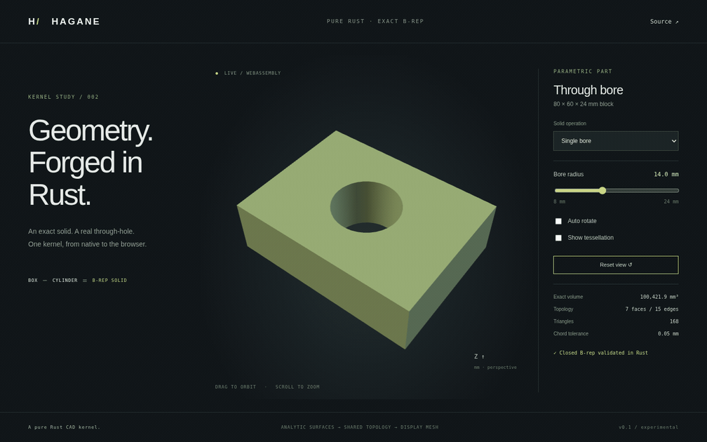

# Hagane

**A pure Rust CAD kernel.**

Hagane is an independent, open-source CAD kernel built around analytic geometry
and boundary representations. The long-term goal is broad CAD functionality
comparable to Open CASCADE Technology. This is an early, working foundation,
not an OCCT binding, source translation, or general-purpose replacement.
No OCCT source was used. Original code is licensed **MIT OR Apache-2.0**.

The GIF above records this repository's actual WASM/WebGL demo. The hole is a
trimmed B-rep solid: planar caps have inner circular wires and share exact
circle edges with an inward-facing cylindrical wall. Tessellation happens
**after** solid construction and validation; there is no mesh Boolean.

The standing [development goal](GOAL.md) is a complete end-to-end CAD workflow;
its acceptance criteria and implementation order guide ongoing development.
See the [roadmap](docs/roadmap.md) for current milestones and limitations.

Checked [rigid placement and coordinate frames](docs/frames.md) preserve exact
B-rep geometry and support polygon extrusion in arbitrary planes. The browser
also includes a rotated four-bore part generated by this Rust operation.

## Quick start

Install [Rust with rustup](https://rustup.rs/), then:

```sh
git clone https://github.com/rsasaki0109/Hagane.git
cd Hagane
cargo test --locked
cargo run --locked --example part
```

`rust-toolchain.toml` pins Rust 1.99.0, rustfmt, clippy, and the
`wasm32-unknown-unknown` target. The `part` example emits the demo mesh and exact
solid volume as JSON. Pass `1`, `2`, `3`, `4`, `5`, `6`, `7`, `8`, `9`, `10`, `11`, `12`, `13`, `14`, `15`, `16`, `17`, `18`, `19`, or `20` to select four bores, a concave
polygon extrusion, a hollow tube, a rigidly placed four-bore part, a
rounded line/arc extrusion, a concave arc-notch plate with a rounded hole,
a cap face subdivision, a curved cap/cylinder-wall subdivision, a cut across two holes, repeated crossings of annular cap arcs, periodic bore subdivision, independent planar face sewing, a closed solid plane partition, convex solid intersection, convex operand subtraction, convex operand union, face-contact box fusion, coplanar face merging, independently parameterized tilted face merging, or shared straight edge simplification:

```sh
cargo run --locked --example part -- 1
cargo run --locked --example part -- 2
cargo run --locked --example part -- 3
cargo run --locked --example part -- 4
cargo run --locked --example placement
cargo run --locked --example part -- 5
cargo run --locked --example rounded
cargo run --locked --example region
cargo run --locked --example part -- 6
cargo run --locked --example intersections
cargo run --locked --example face_clipping
cargo run --locked --example face_split
cargo run --locked --example part -- 7
cargo run --locked --example arc_face_split
cargo run --locked --example part -- 8
cargo run --locked --example cut_graph
cargo run --locked --example part -- 9
cargo run --locked --example repeated_arc_split
cargo run --locked --example part -- 10
cargo run --locked --example periodic_face_split
cargo run --locked --example part -- 11
cargo run --locked --example sewing
cargo run --locked --example classification -- -10 0 0
cargo run --locked --example curved_classification -- 0 0 0 0
cargo run --locked --example part -- 12
cargo run --locked --example solid_split -- -2
cargo run --locked --example part -- 13
cargo run --locked --example convex_intersection -- -2
cargo run --locked --example part -- 14
cargo run --locked --example convex_difference -- -2
cargo run --locked --example part -- 15
cargo run --locked --example convex_union -- -2
cargo run --locked --example part -- 16
cargo run --locked --example box_contact -- -2
cargo run --locked --example part -- 17
cargo run --locked --example face_merge -- -2
cargo run --locked --example part -- 18
cargo run --locked --example reframed_merge -- -2
cargo run --locked --example part -- 19
cargo run --locked --example edge_simplify -- -2
cargo run --locked --example part -- 20
```

Use the local kernel as a dependency during development:

```toml
[dependencies]
hagane = { path = "../Hagane" }
```

The package is named `hagane`; it has not been published to crates.io.

## Minimal example

```rust
use hagane::{BoxSpec, CylinderSpec, Point3, Vec3, Tolerance,
             subtract_through_cylinder};

fn main() -> hagane::Result<()> {
    let tolerance = Tolerance::new(1e-8)?; // all lengths are mm here
    let block = BoxSpec {
        min: Point3::new(-40.0, -30.0, -12.0),
        size: Vec3::new(80.0, 60.0, 24.0),
    };
    let tool = CylinderSpec {
        base: Point3::new(0.0, 0.0, -20.0),
        radius: 14.0,
        height: 40.0,
    };
    let part = subtract_through_cylinder(block, tool, tolerance)?;
    part.validate(tolerance)?;
    let exact_volume = part.volume()?;
    let display_mesh = part.tessellate(0.05, tolerance)?;
    assert!((exact_volume - (80.0 * 60.0 * 24.0
        - std::f64::consts::PI * 14.0 * 14.0 * 24.0)).abs() < 1e-8);
    println!("{} display triangles", display_mesh.triangles.len());
    Ok(())
}
```

## Polygon extrusion and multiple bores

```rust
use hagane::{PolygonProfile, Point3, Vec3, Tolerance, extrude_polygon};

let profile = PolygonProfile {
    origin: Point3::new(0.0, 0.0, 0.0),
    outer: vec![[0.0, 0.0], [12.0, 0.0], [12.0, 4.0],
                [4.0, 4.0], [4.0, 10.0], [0.0, 10.0]],
    holes: vec![],
};
let part = extrude_polygon(&profile, Vec3::new(3.0, -5.0, 7.0),
                           Tolerance::default())?;
assert!((part.volume()? - 72.0 * 7.0).abs() < 1e-8);

```

Use `subtract_through_cylinders(block, &[tool_a, tool_b], tolerance)` for multiple
bores, and `make_tube(TubeSpec { base, outer_radius, inner_radius, height }, tolerance)`
for a coaxial hollow cylinder. All produce exact shared-edge B-rep solids.

## Web demo

Python 3 serves static files; Node and npm are only needed for the optional
tests/recording tools. The browser requires WebAssembly and WebGL.

```sh
./scripts/build-web.sh
python3 -m http.server 8000 --directory web
```

Open port 8000 in your local browser. Drag to orbit; scroll to zoom. The radius
slider reruns the **Rust B-rep operation** in WASM. Select single/four bores,
a concave polygon extrusion with a polygon hole, a hollow tube, or a rotated
four-bore part, a rounded line/arc extrusion, or a concave arc-notch plate with
a rounded hole, a split planar cap, a split curved cap, a cut across two polygon holes, repeated crossings of an annular cap, a periodic bore split, sewn independent planar patches, the positive half of a plane-cut solid, intersecting convex solids, a subtracted rectangular through-hole, the union of overlapping solids, exact face-contact box fusion, merged coplanar faces, tilted faces with independent UV frames, or simplified shared straight boundaries. The split preset moves its cut offset
while preserving the fixed bore and volume; enable tessellation to see the seam.
The corner/notch radius controls exact geometry. The polygon
preset has a fixed profile, so its radius slider is disabled. Toggle the display mesh or
auto rotation. Arrow keys orbit and `+` / `-` zoom when the canvas is focused.
The **Classify** link opens an exact planar-solid point query. Move X/Y/Z or
select material, hole, notch and boundary probes; Rust returns inside/outside/boundary.
The renderer uses WebGL directly, with no CDN assets or JavaScript CAD library.
The generated `web/hagane.wasm` is ignored and rebuilt from source.

Optional browser regression tests and GIF recording:

```sh
npm ci
npx playwright install chromium   # or use an installed /usr/bin/chromium
npm test
npm run capture                 # also requires ffmpeg
```

`HAGANE_CHROMIUM` selects an existing browser executable. The capture command
starts its own static server and records actual rendered frames. It does not
fabricate the demo image.

## Implemented

- `f64` points/vectors, right-handed rigid transforms, explicit linear tolerance.
- Structured length/angular/relative policy and filtered exact 2D orientation,
  segment intersection, and inside/boundary/outside polygon classification.
- Lines, XY and framed circles; arbitrary orthonormal planes and Z/framed cylinders.
- Checked rigid B-rep placement, inverse/composed frames and exact placed bounds.
- Standalone clamped positive-weight NURBS curves: checked knots/degrees/weights,
  homogeneous de Boor evaluation, analytic first derivatives and knot-side limits.
- Standalone tensor-product NURBS surfaces: checked rectangular control nets,
  analytic U/V partials, oriented regular-point normals and uniform display grids.
- Checked line/plane intersection and tolerance-based parallel/coincident classification;
  horizontal-plane/bounded-Z-cylinder intersections.
- Typed plane/plane intersections with shared-parameter UV curves; line/framed-cylinder
  hits with original line parameters, UV, tangency and bounded generator intervals.
- Transverse line clipping against planar B-rep trims, including concavity,
  circular/arc boundaries and holes; planar-face intersection segments with
  normalized pcurves and boundary-event provenance.
- Scoped planar line/arc face subdivision, shared boundary/rim updates,
  rectangular cylinder-wall refinement, multi-interval cut graphs through bounded
  hole edges (including two crossings on one arc), periodic full-circle rim
  refinement, analytic hole ownership and preserved
  closed-solid geometry.
- [Solid point classification](docs/classification.md) for planar polygon/circle
  and bounded-arc trims and rectangular partial/full cylinder walls, with Euclidean boundary bands and two
  checked independent rays. [Cylinder/tube/bore queries](docs/curved-classification.md)
  and [rounded/notched queries](docs/arc-classification.md) are available in the browser model selector.
- [Shared straight edge simplification](docs/edge-simplify.md), removing exact
  degree-two collinear knots while preserving features, holes and shared pcurves.
- [Coplanar face merging](docs/face-merge.md), removing shared internal boundaries
  while preserving planar holes, geometry, original boundary edges and checked
  pcurves across independent UV frames using exact plane-support identity.
- [Axis-aligned box Booleans](docs/box-booleans.md), including identical/coplanar
  operands and full/partial face contact, with regularized empty results.
- [Convex operand union](docs/convex-union.md), combining overlapping or strictly
  contained planar convex operands into one closed, potentially nonconvex solid.
- [Convex operand subtraction](docs/convex-difference.md), sewn into one
  connected boundary, with nonconvex/through-hole results and typed empty output.
- [Convex solid intersection](docs/convex-intersection.md), with checked planar
  convex operands, typed empty results and exact closed B-rep construction.
- [Solid plane partition](docs/solid-split.md) for transverse planar straight-edge
  B-reps, returning two closed parts and exact section faces.
- Exact [planar patch sewing](docs/sewing.md), shared straight boundaries and
  conforming collinear subdivisions, with closed manifold validation.
- Vertices, shared curve edges, oriented coedges with exact pcurves, wires,
  oriented faces, shells, and solids, including periodic cylinder seams.
- Exact axis-aligned boxes, Z cylinders, and hollow tubes with annular caps.
- Positive-Z rectangle/disk extrusion and straight-line XY polygon extrusion,
  including concave profiles, multiple polygon holes, skew vectors and either Z direction;
  frame-based polygon extrusion also accepts arbitrary planes and world-space directions.
- Restricted box-minus-through-cylinders difference, including off-center and
  multiple disjoint holes, with contact/overlap/nesting rejection.
- Simple convex/concave line/arc region extrusion with sharp joins, signed arcs,
  multiple curved/polygon holes and either winding; exact bounded arcs and
  rectangular partial-cylinder walls.
- Simple planar polygon and circular trim containment/separation predicates.
- Structural/geometry validation, connected manifold shells, analytic volume,
  exact bounds for supported solids, and face-indexed display tessellation.
- The same Rust library on native and WASM targets; interactive browser demo.

Analytic [intersection APIs](docs/intersections.md) return typed results and
parameters for further face splitting. [Planar face clipping](docs/face-intersections.md)
now returns exact-trim interior intervals and finite intersection segments. Run
`cargo run --locked --example intersections` for the native JSON fixture; the
same fixture is exported in WASM. Run `cargo run --locked --example face_clipping`
for the trim-clipping fixture. [Scoped face subdivision](docs/face-split.md) now splits line/arc faces and
updates planar neighbors, bounded rims and rectangular cylinder walls. Planar clipping tangencies, vertex cuts, overlapping boundaries and coplanar overlays
remain explicitly unsupported.

## NURBS curves

The geometry layer also has immutable `NurbsCurve` objects with degrees 1..16,
nonuniform clamped knots and positive weights. For a rational quadratic circle:

```rust
use hagane::{NurbsCurve, Point3};
let curve = NurbsCurve::new(2,
    vec![0.0, 0.0, 0.0, 1.0, 1.0, 1.0],
    vec![Point3::new(1.0, 0.0, 0.0), Point3::new(1.0, 1.0, 0.0),
         Point3::new(0.0, 1.0, 0.0)],
    vec![1.0, std::f64::consts::FRAC_1_SQRT_2, 1.0])?;
let point = curve.evaluate(0.5)?;
let tangent = curve.derivative(0.5)?;
```

`cargo run --locked --example nurbs` emits evaluated points and derivatives.
The solid demo links to a separate **NURBS curves** page with weight and
parameter controls. [Curve documentation](docs/nurbs.md) explains knot-side
semantics, numerical limits and the actual WASM demo. These curves are not yet
integrated with B-rep edges; intersections and trimming remain future work.

## NURBS surfaces

`NurbsSurface::new([degree_u, degree_v], [knots_u, knots_v], [count_u, count_v],
points, weights)` accepts an immutable U-major rectangular control net.
`evaluate(u,v)`, `partials(u,v)` and `normal(u,v)` provide checked point,
analytic derivatives and oriented unit normals. Singular tangent planes fail
explicitly; C0 knot lines require an explicit side in each parameter direction.

Run `cargo run --locked --example nurbs_surface` for the native JSON fixture.
The **Surfaces** link opens the interactive 3D WASM demo with height, weight,
U/V and normal-marker controls. Its 24-by-24 display grid has no certified
chord-error bound. These are untrimmed standalone patches, **not B-rep faces or
solids**. [Surface documentation](docs/nurbs-surface.md) describes the API,
control ordering, mathematical formulas, numerical guards and remaining work.

## Explicit limits

The difference API accepts immutable **primitive specifications**, not arbitrary
`Solid` operands. The box axes are global X/Y/Z; the cylinder axis is global Z.
Each cutter must strictly overhang both caps by more than the linear tolerance.
Its circle must stay inside all four sides with clearance greater than that
tolerance. Multiple bores must also clear each other by more than that tolerance;
overlapping, nested, tangent or near-tangent bores return `Unsupported`. An empty
cutter list returns the unchanged box. Tangent, near-tangent, partially penetrating,
disjoint-from-the-box, side-cutting, or cap-coincident cutters return `Unsupported`. Negative/nonfinite/too-small
dimensions return `InvalidInput`. No fallback silently substitutes a mesh.

Primitive lengths must exceed **10 × linear tolerance**. Use one consistent
unit throughout; the demo uses mm. The default tolerance is `1e-8` length units.
Small parts require a correspondingly smaller explicit tolerance. At very large
coordinate offsets, IEEE-754 spacing can exceed the tolerance; construction
then fails validation rather than accepting inconsistent geometry.

Current planar trims support straight-line polygons and disks with disjoint
polygonal/circular inner wires, or simple line/arc outer and inner wires.
Cylindrical trims support full periodic and bounded angular rectangles.
`extrude_polygon` takes a `PolygonProfile` in an XY plane and a vector with
`abs(direction.z) > 10 × tolerance`. It accepts either winding, but rejects
self-intersections, redundant/near-collinear corners, repeated closing points,
nested/touching holes, and extrusion within the profile plane. Limits are
4,096 total profile corners, 256 polygon holes, or 256 independent cylinder
cutters. Tube walls must exceed 10 tolerances. Mixed line/arc regions accept
2..1,024 segments per ring, at most 256 holes and 4,096 total segments. Their
[supported domain](docs/mixed-profiles.md) includes positive XY extrusion and
[framed normal extrusion](docs/framed-arc-extrusion.md) with either sign. Skew
arc extrusion, nested holes and unresolved cusps are rejected. Arbitrary
curved trims, scale/shear/reflection transforms, and general CSG are not implemented.
Rigid placement and arbitrary-plane polygon extrusion are documented in
[frames](docs/frames.md); the restricted Boolean constructor and cylinder/plane
intersection still require their axis-aligned inputs. Topology is intentionally inspectable; callers who
mutate it must call `validate` before using geometry results. Validation checks
the supported trim domains, connectivity, endpoint/pcurve consistency, winding,
vertex links, and volume. It is not a general self-intersection or shape-repair
engine for arbitrary imported B-reps.

Tessellation approximates circles with a conservative sagitta bound. The exact
B-rep and analytic volume remain independent of display tolerance. Segment
counts are capped at 65,536, with 4,096 total trim samples per mixed planar
face. Unresolved/intersecting sampled trims and finer requests return
`Tessellation`; coarse sampling may require a smaller chord error. Mesh vertices
are split at face boundaries for normals; equal positions still form a closed
oriented mesh. Broad numerical robustness and industrial tolerancing remain
ongoing work. [Exact planar predicates and the tolerance policy](docs/tolerances.md)
now protect orientation/crossing/containment decisions; distance calculations,
3D predicates and general intersections are not certified exact.

## Validation

```sh
cargo fmt --all -- --check
cargo clippy --all-targets --locked -- -D warnings
cargo test --locked
./scripts/build-web.sh
node scripts/test-wasm.mjs
```

Tests cover analytic dimensions/volumes/bounds, offset holes, shell and mesh
closure/orientation, sagitta error and volume convergence, contact/near-contact,
small dimensions, malformed topology, nonfinite inputs, multiple-hole overlap,
concave/hollow/skew/reversed extrusions, annular tubes, unsupported operations,
and WASM generation/error recovery with native geometry parity for all twenty-two solid presets. Mixed-profile tests verify exact rounded/capsule volume,
partial bounds, shared arcs and walls, sharp/concave regions, curved holes,
either winding, analytic point classification, closed mesh seams, coarse-trim
rejection, and rejected inputs. Rigid-placement tests check analytic volume, transformed
geometry/normals, exact tilted bounds, unchanged topology/pcurves, inverse
round trips, preserved sagitta bounds, and rejected loss of coordinate precision.
NURBS tests cover analytic quarter circles/lines, independent basis/Bezier
formulas, nonuniform knots, C0 one-sided limits, weight-scale invariance, range
errors and 16 native/WASM curve cases. Surface tests add bilinear/rational
patches, exact quarter-cylinder geometry, partials in both axes, crease-side
normals, singularities, sampling checks, and six native/WASM grid/derivative
cases. Browser tests cover solids, curves and surfaces. CI runs formatting, Clippy, native tests,
WASM build/runtime checks, and browser interactions. Numerical tests also cover
10,000 independent integer orientation fixtures, 3,399 exact BigInt/WASM
orientation comparisons, 204 segment cases, and explicit angle/relative policies.

See [design and invariants](docs/design.md), [roadmap](docs/roadmap.md), and
[references and dependency licenses](docs/references.md).
