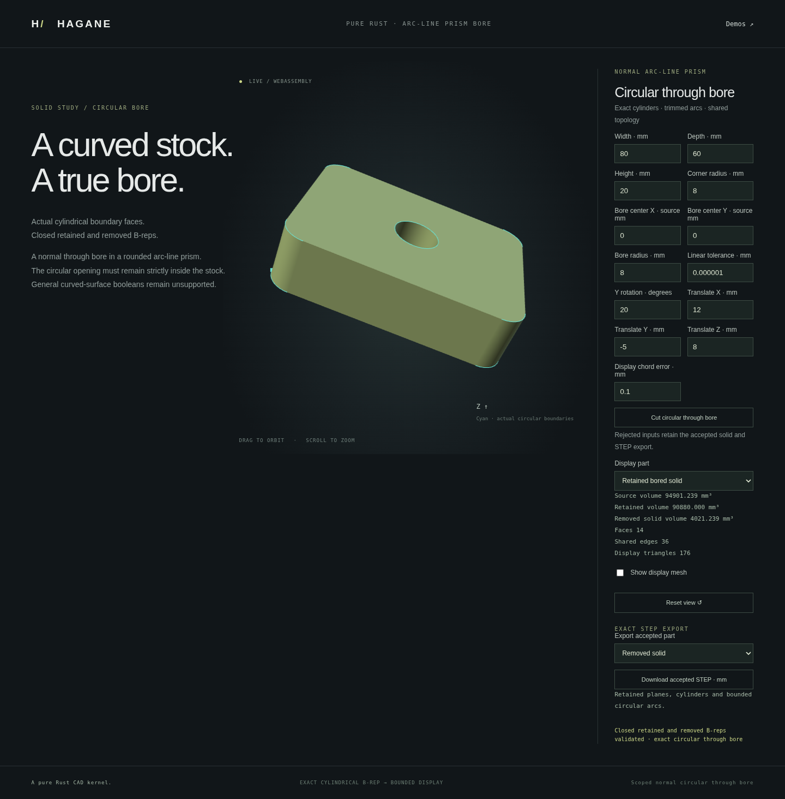

# Normal circular bores in line/arc prisms



`bore_normal_arc_line_prism` cuts a strictly contained circular through opening
in a structurally certified normal line/arc extrusion. It returns both the
retained part and removed cylinder as closed analytic B-reps. Neither is made
by mesh CSG or a visual mask. Display meshes follow validated solid construction.

```rust
use hagane::*;
fn drill(source: &Solid) -> Result<(Solid, Solid)> {
    let tolerance = GeometryTolerance::new(1e-6, 1e-10, 0.)?;
    let result = bore_normal_arc_line_prism(
        source, Point3::new(0., 0., 0.), 8., tolerance,
    )?;
    Ok(result.into_solids())
}
```

The center is a world-space point on the bore axis. Its axial coordinate can
lie outside the part; the axis direction is the source extrusion's normal.
The API uses the source's coordinate units. The demo and STEP interchange use
millimetres, radians and cubic millimetres.

## Geometry and admission

The source certificate checks actual cap geometry, whole line/arc boundaries,
shared walls, translations and outer/inner wire roles. Its recovered profile
is used to add four exact quarter-circle arcs. The trusted region constructor
checks containment, crossings, overlap, nesting and unresolved clearance.
All original source curves must remain represented in the retained solid
within a reserved tolerance budget; both output solids are revalidated and
recertified. The source is not mutated.

The removed solid has two circular caps, eight vertices, twelve edges and
four actual cylindrical wall patches. The operation exposes their retained
hole-wall indices through `hole_faces()`. `direct_removed_volume()` computes
`pi * radius² * height`, independently of subtracting nearly equal stock
volumes. The removed solid's volume is checked against its own scale; combined
retained/removed volume is separately checked against the source.

Supported sources have line/arc cap regions containing at least one circular
arc, one outer wire and disjoint inner wires. Up to sixteen total openings and
128 profile segments are admitted, including the new four-arc opening.
Sequential disjoint bores are supported. Skew extrusions, oblique bore axes,
full-circle single-edge rim representations, freeform solids, contacts,
side crossings and nested/overlapping openings reject. This is a scoped normal
through-bore operation, not a general Boolean implementation. Existing planar
stock operations remain separate.

Absolute/relative tolerances set geometric clearance at source scale. World
coordinate and projection arithmetic have separate conservative guards; moving
the axis point far along its line can therefore be rejected at tight tolerance.
Underflow, overflow and unresolved volume arithmetic reject explicitly. These
are engineering floating-point checks, not interval certification.

## Native and browser demo

```sh
cargo run --example arc_line_prism_bore
./scripts/build-web.sh
python3 -m http.server 8000 --directory web
```

Open `arc-line-bore.html`. The actual demo creates a box, rounds its four
parallel edges with the fillet operation, then calls the bore operation. Stock
dimensions, corner radius, bore position/radius, placement and display tolerance
are editable. Select source, retained or removed geometry and independently
download either result's STEP. Rejected edits preserve accepted geometry,
metrics and export.

The CLI accepts thirteen values:
`width depth height corner_radius center_x center_y bore_radius rotation_y
translation_x translation_y translation_z linear_tolerance chord_error`.
Its default is `80 60 20 8 0 0 8 0 0 0 0 0.000001 0.1`. The retained volume is
`20 * (4800 - (4-pi)*64 - pi*64) = 90880 mm³`; the removed cylinder is
`1280*pi mm³`. The retained B-rep has 24 vertices, 36 edges and 14 faces.

Display cylinder bounds include sagitta and arithmetic reserves. Circular
trim chords may intrude into shallow void-boundary slivers within the requested
chord tolerance; cap exclusion and inward normals are checked independently.
Supporting-surface bounds are not a general symmetric Hausdorff certificate.

## Validation

Tests check actual source-curve retention, opposite shared coedges, closure,
analytic removed volume, conservation, inward walls, point queries, mesh
closure/chord bounds and actual STEP import of both results. They cover all
three box-edge families, arbitrary placement, two sequential bores and resolved
physical scales from 1e-100 to 1e100. Invalid dimensions, contacts, prior-hole
overlap, skew stock, malformed topology and unresolved precision reject.
Native and WASM share the same implementation; floating report comparisons
retain the documented 32-machine-epsilon platform-transcendental allowance,
with exact structure/topology and independent geometry checks.

The frozen source passes all 855 native tests, formatting checks, strict
all-target clippy and the wasm32 release build. The complete WASM suite passes
on the same build, including default, eccentric/posed and micro-scale bores,
both actual STEP reimports, relative analytic-volume guards and invalid-input
transport/display recovery. Existing regression assertions remain intact.

The complete Chromium browser suite also passes on that same build. It checks
actual source, kept and removed displays, both accepted STEP downloads,
independent topology/volume/pcurve/chord checks, rejected-input rollback,
posed orbit controls and responsive layout. The screenshot above comes from
the running implementation.
