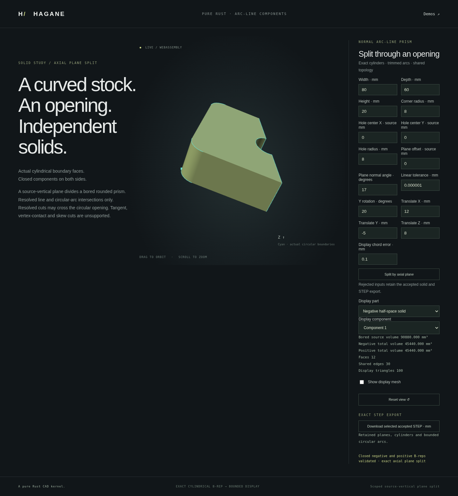

# Analytic prism partitions across openings



The additive `split_normal_arc_line_prism_by_plane_components` API partitions
a certified normal line/arc prism into independently closed solids on each
side of an axial plane. A cut may cross openings and produce several material
intervals or disconnected components. The original single-section API keeps
its existing restricted contract.

```rust
use hagane::*;
fn partition(source: &Solid, plane: &Surface) -> Result<()> {
let split = split_normal_arc_line_prism_by_plane_components(
    source, plane, GeometryTolerance::default(),
)?;
for solid in split.negative().iter().chain(split.positive()) {
    solid.validate(Tolerance::default())?;
}
for section in split.sections() {
    // Each patch comes from an actual negative-side cut face.
    assert_eq!(section.rings.len(), 1);
}
Ok(())
}
```

## Native and browser example

```sh
cargo run --locked --example arc_line_split_components
./scripts/build-web.sh
python3 -m http.server 8000 --directory web
```

Open `arc-line-split-components.html`. The demo first creates a rounded box
and drills an actual through opening, then partitions that retained B-rep.
Select a side and one of its components to display or download that exact
component's STEP file. The section overlay records the actual cut patches.
This demo's rounded stock and one strictly contained circular opening produce
one connected body per side for supported cuts. Disconnected-side examples use
custom concave profiles in the native API tests; arbitrary profile editing is
outside this page.

The default native example is an 80 × 60 × 20 mm stock with radius-8 vertical
corners and a radius-8 opening at the origin. A plane through the opening's
center, at normal angle 0.37 radians, gives two equal solids and two separate
rectangular cut patches. The opening joins each child's outer cap trim as
an exact circular notch; each child has genus zero. The source volume is
`96000 - 1280*(4 - pi) - 1280*pi = 90880` mm³, and each half is 45440 mm³.
The diagonal direction avoids the original quarter-arc vertices.

The optional CLI argument is a JSON array of 15 finite numbers:
`[width, depth, height, corner_radius, hole_x, hole_y, hole_radius,
cut_offset, cut_normal_angle, placement_y_angle, tx, ty, tz,
linear_tolerance, display_chord_tolerance]`.
Lengths use millimetres; angles use radians. Demo stock spans local Z=0 to
height, before rigid placement. Reports, geometry and STEP preserve world
coordinates; display framing does not change them.

## Exact construction and supported domain

The source certificate identifies its actual cap profile, extrusion frame and
height. The planar cut graph refines the actual line/arc edges and adjacent
circular walls. Every resulting cap region is extruded in that certified
frame, retaining exact lines, restricted circular arcs, planar walls and
cylindrical walls with their shared oriented edges and pcurves.

`negative()` and `positive()` return slices of actual closed solids;
`sections()` returns all rectangular material-interval patches. Every section
matches a unique actual cut wall on each side with opposing normals. Child
volumes are checked at their own scale, separately from total conservation.
Original curves must be covered across the complete collection of children.
Neither meshed CSG nor sampled curves provide the modeling result.

Source admission remains the normal line/arc prism certificate: at least one
bounded circular arc, at most 16 openings and 128 cap segments. The plane must
be parallel to the extrusion axis within the reserved arithmetic allowance.
Tangency, vertex passage, overlapping boundaries, tiny unresolved intervals,
meaningful skew, unsupported surfaces and poorly conditioned world coordinates
reject explicitly. Full-circle single-edge cap rims are outside this source
certificate. Splitting a crossing into several ordinary arc edges does not
turn a contact case into a supported operation.

Output admission permits at most 64 components across both sides, 128 section patches and 1024
total cap segments. Every individual child's certificate enforces its own
128-segment limit. Whole source-curve geometry and interval coverage retain
the existing reserved linear tolerance; large effective tolerances do not
relax absolute representation guards. A locally shifted analytic area integral
also checks cancellation separately for each child in this new API.

This is an analytic extrusion partition, not a general curved Boolean or a
shape-healing operation. Display tessellation inherits supporting-surface chord
bounds and circular trim-chord allowances; a general symmetric trim-boundary
approximation guarantee is not claimed.

## Editable history

The existing `plane_split` workflow node also uses this partition. It can now
cross an earlier opening when the selected side contains exactly one connected
component. The unselected side may contain multiple components. A selected
side containing several bodies rejects rather than silently choosing a body.
The document still represents a linear single-solid history.

Subsequent bores act on the actual retained notched body. Editing a cut may
invalidate a later bore; failure preserves the accepted document, cached
solids and exports. A fully line-only child still supports terminal display
and STEP, while subsequent curved-source operations remain unsupported.

Load [the example history](workflow-plane-split-components-example.json) in
`workflow.html` to keep the negative notched half and add a radius-2 bore at
(−20, 0). The actual native result has volume `45440 - 80*pi` =
45188.67258771281 mm³, 28 vertices, 42 edges and 16 faces. Cap inner wires
contribute their holes to the Euler characteristic; raw face count alone
does not give the genus. These workflow roots span Z=−10 to Z=+10.
Rejected bore intent may appear as a cyan candidate outline over the retained
part; the accepted B-rep and STEP remain unchanged.

## Verification

The frozen source passes formatting checks, strict all-target clippy, the
wasm32 release build and 896 native tests plus two documentation tests.
One additional microscopic-input regression passes separately, giving 897
native tests verified in total. It scales the stock by 1e−5, cuts through the
opening and checks each half's volume against its own analytic scale.

Owner and independent native suites check circle-segment subtraction,
two crossed openings with three sections, uncut opening ownership, rigid
placement, disconnected components, actual paired walls, pcurves, whole
source-edge coverage, closed meshes, STEP round trips and immutable rejection.
Workflow tests additionally check both retained notch sides, later actual
bores, prefix reuse, side edits, fresh replay and atomic multiple-body rejection.

The focused WASM suite passes all new partition and workflow cases, including
native report/STEP parity and explicit failure recovery. Cloud commands use
`CARGO_PROFILE_DEV_DEBUG=0`, `CARGO_PROFILE_TEST_DEBUG=0` and
`CARGO_INCREMENTAL=0`; default optimization levels and assertions are retained.
The complete WASM suite also passes on that same frozen binary, with every
legacy check unchanged. The full browser revalidation passes afterward on that binary.

The final focused browser run passes the actual notched component, analytic
volumes, native reports, per-component STEP imports, failed-input display
preservation, orbit/zoom and responsive layout. In the new workflow assertion,
a rejected later bore correctly adds a cyan candidate outline: the accepted
mesh/document stay deeply equal and accepted STEP stays byte-exact. The initial
test incorrectly expected identical pixels despite that existing intent overlay;
only that new expectation was corrected, with the failed log retained. The
component page's strict failed-input pixel check and all legacy guards remain
unchanged. The screenshot was captured from the frozen release binary.

The first full browser run passed the new feature but timed out while an
unchanged legacy surface-polygon canvas was being scrolled into view for a
screenshot. Playwright reported an unstable element, not a geometry mismatch.
An isolated diagnostic run observed constant canvas dimensions, and a second
isolated run passed the exact original block without added waits. The failed
run did not capture layout dimensions. Failure-only diagnostics now preserve canvas,
parent/grid, viewport, scroll and font state and rethrow the original error;
the normal path adds no wait, retry or changed assertion. The failed full log
is preserved separately from the final full revalidation.

Further read-only width probes reproduced a real layout feedback bug in that
legacy page: at desktop widths 1441 and 1439, the rounded-down canvas backbuffer
width changed its intrinsic aspect ratio, and its auto-height parent grew on
successive frames. At width 1281, rounding upward left the dimensions stable.
The full browser revalidation passed before a localized CSS fix was applied.
Only `surface-polygon.html` now gives its desktop viewport a definite 720-pixel
height, consistent with the newer demo pages. After that fix, the complete
affected geometry/pixel/orbit/mobile block and a distinct eight-frame stability
regression at all three widths pass, with stable parent/canvas dimensions and
no WebGL error. Mobile sizing, the shared viewer and the kernel are unchanged.
Verification consists of the full suite followed by affected-page checks
after the localized CSS fix. All temporary test helpers were removed.
