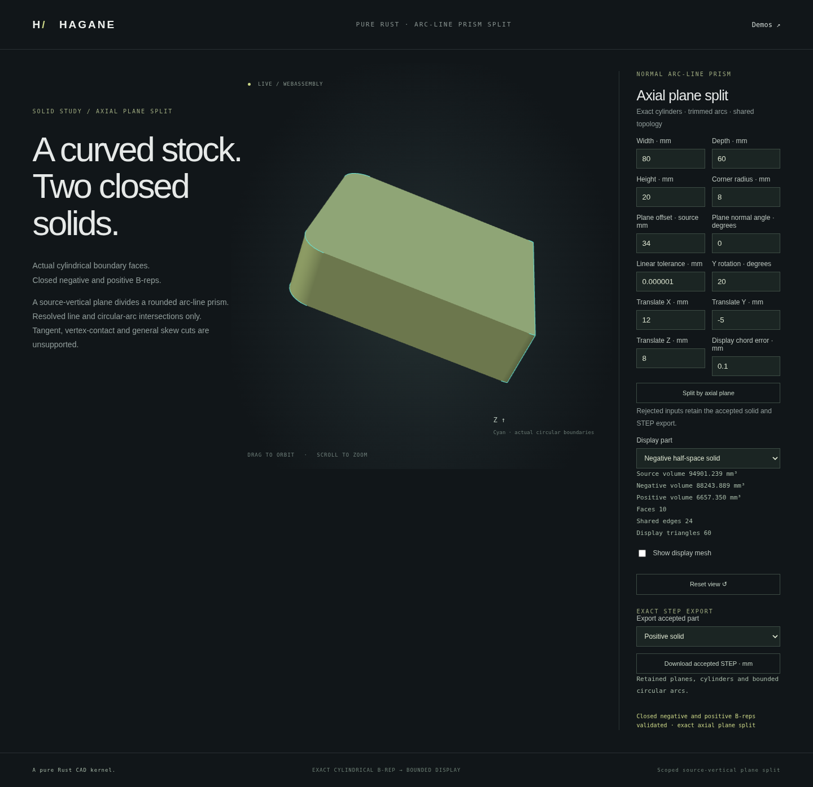

# Axial-plane partition of line/arc prisms



`split_normal_arc_line_prism_by_plane` partitions a structurally checked normal
line/arc extrusion by a plane parallel to its extrusion axis. Both negative
and positive results are closed analytic B-rep solids. Display meshes follow
construction; no mesh Boolean is used.

```rust
use hagane::*;
fn partition(source: &Solid) -> Result<(Solid, Solid)> {
    let tolerance = GeometryTolerance::new(1e-6, 1e-10, 0.)?;
    let plane = Surface::Plane {
        origin: Point3::new(0., 0., 0.),
        u: Vec3::new(0., 0., 1.),
        v: Vec3::new(0., -1., 0.),
    };
    Ok(split_normal_arc_line_prism_by_plane(source, &plane, tolerance)?.into_solids())
}
```

The example plane normal is +X. Negative and positive are defined by the sign
of the distance from the supplied plane along its `u cross v` normal. The API
uses source coordinate units; the demos use millimetres and radians.

## Construction and scope

Source recognition checks actual cap geometry, line/arc boundaries, translated
rims, wall surfaces, pcurves, shared topology and outer/inner wire roles.
An analytic transverse cap cut produces two child profiles. Actual source arcs
are retained as subarcs, and a straight section closes each profile. Normal
extrusion produces both closed results and opposing planar section faces.

This initial operation requires exactly two resolved crossings on distinct
outer edges and one connected material interval. Initial disjoint holes may
remain wholly on one side; cutting through holes, tangencies, boundary overlap,
vertex passage and disconnected sections reject explicitly. Skew prisms,
meaningfully oblique planes, freeform solids and general curved Booleans remain
outside this operation. Source geometry is never mutated. Source recognition
admits at most 128 cap-profile segments and 16 initial openings; each child
must also fit its constructor/certificate limits. Unresolved or over-budget
results return an error rather than omitting boundaries. Full-circle
single-edge rim representations are outside this line/arc certificate.

Absolute and relative policies govern cut admission at source extent. Separate
world-coordinate, frame reconstruction and plane-axis drift budgets protect
representation accuracy. Original line coverage and circular subarc basis/interval
coverage each reserve absolute tolerance/64 for geometric reconstruction and
endpoint coverage; their combined conservative allowance is tolerance/32,
with coordinate arithmetic separately guarded. Output validation and analytic volume conservation
are additional checks, not substitutes for source-curve retention. These are
engineering floating-point guards, not formal interval certification.

## Native and browser demo

```sh
cargo run --locked --example arc_line_prism_split
./scripts/build-web.sh
python3 -m http.server 8000 --directory web
```

Open `arc-line-split.html`. The demo first fillets the four parallel box edges,
then partitions that actual retained solid. Select source, negative or positive
geometry and independently export either result as bounded analytic STEP.
Rejected edits preserve the accepted geometry and exports.

The CLI accepts twelve values:
`width depth height corner_radius cut_offset cut_angle rotation_y
translation_x translation_y translation_z linear_tolerance chord_error`.
Its default is `80 60 20 8 0 0 0 0 0 0 0.000001 0.1`. Source volume is
`20 * (4800 - (4-pi)*64)` mm³. The default central cut yields two equal volumes.
Cut angles describe the source-XY normal; placement rotates the completed
stock and cut plane together about world Y before translation.

The screenshot records the actual negative result for offset 34 mm, normal
angle zero, Y placement 20 degrees and translation (12, -5, 8) mm. The retained
negative and positive volumes are approximately 88243.889 and 6657.350 mm³;
the negative solid has 10 faces and 24 shared edges. To reproduce its input:

```sh
cargo run --locked --example arc_line_prism_split -- \
  '[80,60,20,8,34,0,0.3490658503988659,12,-5,8,0.000001,0.1]'
```

The CLI accepts the parameter array as one JSON argument.

For an independent arc-crossing case, cut at source X=34. Each radius-8 corner
has local center X=32, so the positive cross-section area is
`6 * 44 + 2 * integral(2..8, sqrt(64-t*t) dt)`.
The antiderivative is `(t*sqrt(64-t*t) + 64*asin(t/8))/2`.
This oracle is independent of B-rep volume integration and tests genuine arc
subdivision rather than only straight-wall cuts.

Display bounds apply to supporting analytic surfaces with arithmetic reserves.
Circular trim chords may include slivers within the requested chord bound;
general symmetric trim-boundary approximation is not claimed. STEP retains
shared analytic curves/surfaces and both pcurves; use `step-bounded.html` for
supported imports.

## Verification

The frozen implementation passes a full run of 875 native tests and two documentation tests,
formatting checks, strict all-target clippy and the wasm32 release build. Eight
new native tests cover independent curved-segment areas, signed normal
extrusion, arbitrary rigid placement, reversed cut normals, initial-hole
ownership, a genuinely line-only child, actual section-face parameter bases,
opposing shared coedges, dense pcurves, welded display closure and both STEP
round trips. Vertex/tangent contact, crossed holes, multiple intervals, skew
planes, nonfinite input, far coordinates and relative clearance reject.
The source remains unchanged after accepted and rejected calls. An additional
focused scale regression passes at scales 1 and 1e-5, for both the X=34 cut
and a thin X=39.99 child. It independently checks the small child's volume and
both STEP round trips, bringing the native test total to 876. Formatting and
strict all-target clippy pass again after this test-only addition; kernel and
WASM sources remain unchanged.

The focused browser checks pass: both actual child exports/reimports, native
parity, independent volumes and halfspaces, dense curves/pcurves, display
closure, rejected-cut exact pixel preservation, recovery, orbit and mobile
layout. The image above is an actual browser capture.

The first focused WASM check assumed all cylinder/plane junctions were tangent;
new cut-plane junctions are intentionally not tangent. A split-specific oracle
now identifies those actual interfaces, independently checks the X=34 junction
cosine 2/8, and retains the existing stock tangency assertions unchanged.
The corrected focused run passes; both initial and corrected logs were retained.

Cloud validation uses `CARGO_PROFILE_DEV_DEBUG=0`,
`CARGO_PROFILE_TEST_DEBUG=0` and `CARGO_INCREMENTAL=0` to omit debug symbols and
incremental caches while preserving assertions and default optimization levels.

The complete WASM suite passes on the final native/WASM build, including every
legacy regression and five actual partition cases: central, offset straight,
arc crossing, rigidly placed arc crossing and oblique-in-profile. Independent
partial-circle volumes, cut halfspaces/opposed normals, source curve coverage,
real pcurves, closed chord-bounded meshes, native/STEP parity and actual reader
round trips pass. Contact/vertex/outside/precision/transport errors and recovery
are verified. No full-suite failure occurred.

The complete browser suite passes on that same final WASM build, run after
the full WASM suite to avoid competing heavy test processes. All legacy
regressions and the new axial split block pass through the final metre STEP
checks. Both child downloads/reimports, native parity, exact rejected-input
pixel preservation, recovery, orbit/mobile layout and the refreshed actual
capture pass. No pixel diagnostic or full-suite failure occurred.
