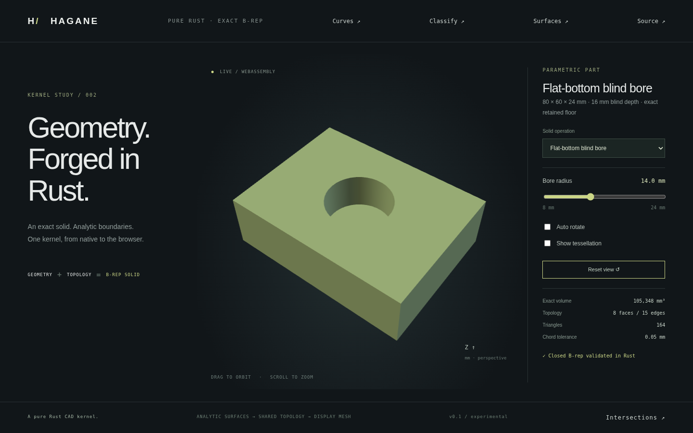

# Flat-bottom cylindrical blind bores



`subtract_blind_cylinder(box, tool, tolerance)` and
`subtract_blind_cylinders(box, tools, tolerance)` implement a restricted exact
primitive difference for top-entry Z-axis circular cylindrical blind bores.
Each tool's base is the retained flat floor. Its top must strictly overhang
the box top. Independent bores may have different radii, centers and depths.

The box bottom remains intact. The top cap gains a clockwise circular inner
wire; an inward-facing cylindrical wall shares the rim and floor circle edges.
An upward-facing planar disk closes the hole bottom. This is an exact closed
B-rep: the floor is real modeled geometry, not a display effect. No mesh Boolean
or general Boolean implementation is claimed.

For N bores the result has `6+2N` faces, `12+3N` edges and `8+2N` vertices.
Each cylinder seam is used twice by its own wall with opposite directions;
each circular edge is shared by a wall and cap/floor. All surface pcurves and
orientations are validated. Volume is analytically
`box_volume - sum(pi*r_i²*(box_top_z-tool_base_z))`.

## Supported domain

The box is axis aligned; all tools point along +Z and enter only the top cap.
Positive finite dimensions must exceed ten linear tolerances. Floors must be
strictly inside the box with more than ten tolerances of remaining bottom
thickness and hole depth. Tool top overhang, side clearance and pairwise XY
circle separation must each exceed ten tolerances. Contact, near-contact,
nesting, overlap, side/bottom breakthroughs and nonfinite input return errors.
At most 256 independent tools are accepted. Empty tools produce an unchanged
validated box. A completed solid supports arbitrary rigid placement.

Tilted blind bores, bottom/side-entry operations, rounded/drill-point bottoms,
intersecting bores and general solid Boolean operations remain unsupported.
[Oriented through bores](oriented-bores.md) retain their separately documented
supported domain. Different APIs distinguish blind and through cuts explicitly;
a through cut is not silently substituted for an invalid blind operation.

## Native and web demo

```sh
cargo run --example blind_bore -- 14 16
cargo run --example part -- 29
./scripts/build-web.sh
python3 -m http.server 8000 --directory web
```

Select **Flat-bottom blind bore** in the main browser demo. The 80×60×24 mm
block has a 16 mm deep bore with 8 mm of material below its floor. The slider
controls radius from 8 to 24 mm; orbit, zoom and tessellation views display the
actual B-rep-derived mesh. The native example accepts radius and depth in mm;
`hagane_blind_bore_demo(radius, depth)` exercises the same operation in WASM.

Native tests check dimensions and bounds, independent analytic volume, manifold
closure/orientation, upward floor triangles, physical floor tolerance bands,
material above/below the floor, rotated and microscopic solids, different-depth
multiple bores and invalid/contact inputs. WASM compares native mesh geometry
and analytic volume across radius/depth combinations, invalid breakthroughs
and recovery. Browser tests check the new preset and radius controls. The image
above captures the implemented renderer.

## Provenance

The construction uses elementary cylinder/plane geometry, oriented boundary
loops, closed-surface volume integration and exact circular disk area. It was
independently implemented in pure Rust using existing Hagane geometry and
validation code. No dependency was added and no OCCT source was used; original
code is MIT OR Apache-2.0. See [references](references.md).
