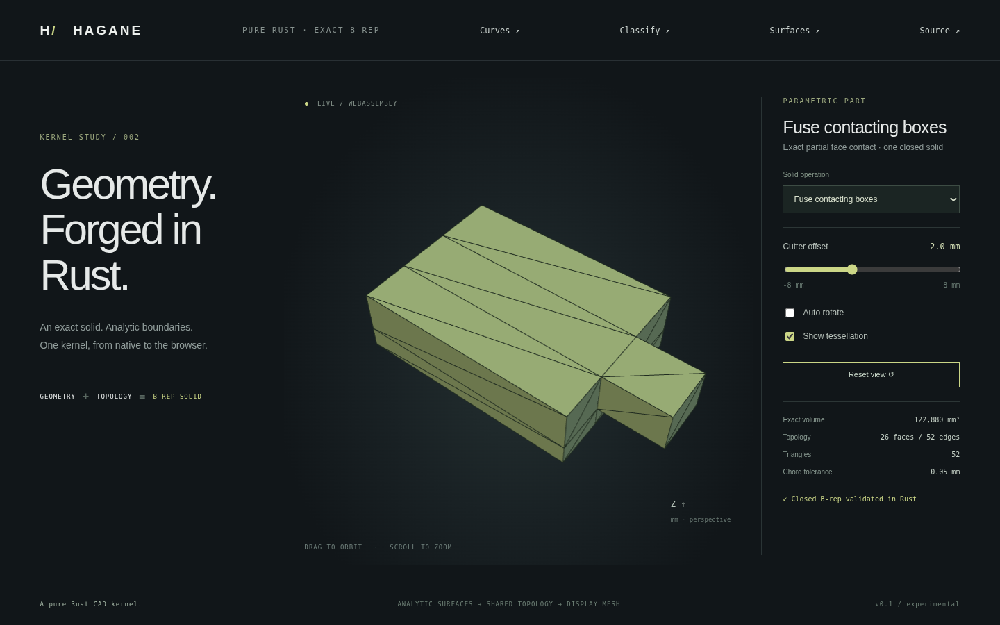

# Axis-aligned box arrangements and face contact



`boolean_boxes(first, second, operation, policy)` accepts two `BoxSpec` values
and `BoxBooleanOperation::{Union, Difference, Intersection}`. It returns
`BoxBooleanResult::{Empty, Solid(Solid)}`. This scoped API supports exact coplanar
boundaries and face contact without extending the general convex-input APIs'
contact contract. It constructs analytic B-reps, not mesh CSG.

## Supported domain

The specifications describe axis-aligned boxes in one coordinate system and
unit. Dimensions must exceed ten absolute linear tolerances. All coordinate
endpoints must be finite and representable. Exact equal boundary coordinates
are accepted. Any pair of distinct endpoints on an axis separated by at most
ten local length budgets is rejected; endpoints are never tolerance-snapped.
The local budget uses the larger operand diagonal and the provided absolute/
relative policy. This deliberately conservative test also applies to endpoints
that might not affect a particular operation.

Union supports volumetric overlap, strict or boundary-sharing containment,
identical operands, and full or partial face contact. Intersection is regularized:
face/edge/point contact has no material volume and returns `Empty`. Difference
removes common volumetric material; surface-only contact leaves the original
material. Identical-box difference returns `Empty`.

Nonempty results must be one closed manifold shell. Disjoint unions, edge-only
or point-only fusion, enclosed cavities and disconnected retained material return
errors. Rotated boxes and arbitrary existing B-reps are outside this API. The
[convex union](convex-union.md), [intersection](convex-intersection.md) and
[difference](convex-difference.md) APIs retain their transverse-cut restrictions.

## Construction

Sort and deduplicate the two boxes' exact minimum/maximum coordinates on each
axis. Their planes induce at most 27 open rectangular cells. Determine material
membership using interval endpoints, then apply the requested Boolean truth
function. For each occupied cell, retain only faces whose neighboring cell is
absent or unoccupied. Shared interior faces, including the contacting interface,
are removed before topology construction.

Every retained patch uses an analytic plane, four straight boundary segments and
an outward orientation. Corners come directly from the shared coordinate arrays;
no accumulated cell-coordinate arithmetic or fuzzy welding is used. The strict
planar sewing API shares vertices/edges and generates plane pcurves, then verifies
closed manifold topology, orientation and geometry. A planar region may retain
several adjacent patches; merging coplanar faces is future work.

The resulting volume must agree within relative `1e-10` with the independent
analytic box overlap formula and inclusion-exclusion. Empty results are explicit.
The cell arrangement is a geometric modeling intermediate; display triangles are
created only from the resulting B-rep.

## Usage

```rust
use hagane::*;
fn main() -> Result<()> {
let first = BoxSpec { min: Point3::new(0., 0., 0.), size: Vec3::new(4., 4., 4.) };
let second = BoxSpec { min: Point3::new(4., 1., 1.), size: Vec3::new(2., 2., 2.) };
let result = boolean_boxes(first, second, BoxBooleanOperation::Union,
    GeometryTolerance::default())?;
Ok(())
}
```

```sh
cargo run --locked --example box_contact -- -2
cargo run --locked --example part -- 17
./scripts/build-web.sh
python3 -m http.server 8000 --directory web
```

Select **Fuse contacting boxes**. An 80×60×24 mm box and a 24×20×16 mm box meet
on a partial face at `x = 40` mm. The slider moves the attached box in Y while
preserving exact face contact. The volume is **122880 mm³**. At offset `-2`, the
B-rep has 26 faces and 52 edges. The viewer renders the actual WASM result.

Native tests cover all three operations, identical/contained/coplanar boxes,
both operand orders and both contact directions on every axis, removed internal
interfaces, rectangular through-holes, outward triangles/closed mesh seams,
translated/tiny parts and explicit invalid/unsupported cases. WASM checks compare
native geometry at four offsets and verify error recovery. Browser checks cover
18 solid presets, offset adjustment, orbit/zoom and actual screenshot capture.
