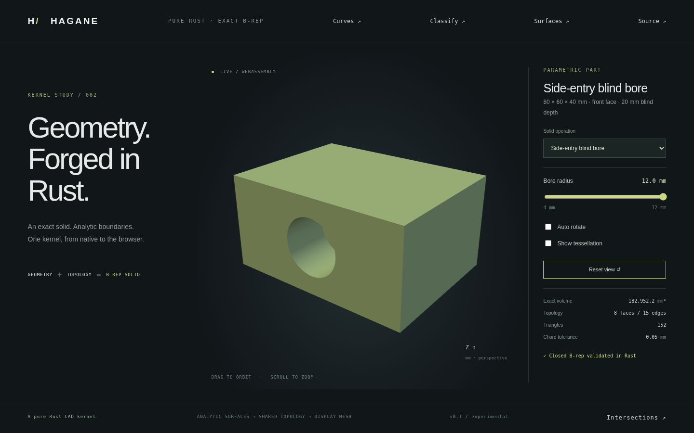

# Blind bores from all six box faces



`subtract_blind_bores_from_face(box, face, bores, tolerance)` extends the
[top-entry blind operation](blind-bore.md) to either end of all three box axes.
Each `FaceBlindBore` has a world-coordinate mouth center, radius and inward
depth. `BoxFace` selects the entry face explicitly; its outward normal determines
the opposite inward tool direction. All holes in one call enter the same face.

| Face | Native/WASM ID | Outward normal | Inward cut |
| --- | --- | --- | --- |
| MaxZ | 0 | +Z | -Z |
| MinZ | 1 | -Z | +Z |
| MaxX | 2 | +X | -X |
| MinX | 3 | -X | +X |
| MaxY | 4 | +Y | -Y |
| MinY | 5 | -Y | +Y |

## Exact construction and supported domain

A checked right-handed signed axis permutation maps the requested face into
canonical +Z coordinates. The existing exact blind-cylinder difference constructs
cap circular hole wires, inward cylindrical walls and retained disk floors.
Rigid placement maps the complete B-rep back to the original box, including
curves, normals, surface frames and pcurves. Reflections and negative scaling
are not used. A floor normal points outward from the retained material into
its cavity, along the selected face's outward normal.

The resulting box bounds and analytic volume are preserved:
`V = box_volume - sum(pi*r_i²*depth_i)`. N bores produce `6+2N` faces and
`12+3N` shared edges. Empty tools return the original validated box.

The box is axis aligned. Mouth centers must lie on the selected face plane
within one linear tolerance; accepted normal offsets are explicitly projected
to that plane. Circular mouths must clear the face edges, and depths must leave
more than ten tolerances of material before the opposite face. Positive radii
and depths exceed ten tolerances; all inputs must be finite. Tools have disjoint
circular footprints with more than ten tolerances of separation. Each call
supports at most 256 independent holes, with independent radii and depths.

Mixed entry faces in one operation, intersecting tools, oblique blind bores and
rounded/drill-point bottoms remain unsupported. This is a scoped exact primitive
difference, not a general curved Boolean operation. Arbitrary rigid placement
of a completed result is supported.

## Demo

```sh
cargo run --example box_face_blind_bore -- 5 7 20
cargo run --example part -- 30
./scripts/build-web.sh
python3 -m http.server 8000 --directory web
```

Select **Side-entry blind bore** in the web demo. An 80×60×40 mm block has a
20 mm deep bore entering its MinY/front face. The slider controls radius from
4 to 12 mm. Orbit downward to inspect the floor, or rotate to see the intact
opposite face. The native example accepts face ID, radius and depth. Its WASM
counterpart is `hagane_box_face_blind_bore_demo(face, radius, depth)`.

Native tests exercise all six entry faces on translated, rotated and microscopic
boxes. They check independent analytic volume, box bounds, mouth/cavity/floor/
retained-material classification and tolerance bands, floor normals, oriented
mesh closure, wrong-face centers, projection tolerance, breakthroughs and
invalid dimensions. WASM tests compare native geometry for every face across
multiple depths, analytic volume, errors and recovery. Browser checks exercise
side-entry radius controls and orbit; the image is captured from that renderer.

## Provenance

The implementation reuses independently written Hagane cylinder construction
and rigid B-rep placement, using elementary right-handed axis permutation.
No new dependencies or OCCT code were used; original code is MIT OR Apache-2.0.
See [references](references.md).
