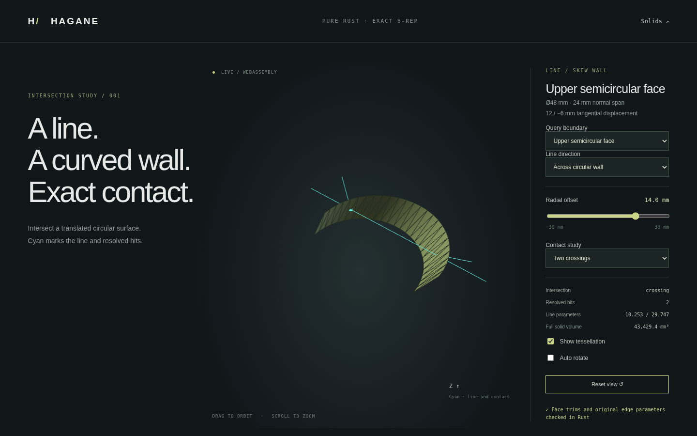

# Intersections with trimmed circular B-rep faces



`intersect_line_circular_face(&solid, face_index, anchor, direction, policy)`
intersects an infinite line with an actual B-rep face, including its angular trim.
It supports rectangular normal-cylinder and skew circular-translation walls.
The complete solid is validated before querying; no display mesh participates.

```rust
use hagane::*;
let t = GeometryTolerance::default();
let solid = skew_arc_extrusion_demo(14., 14., -24.)?;
// Select a circular wall from the actual closed solid.
let face = solid.shell.faces.iter().position(|f|
    matches!(f.surface, Surface::ExtrudedCircle { .. })
).ok_or(Error::InvalidInput("no circular wall"))?;
let result = intersect_line_circular_face(
    &solid, face, Point3::new(-40., 0., 0.), Vec3::new(1., 0., 0.), t,
)?;
# Ok::<(), hagane::Error>(())
```

The result is `CircularFaceLineIntersection::{Empty, Points, Coincident}`.
`Points` carries crossing/tangent contact and sorted `CircularFacePoint` records.
Each point preserves the original line parameter, world position, face UV and
oriented unit normal. `boundaries` contains wire/coedge/edge indices and original
edge parameters for boundary hits; it is empty for face-interior hits. Edge
parameters follow the stored curve, independently of coedge traversal.
`Coincident` carries start/end locations of a continuous generator overlap,
ordered by original line parameter even for reversed directions.

## Supported trim and boundary rules

The existing validator enforces one four-coedge UV rectangle from `(0,0)` to
`(span,height)`, with `0 < span <= 2π`. Surface hits are filtered by this angular
range. A quarter wall can retain one root of the supporting surface; a half wall
can retain two or none. Tangencies outside the selected angular trim are empty.
Exact axial rims and angular generators return edge provenance; nonperiodic
corners have two boundary uses. Full-periodic seams retain both coedges of the
shared generator without removing or duplicating surface hits. A rim/seam vertex
can consequently have three recorded uses.

The local length extent is `max(radius, height * generator_length)`. The policy
budget is `max(linear, relative * extent)`, independent of world translation.
Near angular boundaries are unresolved when the endpoint chord is within the
budget times the conservative inverse-shear stretch. No fixed angular slack
or tolerance-only snapping selects these hits. The existing surface solver
retains its contact, axial end-level and conditioning guards.

For actual straight boundary edges, exact dyadic integer predicates certify
line/edge coplanarity or collinearity directly from anchor, direction and stored
endpoints. They do not construct a rounded `anchor + direction` point or subtract
endpoints in floating arithmetic for the certificate. A certified generator
can be resolved from its shared edge even when a trigonometric frame makes the
supporting surface reduction near-generator. Certified nonparallel boundary
crossings use checked line/edge parameters and agreement with the candidate hit.
Near-coplanar lines without a certificate remain errors.

Every reported boundary parameter is verified on both its owning curve and
pcurve. Original local surface dimensions are also checked, so matching rounded
world points do not hide a lost small radius at large coordinates. Unrepresentable
parameters, nonfinite computations, unresolved angular selection and unsupported
trim forms return errors. Some geometrically valid boundary queries remain
unresolved after placement or finite-precision construction; they are not
silently assigned to one side.

## Run the actual demo

```sh
cargo run --locked --example circular_face_intersections -- 0 0 14 0
cargo run --locked --example circular_face_intersections -- 0 0 -14 0
cargo run --locked --example circular_face_intersections -- 1 1 0 0
```

Arguments are semicircular wall selection (`0` upper, `1` lower), line mode
(`0` transverse, `1` generator, `2` reversed generator), radial offset and rigid
rotation in radians. The examples demonstrate retained crossings, an empty
selected face, and certified overlap on its shared generator.

Build and serve `web/`, then open `intersections.html`. **Query boundary** selects
the complete supporting surface or either actual semicircular face. Only the
selected face is displayed in face mode; its open display mesh is extracted
from the solid's B-rep tessellation. **Full solid volume** continues referring to
the closed parent solid. Cyan lines show the query and resolved contacts.

Tests cover half/quarter trims, one/two/zero roots, tangencies, rims, corners,
original edge parameters, periodic seam uses, signed overlaps, inward normals,
placement, tiny dimensions, near-boundary rejection, exact boundary certificates,
invalid topology and lost-radius rejection. Native/WASM checks compare queries,
provenance and meshes; browser checks exercise selected-face rendering, boundary
selection, ambiguity and recovery alongside the existing solid/surface demos.

[Skew-solid classification](skew-classification.md) and
[bounded face subdivision](skew-face-subdivision.md) are now implemented separately.
General nonrectangular circular trims, arbitrary curved-face subdivision and
general Booleans remain unsupported. This is a
face-intersection prerequisite, not a general Boolean implementation.

Original code is MIT OR Apache-2.0. No dependencies were added and no OCCT source
was used. References: scalar triple products for line coplanarity, cross products
for line intersection, and exact binary64 dyadic arithmetic as documented in
[predicates](tolerances.md) and [reframed plane merging](reframed-merge.md). Surface
intersection mathematics remains in [extrusion intersections](extrusion-intersections.md).
