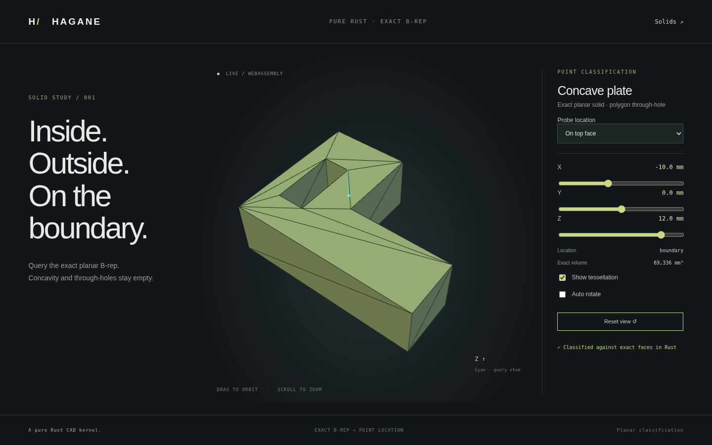

# Analytic solid point classification



`classify_point_in_solid(&Solid, Point3, GeometryTolerance)` returns
`PointLocation::{Inside, Outside, Boundary}` for a validated closed oriented
B-rep with planar polygon/circle/bounded-arc trims and rectangular cylinder or
skew circular translation walls. See [skew classification](skew-classification.md)
for Euclidean boundary-band bounds on oblique circular extrusion.
Polygon/circular holes, concavity, planar face subdivisions, rigid placement and
skew polygon extrusion are supported. General cylinder trims and other unsupported
boundaries return errors before a bounds shortcut. See [arc classification](arc-classification.md).
Invalid topology and nonfinite coordinates return errors. See
[curved classification](curved-classification.md) for cylinders, tubes and bores.

```rust
use hagane::*;
let tolerance = GeometryTolerance::default();
let solid = make_box(BoxSpec {
    min: Point3::new(0.0, 0.0, 0.0),
    size: Vec3::new(4.0, 4.0, 4.0),
}, tolerance.absolute())?;
assert_eq!(classify_point_in_solid(&solid,
    Point3::new(2.0, 2.0, 2.0), tolerance)?, PointLocation::Inside);
assert_eq!(classify_point_in_solid(&solid,
    Point3::new(2.0, 2.0, 0.0), tolerance)?, PointLocation::Boundary);
```

## Boundary and ray contract

The shape is validated before any bounds shortcut or query result. Its local
bounds diagonal defines the length budget `max(linear, relative * diagonal)`;
world offsets and query distance do not enlarge it. A point within that budget
of a trimmed face is `Boundary`. Distance combines plane-normal distance and
projected trim distance using `hypot`. A projection inside the material region
has zero lateral distance; projections in holes or outside the outer loop use
the nearest analytic polygon segment or circle. Full-cylinder wall distance
combines radial gap and distance outside its finite axial interval using `hypot`. This is a Euclidean band, including edges
and vertices, rather than independent coordinate-wise snapping.

For remaining points, ray/plane hits are evaluated against polygon/circle trims
using exact 2D signs for polygons and analytic radial distance for circles.
Line/cylinder intersections provide sorted lateral crossings and local normals. Near-parallel candidates, vertex/edge hits,
hits within the boundary budget, and unresolved reconstruction discard that
ray. Sorted material crossings must alternate entry/exit according to face
orientation, end outside at infinity, and have resolvable separation. Parity
then determines membership. Two independent successful directions must agree;
inconsistent orientation, disagreement or exhaustion of twelve deterministic
candidate directions returns `Unsupported` rather than guessing a result.
A very large angular tolerance can exhaust the candidate set.

No display mesh is consulted. Numerical plane intersections and metric distances
use checked f64 calculations; 3D decisions are not certified exact predicates.
The input must be a geometrically non-self-intersecting solid within the existing
supported trim domain. Existing structural validation checks topology, trims,
pcurves, connectivity and orientation; it is not a general geometric
self-intersection detector. General circular/NURBS trim classification and general curved Boolean selection
remain subsequent work.

## Native/WASM/browser evidence

Run `cargo run --locked --example classification -- -10 0 0` for a point query
against the fixture, or add `--mesh` for its B-rep-derived display JSON.
The **Classify** link opens `classification.html`: a concave L-shaped extrusion
with a polygon through-hole, volume 69336 mm³. X/Y/Z controls and fixed probes
query material, through-hole, notch, top face, corner and external points. The
cyan stem marks the query location; interior points can be occluded by the solid.
The same Rust fixture and classifier execute natively and in WASM.

Tests cover an independent analytic box grid, concave/hollow trims, face/edge/
vertex and near-boundary points, Euclidean corner distance, relative tolerance,
ray vertex degeneracy, face subdivision, rigid/skew placement, tiny models,
exhausted candidates, bounded arcs, partial wall subdivision, invalid topology and nonfinite
queries. WASM tests compare native results, boundary bands, recovery and the
actual display mesh. Browser tests exercise all probes, coordinate changes,
orbit and responsive layout.


The model selector now also queries a circular-bore plate, cylinder and hollow
tube using the same classifier. Their cap, wall, rim, axis and void probes are
verified natively, in WASM and through browser interactions. See
[curved classification](curved-classification.md).
