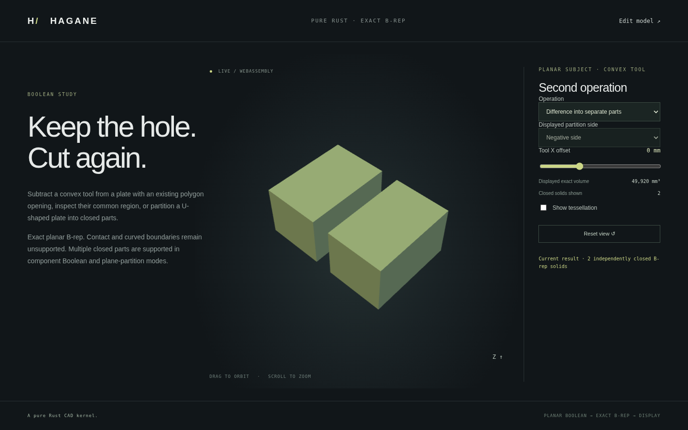

# Multi-component planar Boolean results



Two new APIs return `Vec<Solid>` instead of imposing one connected result:

- `subtract_convex_from_planar_solid_components(subject, tool, tolerance)`
- `intersect_planar_solid_with_convex_components(subject, tool, tolerance)`

An empty vector is a valid empty result. A separated tool yields one unchanged
subject for difference and no common components for intersection. Every returned
solid has independent validated geometry, topology, oriented shared edges and
surface pcurves. Display meshes are generated after exact B-rep construction;
no mesh CSG defines the modeling result.

## Input domain and construction

The subject must be one validated planar straight-edge solid; concavity and
polygon openings are supported. The tool must be a convex planar straight-edge
solid with no face holes. Each operand is limited to 128 faces. All supporting
plane cuts must clear current vertices by ten local length budgets; contact,
near contact, coplanar overlays and curved inputs remain unsupported.

For each tool supporting half-space, every current common component is either
retained, moved to the outside set, or split into negative/positive closed
components. No component is dropped merely because the intersection becomes
disconnected. At most 256 intermediate pieces are supported. Each resulting
common component is checked against all tool half-spaces, and its total volume
must not exceed either operand. Common plus outside volume must conserve the
original analytic volume.

Difference keeps original subject boundary patches from outside pieces and
reverses cutter-derived boundary patches from all common components. Generated
patches are sewn with the existing bounded arithmetic-roundoff reconciliation;
near-distinct input vertices are not healed at model tolerance. Shared B-rep
edges define shell adjacency. Each shell is extracted with reindexed vertices,
edges and coedges and independently validated. All retained volumes plus removed
common volume must equal the original volume. Final sewing retains the existing
512-patch / 4096-corner limit across the entire arrangement.

Independent internal cavity shells are unsupported: subtracting a strictly
contained cutter returns an explicit error, rather than publishing an enclosing
solid and a negatively oriented shell as separate positive parts. Touching or
intersecting shells and unresolved arrangements are not silently repaired.
Original single-result Boolean APIs retain their prior contracts.

These APIs accept a single subject, not an arbitrary assembly/result-vector
operand. Component order follows deterministic input traversal; it is not stable
persistent naming. Union of nonconvex/component operands, curved Booleans, STEP,
assemblies and Boolean nodes in the editable JSON document remain later work.

## Run the examples

```sh
cargo run --locked --example component_boolean -- 0 0
cargo run --locked --example component_boolean -- 1 0
./scripts/build-web.sh
python3 -m http.server 8000 --directory web
```

Open `planar-boolean.html` and choose a component Boolean mode. In difference
mode a 60 × 40 × 24 mm stock loses an 8 mm wide through slot. The two retained
parts each have volume 24,960 mm³, totaling 49,920 mm³. In intersection mode a
U-shaped stock meets a 10 mm high transverse tool band; both separated arm
regions have volume 4,800 mm³, totaling 9,600 mm³. The displayed solid count and
volume describe the actual returned vector. Mesh concatenation is display-only.
Contact offsets retain the previous validated result with an explicit label.
Empty results clear the display; separated difference returns the unchanged stock.

## Evidence

Native tests verify two-part slot difference, two-part concave intersection,
three-part concave remainder, retained polygon openings, material/gap queries,
exact total volumes, translations and microscopic/large dimensions. Every
component passes closed topology/pcurve checks and has opposite paired display
edge uses. Empty/unchanged/contained outcomes, near contacts, curved inputs and
unsupported internal cavities are checked. Native/WASM comparisons check every
mesh, volume and component count. Browser checks cover both operations, contact
rejection/recovery, empty/unchanged results, displayed counts and volumes.
Mathematical and dependency provenance is in [references](references.md); no
new dependency was added.
