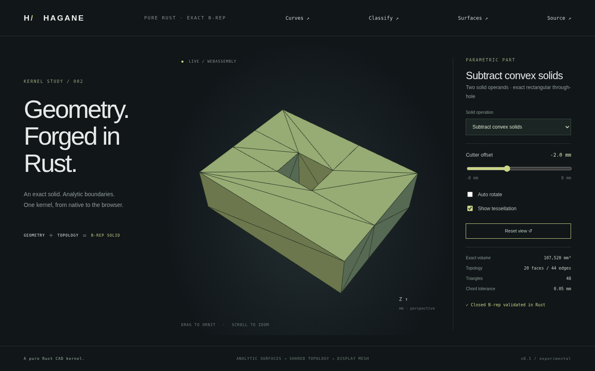

# Convex operand difference



`subtract_convex_solids(&first, &second, GeometryTolerance)` returns
`SolidDifference::{Empty, Solid(Solid)}`. Both operands must be checked convex
planar straight-edge solids. The result may be nonconvex or have a through-hole,
but must have one connected closed boundary shell. This operates on actual
`Solid` operands; it does not accept only primitive specifications or return a
collection of overlapping partition cells.

```rust
use hagane::*;
let policy = GeometryTolerance::default();
let first = make_box(BoxSpec {
    min: Point3::new(-4.0, -3.0, -2.0),
    size: Vec3::new(8.0, 6.0, 4.0),
}, policy.absolute())?;
let cutter = make_box(BoxSpec {
    min: Point3::new(-1.0, -1.0, -3.0),
    size: Vec3::new(2.0, 2.0, 6.0),
}, policy.absolute())?;
let SolidDifference::Solid(part) =
    subtract_convex_solids(&first, &cutter, policy)? else {
    panic!("expected retained material");
};
assert!((part.volume()? - 176.0).abs() < 1e-10);
```

## Supported domain and result contract

- Both operands satisfy the [convex intersection contract](convex-intersection.md):
  at most 128 convex planar faces each, straight boundaries, no face holes,
  checked supporting planes and valid manifold topology.
- All proper clipping planes must clear current vertices, including generated
  ones, by more than ten local length budgets. Original/generated vertex
  contact, coplanar faces, tangencies and near contacts return errors.
- One connected closed result shell is required. A cutter wholly inside the
  first operand creates an enclosed cavity with separate shells and is
  unsupported. Disconnected retained material is also rejected. A through-hole
  can have one connected shell and is supported.
- Strictly disjoint operands return the original first operand's geometry.
  Strict coverage of the first operand returns `Empty`. Equal/contacting
  operands still fall outside the current contact contract.
- Nonconvex/curved input, unresolved arithmetic, incompatible sewing, oversized
  arrangements or invalid topology return errors. Successful nonconvex results
  are not automatically accepted as inputs to this convex-only API.
- Input solids must be geometrically non-self-intersecting. Structural validation
  is not a general imported-shell self-intersection detector. [Scoped union](convex-union.md) is available separately; general union,
  curved difference, cavity shells and contact overlays remain future work.

## Boundary construction

The shared clipping pipeline retains positive outside regions as well as the
negative common region. Only their boundary fragments inherited from the
original first operand are kept. The common region's cutter-derived faces are
added with reversed face orientation to face the removed material. Artificial
partition caps between outside regions are discarded. Exact plane provenance
is retained through copied surface frames; no sampled geometry selects faces.

The retained patches are sewn into one B-rep, rather than exposed as partition
cells. Shared edges, coedge direction, pcurves, closed vertex links and shell
connectivity are validated. Result volume plus common volume must match the
first operand within 1e-10 relative error. Input geometry is never mutated.
Tessellation occurs only after this complete boundary construction.

Repeated generated cuts can reconstruct an intersection with slightly different
binary64 coordinates. Their internal assembler reconciles only arithmetic
roundoff bounded by `min(64*EPSILON*local_diagonal, linear/1024)` for vertex
coincidences and collinear subdivision incidence. Full geometry and volume
checks follow. This is far below the modeling tolerance and does not enable
arbitrary tolerance-based healing: the public independent-patch sewing API
continues rejecting near-coincident/near-collinear input. Excess reconstruction
error still fails. Metric 3D calculations are not certified exact predicates.

## Demo and evidence

Run `cargo run --locked --example convex_difference -- -2` or
`--example part -- 15`. **Subtract convex solids** subtracts a 20×16×40 mm box
from an 80×60×24 mm box. The tool overhangs both Z caps and moves from -8 to 8 mm
along X. Its exact rectangular through-hole leaves volume
`115200 - 20*16*24 = 107520` mm³. The closed result has twenty faces and
forty-four edges because exterior planar fragments retain their shared seams;
those seams are not artificial interior faces. Coplanar face merging is later
work. Enable tessellation to inspect closure around the hole.

Tests cover analytic partial box cuts, rectangular through-holes, triangular
prism subtraction, retained/removed point classification, bounds, rigid
multi-plane placement, tiny models, closed oriented mesh seams, empty and
unchanged results, and rejected cavities/disconnected/contact/nonconvex/curved
cases. Existing strict sewing and convex intersection tests remain passing.
Native/WASM parity and recovery use the same fixture; browser tests move the
cutter and verify unchanged retained volume with changing geometry.
