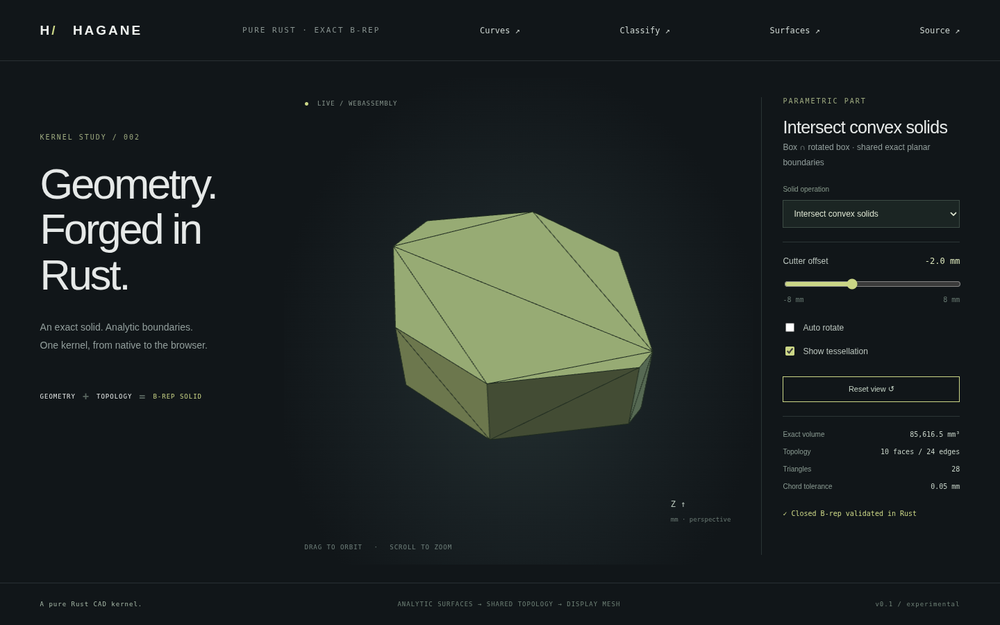

# Convex solid intersection



`intersect_convex_solids(&first, &second, GeometryTolerance)` returns
`SolidIntersection::{Empty, Solid(Solid)}`. It computes common material of two
validated convex planar straight-edge B-reps, retaining exact plane/line geometry
and shared oriented topology. It is not a mesh Boolean or a primitive-spec-only
operation. Both inputs must meet the supported conditions below.

```rust
use hagane::*;
let policy = GeometryTolerance::default();
let first = make_box(BoxSpec {
    min: Point3::new(-4.0, -3.0, -2.0),
    size: Vec3::new(8.0, 6.0, 4.0),
}, policy.absolute())?;
let second = make_box(BoxSpec {
    min: Point3::new(1.0, -1.0, -1.0),
    size: Vec3::new(6.0, 6.0, 6.0),
}, policy.absolute())?;
let SolidIntersection::Solid(common) =
    intersect_convex_solids(&first, &second, policy)? else {
    panic!("expected common material");
};
assert!((common.volume()? - 36.0).abs() < 1e-10);
```

## Supported domain and results

- Both operands validate as closed connected oriented solids, with at most
  128 planar faces each, straight edges, convex outer face rings and no holes.
  Convex face turns use the existing exact projected orientation predicate.
  Every vertex must lie behind every outward supporting plane, allowing only
  a checked floating reconstruction guard bounded by linear tolerance.
- Strict containment can legitimately return the contained operand's geometry.
  Strict separation returns `Empty`. Empty is a successful geometric result,
  not a malformed zero-volume solid.
- Any clipping plane that touches or nearly touches a current vertex, including
  a vertex introduced by an earlier cut, returns `Unsupported`. Coplanar and
  tangent/near-contact arrangements are not resolved. Clear input corners do
  not alone guarantee success: later arrangement contacts are also rejected.
- The vertex clearance is ten times `max(linear, relative * scale)`, where scale
  is the larger input bounds diagonal. Plane partition additionally applies its
  own current-shape checks. Both operands are validated before bounds shortcuts,
  so unsupported curved/nonconvex solids do not masquerade as empty results.
- Nonconvex operands, curved faces/edges, face holes, unresolved coordinates or
  topology fail explicitly. Inputs must be geometrically non-self-intersecting;
  this is not a general imported-shell self-intersection detector.
- [Scoped difference](convex-difference.md) and [scoped union](convex-union.md) are available separately;
  coplanar overlays remain future work. Operand
  order can change which unsupported arrangement is encountered; successful
  intersections preserve common geometry, not stable face-index provenance.

## Construction and validation

The cutter's signed face orientations give outward planes whose negative
half-spaces bound its convex material. Each plane either strictly contains the
current result, strictly excludes it, or transversely clips it. Proper clips
reuse `split_solid_by_plane` and retain its negative closed part, including new
section caps and shared intersection vertices. The result is validated after
construction, lies inside all cutter half-spaces within its length budget, and
has volume no greater than either operand within 1e-10 relative error.
No input geometry is mutated and no display mesh influences modeling.
Supporting-plane and metric 3D checks remain f64 numerical calculations; they
are not certified exact 3D predicates.

## Demo and evidence

Run `cargo run --locked --example convex_intersection -- -2` or
`--example part -- 14`. **Intersect convex solids** computes an 80×60×24 mm box's
common material with a 64×64×40 mm box rotated 45° about Z, translated along X.
The offset slider runs from -8 to 8 mm. At -2 mm it yields an octagonal prism
with ten faces / twenty-four edges and volume approximately 85616.48445 mm³.
The rotated box overhangs Z; its actual planar B-rep is the second operand.

An independent area formula checks the demo. For `d = 32*sqrt(2)` and offset o,
the clipped diamond has area
`4096 - max(d-40+o,0)^2 - max(d-40-o,0)^2 - 2*(d-30)^2`
throughout the demo range. Multiply by height 24 for volume. This removes the
four right-triangle tips against the original box's sides; it is independent
of the face clipping code.

Tests cover analytic box/triangular-prism overlap in both operand orders,
separation despite overlapping bounds, bounds and membership,
containment, empty results, original/generated vertex contact and coplanar rejection, unsupported curved and
nonconvex inputs, rotated-diamond area, rigid placement, tiny models, positive
triangle winding and closed mesh seams. Native/WASM fixtures compare geometry,
metrics, empty/contact results and recovery. Browser tests move the cutter,
verify topology/volume changes and exercise orbit/zoom.

Exact coplanarity and full/partial face contact are supported separately for
axis-aligned `BoxSpec` operands by [box arrangements](box-booleans.md). This does
not change this convex-input API's contact restrictions.
