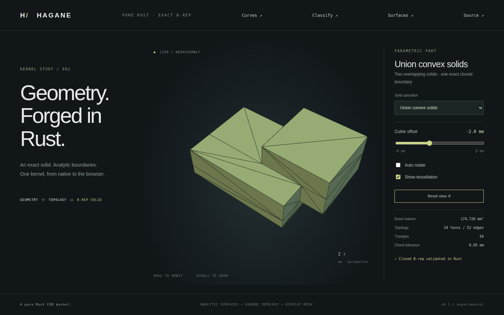

# Convex operand union



`union_convex_solids(&first, &second, GeometryTolerance)` returns one checked
`Solid`. The inputs are convex planar straight-edge B-reps; the output can be
nonconvex. This is a boundary operation on exact planes, straight edges and
surface parameter curves, followed by display tessellation. It performs no
mesh Boolean.

## Supported domain

Both operands satisfy the [convex intersection contract](convex-intersection.md):
validated topology, at most 128 planar faces each, convex outer rings, no face
holes and straight edges. Both half-space partitions must clear every current
vertex by ten local length budgets. Strict containment returns the enclosing
operand. Proper volumetric overlap produces a connected closed shell.

Disjoint operands return an explicit unsupported error because this API returns
one connected solid. Identical operands, tangent/coplanar boundaries and near
contacts are unsupported, including arrangements encountered during intermediate
clipping. Curved or nonconvex input is rejected before separation shortcuts.
Nonconvex output cannot be fed back into these convex-input Boolean APIs.
Structural validation is not a general imported-shape self-intersection detector;
operands must represent geometrically valid convex material.

## Construction and checks

Partition each operand by the outward supporting planes of the other. From each
outside cell, retain only fragments of that operand's original boundary. Discard
all artificial partition caps and faces inside the other operand. Sew the combined
exterior fragments into a single shared, oriented boundary. Original outward
orientations stay intact. Coplanar adjacent exterior fragments are not merged.

The private generated-arrangement sewing path reconciles only arithmetic roundoff:
its distance bound is the smaller of `64 * f64::EPSILON * local_diagonal` and
`linear_tolerance / 1024`. The public independent-patch sewing API remains strict.
See [sewing](sewing.md). Patch/corner limits and unresolved geometry return errors.

Both independently generated overlap volumes must agree. The result must satisfy
`V(union) = V(first) + V(second) - V(common)` within relative `1e-10`, then satisfy
closed-manifold topology, shared edge orientations, vertex links, planar trims and
pcurve checks enforced during sewing.

## Example and browser demo

```sh
cargo run --locked --example convex_union -- -2
cargo run --locked --example part -- 16
./scripts/build-web.sh
python3 -m http.server 8000 --directory web
```

Select **Union convex solids** in the viewer. The first box spans
`[-40, 40] × [-30, 30] × [-12, 12]` mm. The second has minimum
`(10 + offset, -10, -4)` mm and size `(50, 50, 32)` mm. For offsets `[-8, 8]`,
the analytic overlap is `(30 - offset) * 40 * 16` mm³ and the union volume is
`176000 + 640 * offset` mm³. At offset `-2`, the result has volume **174720 mm³**,
24 faces and 52 edges. Orbit, zoom, offset adjustment and mesh inspection use
geometry generated by the same Rust kernel natively and in WASM.

Tests cover either operand order, strict containment, nonconvex output,
point classification, analytic box and triangular-prism volumes, rigid placement,
microscopic dimensions, invalid input and rejected disjoint/contact/curved cases.
Display tests verify outward triangles and closed mesh seams. WASM tests compare
native output and exercise errors/recovery; browser tests check all 17 presets
and changing the union offset.

General nonconvex/curved Boolean inputs and contact overlays remain future work.
