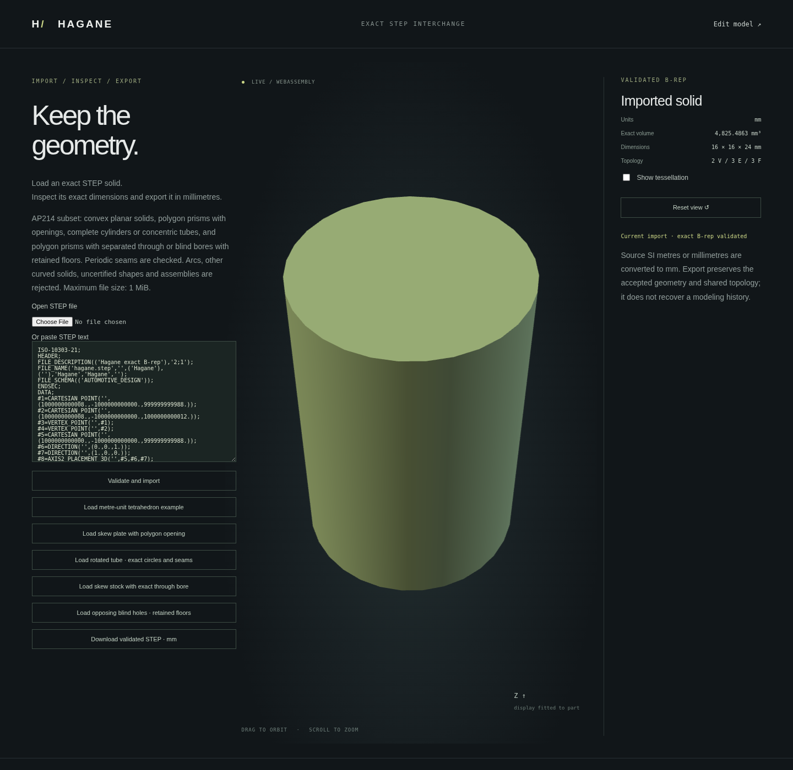

# Coordinate precision and display accuracy

Hagane retains `f64` model coordinates and analytic curves/surfaces. Moving a
small part far from the world origin does not increase their floating precision.
The kernel now rejects curved endpoints whose local offsets no longer resolve
their exact curve within the caller's modeling tolerance. This applies to native
solid validation/rigid placement and STEP circular seam reconstruction. It never
snaps a vertex or changes a radius to make the input pass.

## Display allowance

`solid.tessellation_roundoff_budget(tolerance)` reports a conservative arithmetic
allowance in the model's length units. It is `32 * f64::EPSILON * scale`, where
`scale` bounds absolute intermediate coordinate expressions, including placement,
curve coefficients, planar UV coefficients, circular height bands and skew drift.
The final bounding box alone is insufficient: large plane origins and opposing
UV offsets can cancel to a small visible part while retaining large arithmetic
errors. Nonfinite envelopes fail explicitly.

`tessellate(error, tolerance)` requires the allowance to be less than one quarter
of the requested chord error, then reserves the allowance by sampling with
`error - allowance`. Shared rim grids, sagitta/ellipse bounds and conforming
cap/wall topology are otherwise unchanged. The allowance is a floating arithmetic
guard, not a formal interval guarantee for arbitrary platform trigonometric
implementations. Independent geometric checks run natively and in WASM.

```rust
let allowance = solid.tessellation_roundoff_budget(tolerance)?;
let display = solid.tessellate(0.05, tolerance)?;
```

An unresolved request returns `Error::Tessellation` explaining that coordinate
precision cannot resolve the requested error. Callers can deliberately choose a
coarser display tolerance or use a local part frame. No automatic change to
modeling tolerance, geometry or world placement occurs. Display centering in the
browser retains the original accepted B-rep metrics and exported coordinates.

Exact interchange and display have separate requirements:
`import_step_mm` accepts the provided radius-0.125 mm cylinder at a 1e15 mm offset,
whose cardinal seam remains representable. The default `import_step_json` display
path rejects its 0.05 mm mesh request. Translating that exact solid explicitly to
a local frame allows a fine display mesh. A radius-0.01 mm seam rounded onto the
axis is invalid geometry and fails native validation and STEP import/export.

## Stable mesh volume and actual example

`Mesh::signed_volume` uses tetrahedra relative to a vertex referenced by a triangle and Neumaier
compensated summation. It assumes a closed, oriented mesh; it does not establish
closure or replace `Solid::volume`, which integrates the analytic B-rep.
Reversed mesh orientation reverses its signed volume. Unused far-away vertices
do not select the volume reference. Empty triangle sets return zero.

```sh
cargo run --quiet --locked --example placement_precision
cargo run --quiet --locked --example placement_precision -- 1e12 8 0.05 step > far.step
# Explicit precision failure:
cargo run --quiet --locked --example placement_precision -- 1e15 0.125 0.05
```

The default example generates a real radius-8 mm, height-24 mm cylinder at
`[1e12,-1e12,1e12]` mm. Its coordinate allowance is approximately 0.007105 mm,
analytic volume 4825.486 mm³ and display mesh volume 4792.522 mm³ at the requested
0.05 mm error. Native tests and independent WASM wall-chord midpoint checks
verify the approximation bound. The canonical
[far-cylinder STEP](step-far-cylinder-example.step) can be uploaded directly to
`web/step.html`; orbit and download retain its world coordinates.
The [unresolved display fixture](step-unresolved-display.step) exercises the
explicit precision error and recovery.



Native regressions reproduce previously accepted collapsed seams, unstable
translated-box volume and unguarded display requests. They also check reversed
mesh volume, explicit local-frame recovery and cancelling parameter origins.
WASM compares complete native reports, exact position arrays and re-exported
bytes, and independently checks wall chord error. Browser tests exercise upload,
orbit/download, both precision/geometry failures, previous-model preservation and
recovery. Existing external STEP regression checks remain passing; they do not
claim far-coordinate display accuracy from the external reader.

Implementation and fixtures are original MIT OR Apache-2.0 work. Numerical
references are recorded in [references](references.md); no dependency was added.
