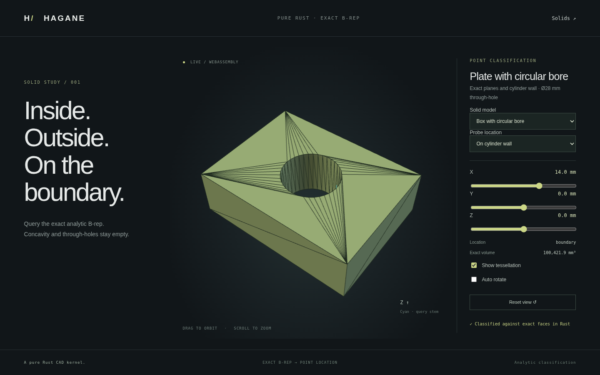

# Full-cylinder and circular-trim solid classification



`classify_point_in_solid(&solid, point, policy)` now supports complete periodic
cylinder walls and planar polygon/full-circle wires. It returns the existing
`PointLocation::{Inside, Outside, Boundary}` and queries analytic B-rep boundaries;
it never classifies against the display mesh.

## Supported domain

The existing closed/oriented solid validator runs before any classification or
bounds shortcut. Planar faces may have polygon or single full-circle outer/inner
wires. Cylindrical faces must have a full `2π` rectangular trim over their declared
axial height. Z cylinders and rigidly placed framed cylinders are supported.

This covers exact cylinders, hollow tubes and boxes with one or multiple circular
through-bores, alongside the previous planar concave/polygon-hole solids. Bounded
arcs, partial cylinder walls, general cylinder trims and NURBS remain unsupported,
even for points outside the bounds. Inputs must be geometrically non-self-
intersecting; structural validation is not a general geometric intersection detector.

## Boundary and crossing rules

The length budget is `max(linear, relative * bounds_diagonal)`, independent of
world translation and query distance. Planar face distance combines normal
distance with the nearest analytic trim boundary when the projected point is not
in the material region. Circle distances use `hypot(x - cx, y - cy)` and radial gap.
Circular holes therefore stay empty on the cap as well as in the solid interior.

Finite full-cylinder wall distance combines absolute radial gap and distance
outside `[0, height]` with `hypot`. The union of these trimmed cap/wall bands gives
a Euclidean boundary band around rims. Independent coordinate-wise proximity does
not replace Euclidean distance. The artificial angular seam does not introduce a
physical material boundary or duplicate crossings.

Away from the boundary band, deterministic unit rays intersect analytic planes
and full cylinders. Circle/polygon trims select planar crossings. Existing checked
line/cylinder roots provide lateral crossings, UV and local outward normals; face
orientation handles inward bore/tube walls. Tangencies, near-axial/near-tangent
unresolved calculations, rim hits and coincident generators discard that candidate
ray. Hits closer than the budget are unresolved. Crossings must alternate entry
and exit and end outside at infinity. Two independent resolved rays must agree;
disagreement, inconsistent orientation or exhaustion returns an explicit error.

Ray-cylinder root checks use the solid's local length budget. Large tolerances
relative to small wall features can leave no two resolved rays; the classifier
returns an error rather than guessing. Boundary bands remain tolerance-based
f64 geometry; exact 2D signs do not certify rounded distances or cylinder roots.

## Native and browser examples

```rust
use hagane::*;
fn main() -> Result<()> {
    let policy = GeometryTolerance::default();
    let tube = make_tube(TubeSpec {
        base: Point3::new(0., 0., -12.), outer_radius: 24., inner_radius: 14., height: 24.,
    }, policy.absolute())?;
    assert_eq!(classify_point_in_solid(&tube, Point3::new(20., 0., 0.), policy)?,
        PointLocation::Inside);
    assert_eq!(classify_point_in_solid(&tube, Point3::new(0., 0., 0.), policy)?,
        PointLocation::Outside);
    assert_eq!(classify_point_in_solid(&tube, Point3::new(14., 0., 0.), policy)?,
        PointLocation::Boundary);
    Ok(())
}
```

```sh
cargo run --locked --example curved_classification -- 0 0 0 0
cargo run --locked --example curved_classification -- 1 12 0 0
cargo run --locked --example curved_classification -- 2 14 0 0
cargo run --locked --example curved_classification -- 2 --mesh
cargo test --locked --test curved_classification --test classification
./scripts/build-web.sh
python3 -m http.server 8000 --directory web
```

Example model IDs are `0` circular-bore plate, `1` cylinder and `2` hollow tube.
Open the **Classify** page and choose a model. The original concave polygon plate
is still available. X/Y/Z controls and named probes query material, holes, solid
axis, cylindrical wall, cap and circular rim. The cyan stem marks the query point;
interior/occluded points may be hidden by material. The displayed volume belongs
to the actual queried B-rep.

Native tests independently check 4950 cylinder/tube grid points, bore voids/caps,
multiple bores, periodic seams, Euclidean rim distances, relative policies,
rigid placement, tiny dimensions and explicit unsupported/invalid/exhausted cases.
WASM compares native results for 16 probes and all three curved display meshes,
plus invalid input and recovery. Browser tests query all four models, change
coordinates, switch back to planar queries and verify orbit/responsive rendering.
