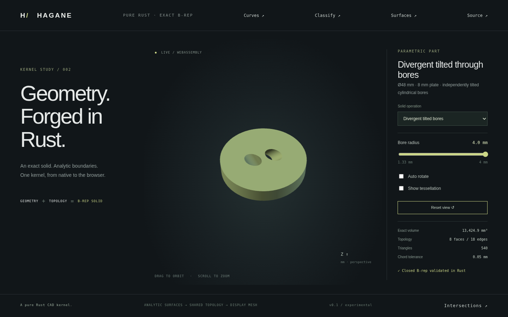

# Independently tilted cylindrical through bores



`tilted_bores_demo_solid` now accepts different bore inclinations about Y when
an analytic certificate proves that each pair stays separated throughout the
plate height. This extends the earlier [parallel-bore construction](ellipse-separation.md).
All surfaces, ellipse rims, shared oriented edges and harmonic pcurves remain
exact B-rep geometry. Display tessellation follows validation; no mesh CSG is used.

## Full-height separation certificate

A bore's horizontal section at height z has center
`(cx + z*tan(tilt), cy)` and semiaxes `(r/cos(tilt), r)`.
For fixed unit XY direction `(nx,ny)`, the exact projection radius is
`hypot(nx*r/cos(tilt), ny*r)` and does not vary with height. The projected
center difference is affine in z. If the same signed separation exceeds the
sum of projection radii at both endpoints `z=±H/2`, the same gap holds at every
intermediate height. This supplies a separating plane between the
whole trimmed cylinders, even when their axes are nonparallel. The midpoint
between the projected boundary intervals is affine in z and defines this plane;
it need not be vertical.

The implementation tries 64 directions starting with the mid-height center
direction. Each accepted direction proves separation of continuous analytic
geometry; these are not 64 sampled heights or boundary points. Gaps must exceed
20 linear tolerances plus arithmetic margins. Failure is an explicit unsupported
error. Some valid separated configurations require more sophisticated separating
surfaces and remain unsupported. End-cap separation alone never authorizes a
solid: crossing axes can leave disjoint holes at both caps but intersect inside.

Each tool independently satisfies conservative outer-cylinder clearance for the
whole height. Final B-rep validation also checks cap containment/separation,
shared edge orientation and pcurve coherence. The original limits remain:
finite resolved positive dimensions; tilt about Y in [-pi/3,pi/3]; at most sixteen
holes; conservative normalized enclosing-circle outer containment. General
curved Boolean operations, intersecting bores and arbitrary tilt azimuths remain
unsupported. Arbitrary rigid placement of the completed solid is supported.

## Demo

```sh
cargo run --example divergent_tilted_bores -- 0.7 3
cargo run --example part -- 27
./scripts/build-web.sh
python3 -m http.server 8000 --directory web
```

Select **Divergent tilted bores** in the main web demo. The 48 mm diameter,
8 mm high plate has two bores centered at Y=±5 mm and tilted ±0.7 radians.
Their radius slider covers 1.33–4 mm. Orbit, zoom and wireframe use the actual
B-rep-derived display mesh. Preset 27 accepts control values 8–24 and divides
by six to obtain the tool radius. The native cap-query example uses 3 mm radii
and centers Y=±4 mm. Its WASM equivalent is
`hagane_divergent_tilted_bores_demo(tilt, offset)`.

For N nonintersecting bores the exact volume is
`pi * (R² - sum(r_i² / cos(tilt_i))) * H`; the two-bore fixture has eight faces
and eighteen shared edges. Native tests independently verify volume,
classification across the height, microscopic dimensions and mesh volume, and
reject internally crossing, touching and near-touching tools. WASM checks use
independent cap roots and volume plus native geometry parity, invalid inputs
and recovery. Browser tests exercise the new solid, radius controls and orbit.
The image above is captured from this implementation.

## Provenance

The certificate follows direct plane/cylinder substitution, the maximum of a
sine/cosine linear combination and the endpoint bound of an affine function.
The implementation is independent pure Rust, adds no dependencies, and uses
no OCCT source. Original code is MIT OR Apache-2.0; see [references](references.md).
