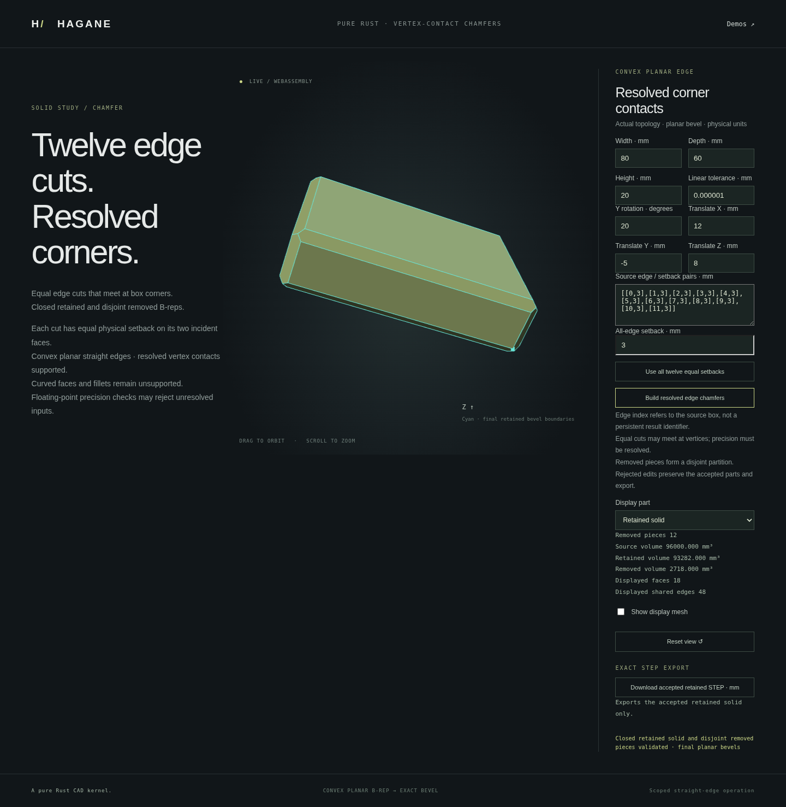

# Vertex-contact planar edge chamfers

A dedicated contact-capable API supports resolved intersections of multiple
original-edge bevel planes, including all twelve equal-setback box edges.
It clips actual convex planar B-reps using globally shared source vertices and
cached edge intersections. It returns the retained solid, sequentially disjoint
removed solids and actual final trimmed bevel faces. Display follows construction;
there is no mesh Boolean.



```rust
use hagane::*;
let tol = GeometryTolerance::new(1e-6, 1e-10, 0.)?;
let source = make_box(BoxSpec {
    min: Point3::new(0., 0., 0.),
    size: Vec3::new(80., 60., 20.),
}, tol.absolute())?;
let selections: Vec<_> = (0..12).map(|edge| (edge, 3.)).collect();
let result = chamfer_straight_convex_edges_with_vertex_contacts(
    &source, &selections, tol,
)?;
result.solid().validate(tol.absolute())?;
let step = export_step_mm(result.solid(), tol.absolute())?;
Ok::<(), hagane::Error>(())
```

The example has 32 vertices, 48 edges and 18 faces: six rectangular source
faces and twelve hexagonal bevel faces. For dimensions L,W,H and setback d
below half the smallest dimension, retained volume is
`L*W*H - 2*d*d*(L+W+H) + 6*d*d*d`. The corner-overlap correction prevents
counting material removed by several tools more than once. At 80×60×20 mm
and d=3 mm, retained volume is 93,282 mm³ and removed volume is 2,718 mm³.

## Precision and supported domain

The original solid must satisfy the isolated chamfer's strict convex planar
straight-edge domain. Each selected original edge has two incident faces, and
its individual plane must isolate that edge before any cuts. The core allows
1–64 unique original edge selections. Indices are not persistent references
across edits to the source topology.

The contact splitter is internal to this dedicated chamfer API; it does not
widen the generic transverse plane splitter or the original multiple-chamfer
entry point. Those APIs retain their existing contact refusal.

For each cut, a conservative binary64 arithmetic allowance includes geometry
scale and all relevant world coordinates and surface origins. Vertices in the
arithmetic contact band retain their actual coordinates. A nearby witness on
**both** sides must be available on incident edges; along-edge displacement
bounds reserve part of the linear tolerance. Strict edge crossings receive a
separate conditioning bound. This rejects shallow-angle amplification even
when the apparent normal gap is tiny. Gaps outside the arithmetic contact
band but inside the modeling near-plane band are rejected.

Clipping shares intersection coordinates across every incident face. Directed
cut-boundary edges cancel opposite internal uses and form one simple cycle;
branches, multiple cycles and unresolved geometry fail explicitly. Degenerate
faces are omitted only after exact binary64 orientation predicates establish
collinearity. Final sewing checks shared edges, orientation, pcurve agreement,
positive volume and conservation. The generated-sewing path reconciles only
its existing arithmetic allowance; contacts are not cleared by perturbing input
vertices. These are conservative engineering admission checks, **not** interval
certification or a certified Hausdorff bound.

Curved faces, holes, concavity, coplanar subdivisions, vanished bevels,
non-crossing/collapsing cuts, insufficient precision and resource exhaustion
return errors without publishing an intermediate result. The internal splitter
limits work to 512 faces and 4,096 face corners. General chamfers and fillets
remain future work.

## Running the demo

Build with `scripts/build-web.sh`, serve `web` as described in the README, and
open `edge-chamfer-contact.html`. Edit source edge/setback pairs or populate all
twelve equal setbacks, inspect retained/removed solids, orbit/zoom and download
the accepted retained solid as exact AP214 STEP. Rejected edits preserve the
accepted display and export.

`cargo run --example edge_chamfer_contact --locked` emits actual geometry JSON.
The optional flattened numeric JSON argument uses `[width, depth, height,
y_rotation_radians, tx, ty, tz, linear_tolerance, count]`, followed by `count`
`[original_edge_index, setback]` pairs. The demo allows 1–12 integer indices
0–11, at most 33 finite numbers, and millimetres for lengths.

## Independent validation

Owner and independent tests verify the all-edge analytic volume, actual
half-space containment and convex face rings, shared coedge/pcurve identity,
final bevel faces, arbitrary rigid placement and reverse-order physical
geometry. Display review checks all thirteen solids, cut-plane seam area
balance, STEP reimports and hundreds of analytic material/removed probes.
Dedicated guard tests reject shallow-angle normal-gap amplification, unstable
strict crossings and far-origin cancellation. The original API's equal-contact
rejection remains covered by its unchanged regressions.

The full native suite passes 813 tests, including ten new owner, internal
conditioning and independent contact-chamfer tests. Formatting, strict
all-target clippy and the wasm32 build also pass.

The complete WASM regression suite passes against the same frozen build,
including default, posed and reversed all-edge native JSON/STEP byte parity,
independent volume and supporting-plane checks, disjoint removed probes,
transport/precision rejection and all unchanged legacy cases.

The complete browser regression suite also passes, including all-edge and
legacy chamfer geometry, exact accepted STEP, rejected-edit preservation,
orbit/zoom and mobile layout. An earlier full run was killed by the operating
system for memory exhaustion. Screenshot preservation now uses the same exact
byte comparison with concise failure diagnostics; the rerun passed every
route, including the previous termination point.
