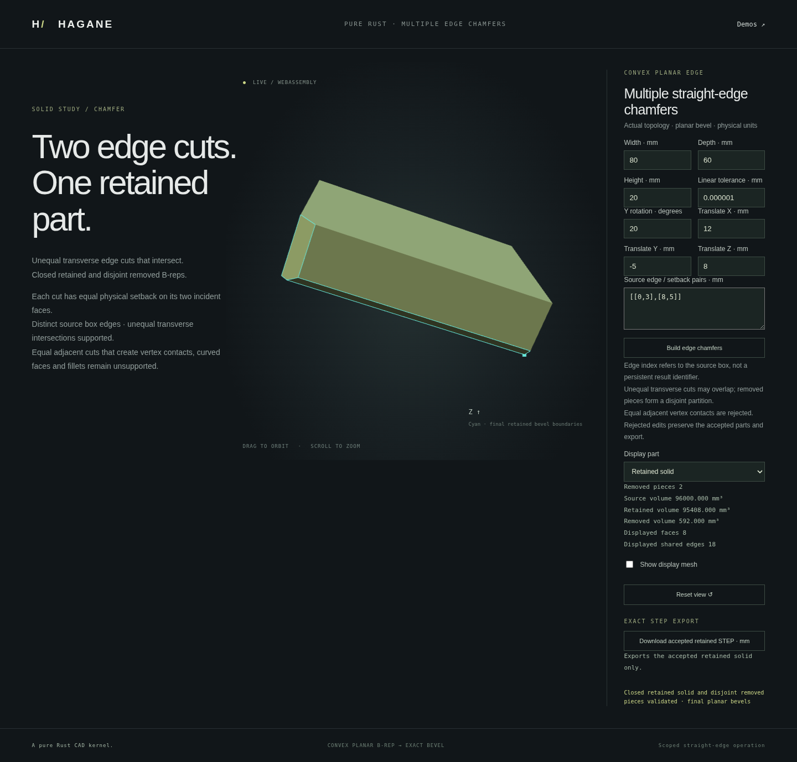

# Transverse multiple planar edge chamfers

Hagane intersects several original-edge bevel half-spaces in a convex planar
solid. Each cut operates on the retained B-rep; each removed piece is a closed
solid with an interior disjoint from previously removed pieces. The returned
bevels are actual final faces, trimmed by subsequent cuts, rather than obsolete
intermediate sections. Display is generated after B-rep construction.



```rust
use hagane::*;
let tol = GeometryTolerance::default();
let source = make_box(BoxSpec {
    min: Point3::new(0., 0., 0.),
    size: Vec3::new(80., 60., 20.),
}, tol.absolute())?;
let result = chamfer_straight_convex_edges(&source, &[(0, 3.), (8, 5.)], tol)?;
result.solid().validate(tol.absolute())?;
let step = export_step_mm(result.solid(), tol.absolute())?;
Ok::<(), hagane::Error>(())
```

For this box, the two individually removed wedges have volumes 360 and
250 mm³. Their overlap is 18 mm³, giving 592 mm³ removed and 95,408 mm³
retained. Sequentially removed pieces count that overlap only once.
The final retained mathematical intersection is independent of cut order;
removed-piece decomposition and output topology indices may depend on order.

## Scope

The core accepts 1–64 unique edge indices of the original input solid with
positive finite physical setbacks. Each plane must satisfy the single-edge
chamfer's strict convex planar/straight-boundary and original isolation guards.
The supplied indices identify original edges, not edges of intermediate solids,
and are not persistent references after subsequent edits.

Cuts must intersect every intermediate solid transversely, separated from
existing vertices by the splitter's tolerance guard. Vanished bevels, duplicate
selections, collapsing cuts, curved/concave/holed inputs and insufficient
precision are rejected transactionally, without publishing intermediate results.
**Equal-setback adjacent box edges and all 12 equal-setback box edges remain
unsupported**, because their next plane passes through an existing cut vertex.
This limitation is explicit; near contacts are not nudged into apparent success.
The separate [contact-capable API](edge-chamfer-contact.md) now handles resolved
vertex contacts; this transverse entry point keeps its narrower contract.

The browser supports 1–12 selected box edges, actual retained/removed-piece
views, final bevel overlays and exact accepted-solid AP214 STEP downloads.
Rejected edits preserve the accepted geometry and export. Build with
`scripts/build-web.sh`, serve `web` as described in the README and open
`edge-chamfer-multi.html`.

`cargo run --example edge_chamfer_multi --locked` produces actual geometry JSON.
Its optional numeric JSON argument consists of `[width, depth, height,
y_rotation_radians, tx, ty, tz, linear_tolerance, count]`, followed by `count`
`[original_edge_index, setback]` pairs (flattened). The demo allows integer
indices 0–11 and a total of at most 33 numbers. Lengths use millimetres.

## Independent checks

For adjacent setbacks a,b, let m=min(a,b). The shared corner volume is
`a*b*m - (a+b)*m*m/2 + m*m*m/3`. Independent tests compare the actual retained
volume with the two analytic wedges minus this overlap; they also verify
closed opposing coedges, pcurve geometry, a genuinely trimmed final bevel,
reverse-order physical geometry, skew solids and rigid placements.

For future contact-aware all-edge support, the independent equal-setback box
oracle is `L*W*H - 2*d*d*(L+W+H) + 6*d*d*d`, for d below half the smallest
dimension. This oracle does not imply that case is currently supported.

The full native suite passes 803 tests, including nine new owner and
independent multi-chamfer tests. Formatting, strict all-target clippy and
the wasm32 build pass. Independent display review also checks final bevel
areas, shared seam partitions, point classification against analytic
half-spaces and STEP reimports. Display closure uses unique actual B-rep
vertex matching within an arithmetic guard, then strict two opposing
incidences per mesh edge; raw bitwise equality is not assumed.

The complete WASM regression suite passes against the same frozen build,
including native report/STEP byte parity, overlap and order-independent
retained geometry checks, and explicit contact/count/late-cut rejection.

The complete browser regression suite passes, including actual multi-chamfer
views and downloads, independent overlap volume, reverse-order geometry,
rejected-edit preservation, placement, orbit and mobile layout. The screenshot
records the actual running implementation.
