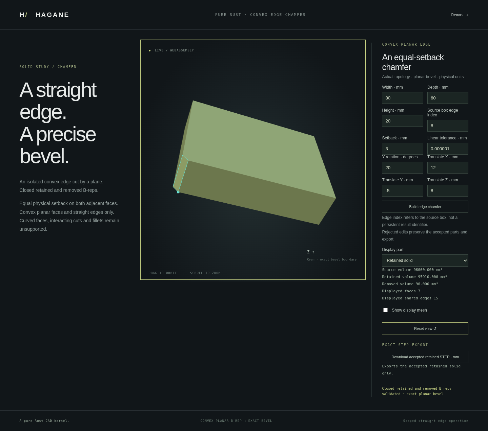

# Isolated planar edge chamfer

Hagane creates an equal-setback chamfer by splitting an actual convex planar
B-rep with a bisector plane. Both retained and removed parts are closed solids;
the bevel carries shared straight edges and planar pcurves. Display triangulates
these solids after construction. No mesh Boolean is used.



Run `scripts/build-web.sh`, then serve `web` as described in the README and open
`edge-chamfer.html`. Select a box edge, change the setback, orbit/zoom the result,
switch between retained and removed material, and download the accepted solid
as exact AP214 STEP. Rejected edits preserve the accepted display and export.

```rust
use hagane::*;
let tol = GeometryTolerance::default();
let source = make_box(BoxSpec {
    min: Point3::new(0., 0., 0.),
    size: Vec3::new(80., 60., 20.),
}, tol.absolute())?;
let cut = chamfer_straight_convex_edge(&source, 0, 3., tol)?;
cut.solid().validate(tol.absolute())?;
let step = export_step_mm(cut.solid(), tol.absolute())?;
Ok::<(), hagane::Error>(())
```

`cargo run --example edge_chamfer --locked` emits actual geometry and STEP JSON.
Its optional ten-number JSON argument is `[width, depth, height, edge_index,
setback, y_rotation_radians, tx, ty, tz, linear_tolerance]`; dimensions and
translations use millimetres. The box demo accepts integer edge indices 0–11.
The core accepts an index in its supplied solid; indices are not persistent
selection identifiers across later operations.

## Supported scope and rejection

All faces must be planar, all boundaries straight, with one simple wire per
face and strict convex supporting planes. The selected edge has exactly two
incident faces. Setback measures physical distance from the original edge on
both incident faces, rather than bevel width. The cut must isolate the selected
edge's two endpoints and remain separated from every other vertex. Arbitrary
rigid placements and resolved convex skew solids are supported; successive
isolated cuts may also satisfy these conditions.

Curved faces/edges, holes, concavity, coplanar face subdivisions, touching or
interacting cuts, collapsed corners, unresolved angles and insufficient
floating-point precision return explicit errors. Positive finite dimensions,
setbacks and tolerances are required. This is not a general chamfer or fillet
operator. Precision guards are conservative engineering bounds, not interval
certification.

For a rectangular box edge of length L and setback d, removed volume is
`L*d*d/2`; bevel width is `sqrt(2)*d`. Independent tests verify these values,
non-right-angle wedge volume, shared coedge orientation and pcurve identity,
small dimensions, pose invariance, sequential cuts and rejection without
source mutation. Native/WASM tests compare actual reports and STEP bytes;
browser tests exercise accepted-state recovery and real downloads.

## Verification

The full native suite passes 794 tests, including 11 new owner and independent
chamfer tests. Formatting, strict all-target clippy and the wasm32 build pass.
Planar display evaluates face coordinates separately: shared vertices need not
be bitwise identical. Closure checks match each display vertex uniquely to an
actual B-rep vertex within an explicit `4096*EPSILON*world_scale` arithmetic
guard, then require exactly two opposing incidences per mesh edge.

The complete WASM suite also passes against the same frozen build, including
all 12 box edges and four placed cases, native report/STEP parity and all
existing regressions.

The complete browser regression suite passes, including all edge selections,
accepted STEP downloads, invalid-edit preservation, posed geometry, orbit/zoom
and mobile layout. The screenshot above records the actual running demo.
