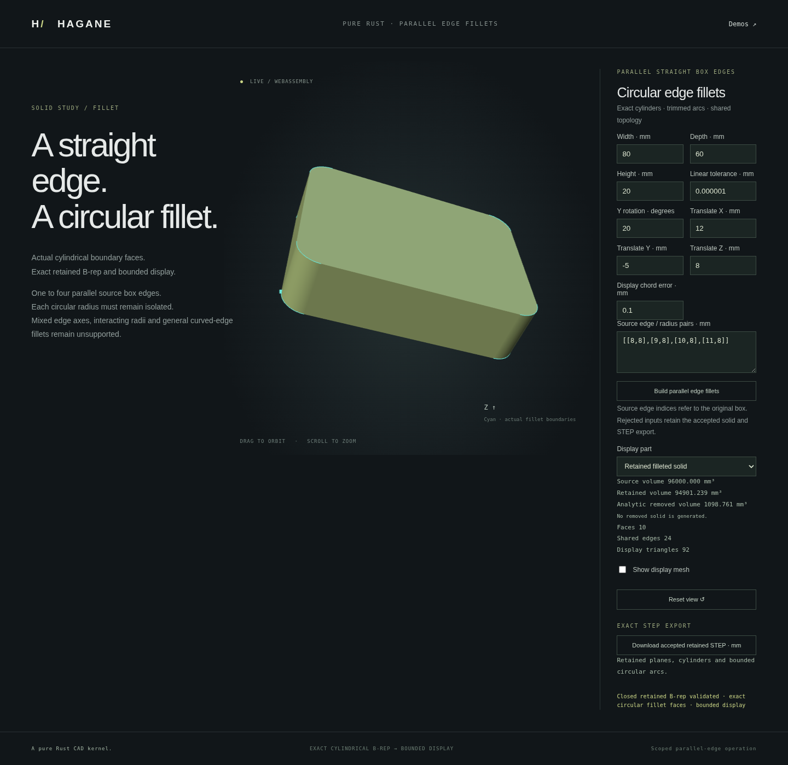

# Parallel box-edge fillets

Hagane replaces selected parallel edges of an actual checked orthogonal box
B-rep with tangent circular fillets. The retained solid has exact circular
arcs, trimmed cylindrical surfaces, shared oriented edges and surface pcurves.
The browser mesh is generated from that B-rep.



The capture shows four radius-8 mm fillets on an 80 × 60 × 20 mm box,
rotated 20 degrees about Y and translated by (12, -5, 8) mm.

## Native API

```rust
use hagane::*;

let tolerance = GeometryTolerance::new(1e-6, 1e-10, 0.0)?;
let source = make_box(
    BoxSpec {
        min: Point3::new(0.0, 0.0, 0.0),
        size: Vec3::new(80.0, 60.0, 20.0),
    },
    tolerance.absolute(),
)?;
let rounded = fillet_parallel_box_edges(
    &source,
    &[(8, 3.0), (9, 3.0), (10, 3.0), (11, 3.0)],
    tolerance,
)?;
rounded.solid().validate(tolerance.absolute())?;
let step = export_step_bounded_analytic_mm(rounded.solid(), tolerance.linear())?;
# Ok::<(), hagane::Error>(())
```

`ParallelBoxEdgeFillets` exposes its retained solid, original edge/radius
selections, actual cylindrical face indices and direct analytic removed
volume. Its fields are private; `into_solid` transfers the retained body.
Indices identify the input topology or this result, rather than persistent
feature IDs. The input is never modified after a rejected request.

## Supported domain

The source must validate as a closed solid with eight vertices, twelve unique
straight cube edges and six outward planar quadrilateral faces. The operation
recovers a right-handed orthogonal frame from actual incident edges and checks
all corners, edges and supporting faces. Rigid placement and any of the three
parallel edge families are supported. One to four distinct original edges
must belong to the same family. Radii may differ.

Every radius must exceed ten times the scale-aware tolerance band. The sum
of neighboring corner radii must leave a straight boundary longer than ten
bands. Touching radii, collapsed segments, mixed edge families, skew boxes,
curved or already filleted sources, arbitrary polyhedra and unresolved
precision are rejected. This is a scoped circular fillet operation; general
edge fillets, blends between intersecting fillets and variable radii remain
future work.

Frame recovery reserves a physical displacement budget, including angular
drift multiplied by the model extent. Arithmetic guards include source plane
origins and world coordinates. Recognition checks use a fraction of the
linear tolerance rather than silently repairing a distorted input.

## Actual geometry and volume

In the recovered transverse rectangle, each selected corner is replaced by
a tangent quarter circle. Straight profile segments join the circular arcs.
Extrusion along the selected edge axis creates actual planar and cylindrical
faces with shared analytic boundaries and pcurves.

For transverse dimensions `W`, `D`, selected edge length `L`, and selected
radii `r_i`, the removed volume is

```text
L * (1 - pi/4) * sum(r_i * r_i)
```

The retained volume is `W * D * L` minus this value. With `k` selected edges,
the result has `8 + 2k` vertices, `12 + 3k` edges and `6 + k` faces. The four
default radius-3 fillets on an 80 × 60 × 20 mm box therefore produce a
16-vertex, 24-edge, 10-face solid.

Removed volume is calculated directly, without subtracting nearly equal
solid volumes. A removed-body B-rep is **not returned**: the corner offcuts
have cusp boundaries outside the current mixed-profile domain. The browser
shows source and retained solids and labels removal as an analytic volume.

## STEP and display

The separate `export_step_bounded_analytic_mm` writer exports validated
analytic solids with lines, circles and supported bounded circular arcs;
surfaces are planes or rectangular trimmed cylinders. It preserves actual
shared edge uses and two-dimensional pcurves using `SURFACE_CURVE`, and
periodic seams use `SEAM_CURVE`. Circular geometry is represented by `CIRCLE`,
with finite edge endpoints defining its bounded span.

Canonical B-rep arc validation currently admits positive sweeps up to pi.
Clockwise input profile arcs use their canonical oriented circle frame.
Negative/long invalid B-rep arcs, unresolved endpoints and unsupported
geometry are rejected. The original `export_step_mm` and planar writer keep
their prior domain and output. The original strict STEP importer does not
import these bounded circular edges. The separate opt-in
[bounded analytic reader](step-bounded-import.md) now supports checked
line/arc normal-extrusion round trips, including these fillets.

The display chord tolerance controls arc subdivision. For radius `r` and
segment angle `a`, radial chord error is `r * (1 - cos(a/2))`. Display tests
check actual face geometry and shared boundary samples. These are engineering
tolerance checks, not interval-certified geometry or a general tessellation
certificate.

## Running the demo

Build with `scripts/build-web.sh`, serve `web` as described in the README,
and open `edge-fillet.html`. Edit edge/radius pairs, display chord tolerance
and placement, inspect source or retained geometry, and orbit or zoom.
STEP download uses the accepted retained solid. Rejected edits preserve the
accepted geometry and export.

`cargo run --example edge_fillet --locked` emits actual geometry JSON.
Its optional flattened numeric JSON argument is
`[width, depth, height, y_rotation_radians, tx, ty, tz, linear_tolerance,
display_chord_tolerance, count]`, followed by exactly `count`
`[original_edge_index, radius]` pairs. The demo accepts one to four integer
edge indices 0–11, at most eighteen finite numbers. Lengths use millimetres.

## Validation

Owner and independent tests exercise all fifteen nonempty subsets of each
parallel edge family, arbitrary rigid placement, actual analytic volume,
quarter-circle geometry, cylindrical area, tangency, pcurve identity and
opposed shared coedges. Display review checks closed meshes using actual edge
parameters, radial chord errors and dense samples of cylinder triangles.
Invalid topology, nonorthogonal stock, contacting radii, mixed axes and
unresolved precision are explicit rejection cases.

The full native suite passes 823 tests, including ten new core, independent
display/geometry, demo and bounded-analytic STEP tests. Formatting, strict
all-target clippy and the wasm32 build also pass against the frozen source.

The full WASM regression suite passes on the same frozen build. Twenty fillet
cases cover all subsets, three axis families, placement and reversed selection
order with whole native JSON/STEP parity. Independent geometry checks include
actual pcurve attachments, tangency, analytic volume, closed meshes and dense
triangle checks against reported chord bounds. Invalid model/count/cast,
contact, display precision and transport inputs reject and recover correctly.

The complete browser regression suite passes against the same build, including
source/retained switching, one-to-four selections, actual native STEP download
parity, rejected-edit byte preservation, orbit/zoom and mobile layout. The
capture above comes from the tested implementation.

An optional interoperability review imports four actual exported fixtures
with the cached `occt-import-js` reader, in millimetres and metres. Eight
imports preserve expected planar/cylindrical face geometry, closed opposed
mesh edges and volume within chord/float32 allowances. This external reader
is a test oracle with its existing recorded licensing, not a kernel dependency
or proof of general STEP compatibility.
