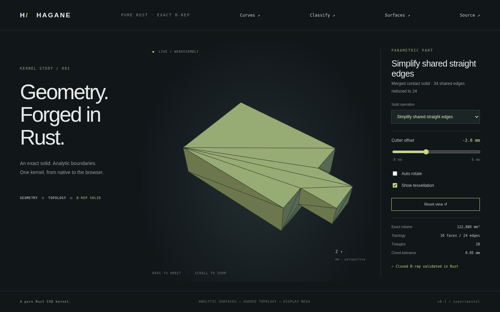

# Shared straight edge simplification



`simplify_straight_edges(&solid, GeometryTolerance)` removes redundant degree-two
vertices from exact straight boundaries and rebuilds their shared edges and
pcurves. It returns a validated `Solid` and leaves the input unchanged. Apply it
after [coplanar face merging](face-merge.md) to remove leftover subdivisions.

## Supported domain

Inputs must be geometrically valid, closed planar straight-edge B-reps with at
most 512 faces and 4096 coedges. A vertex is eligible only when:

- It has exactly two incident edges, sharing the same pair of incident faces.
- Its three-dimensional point is exactly collinear with the other endpoints,
  verified by exact orientation predicates in XY, XZ and YZ projections.
- It lies strictly between those endpoints.
- It occurs consecutively in both incident face wires. Their affine UV boundaries
  meet exactly at the knot, are exactly collinear and do not backtrack.

Corners, branches, intersections of three faces, distinct supporting edges and
nearly collinear knots remain. No tolerance snapping or approximate straightening
is performed. Rigid placement can round a formerly collinear binary64 knot off
the exact line; such knots conservatively remain. Simplify before placement when
minimal topology is needed. Curved input and invalid topology return errors.

## Shared reconstruction and checks

Select eligible vertices globally, so both incident face wires remove the same
knots. Rebuild each retained boundary chain as a shared `Curve::Line` with its
original outer endpoint positions. Coedge direction follows the owning edge's
orientation. New affine pcurves join the original chain's UV endpoints in each
face's own frame; unchanged single edges retain their original geometry/pcurves.
Unused vertices and old edges are removed. Outer and inner wires remain distinct.

The result must validate plane trims, pcurves, endpoint agreement, opposite
signed edge uses, vertex links and closed connectivity. Exact bounds, face count
and analytic volume (relative `1e-10`) remain unchanged. Edge/vertex counts cannot
increase; a second simplification preserves topology counts. This is a geometric
B-rep operation, with display triangulation performed afterward. It does not
perform mesh simplification, healing or curved edge merging.

## Example and browser demo

```rust
use hagane::*;
fn main() -> Result<()> {
    let a = BoxSpec { min: Point3::new(0., 0., 0.), size: Vec3::new(4., 4., 4.) };
    let b = BoxSpec { min: Point3::new(4., 0., 0.), size: Vec3::new(4., 4., 4.) };
    let policy = GeometryTolerance::default();
    if let BoxBooleanResult::Solid(part) =
        boolean_boxes(a, b, BoxBooleanOperation::Union, policy)? {
        let merged = merge_coplanar_faces(&part, policy)?;
        let simplified = simplify_straight_edges(&merged, policy)?;
        assert_eq!(simplified.shell.faces.len(), 6);
        assert_eq!(simplified.edges.len(), 12);
        assert_eq!(simplified.vertices.len(), 8);
    }
    Ok(())
}
```

```sh
cargo run --locked --example edge_simplify -- -2
cargo run --locked --example part -- 20
cargo test --locked --test edge_simplify
./scripts/build-web.sh
python3 -m http.server 8000 --directory web
```

Select **Simplify shared straight edges**. The previous contact fixture retains
its exact volume **122880 mm³** and **10 faces**, while shared edges decrease from
**34 to 24**. The attachment-position slider runs the same modeling sequence in
native Rust and WASM.

Tests cover minimal box topology, preserved feature corners/face branches,
annular planar caps, concave contact boundaries, classification equivalence,
closed outward mesh triangles, translated/tilted models, tiny dimensions,
idempotence and rejected curved/invalid input. Native/WASM parity covers four
fixture offsets plus errors/recovery. Browser tests exercise all 21 solid presets
and capture the actual WASM rendering above.
