# Explainable editable stock-and-bore workflow

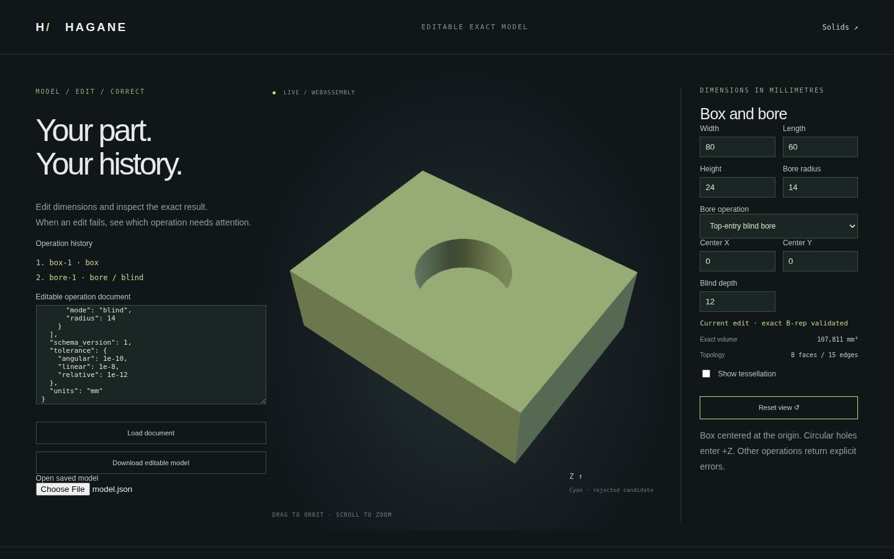

Open `web/workflow.html` after building the WASM module, or choose **Edit model**
from the main demo. Change width, length, height, tool center, radius and blind
depth. The same pure Rust kernel rebuilds and validates the exact B-rep. Switch
between through and top/bottom-entry flat-bottom blind bores. **Add bore** appends a
new machining operation; **Edit bore** selects a history node. Editing an earlier
hole preserves the later cuts. **Remove selected bore** removes that node and
relinks the remaining chain. The Stock only option removes the selected bore.

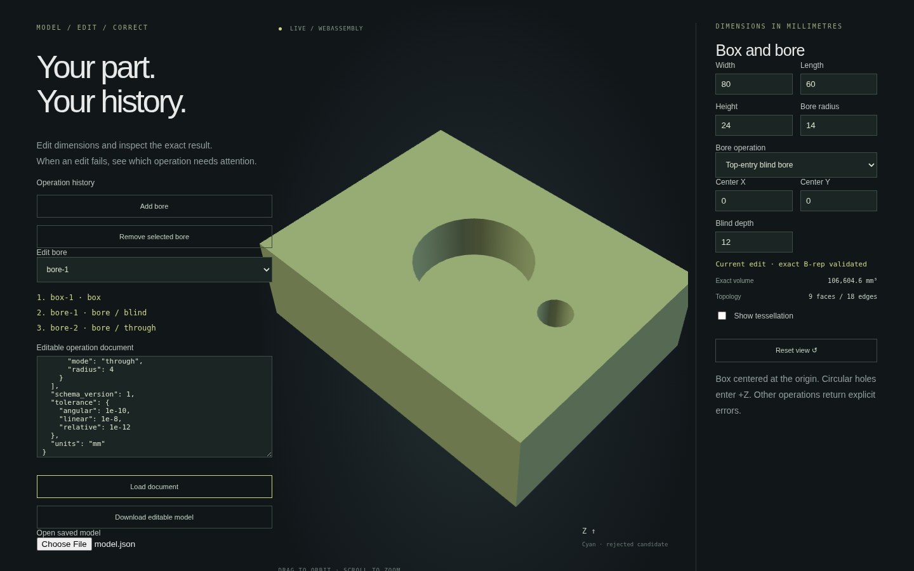

When a tool reaches a side or breaks through the floor, the report identifies
its operation ID and relevant parameters, measures the clearance, states the
required tolerance margin and suggests an appropriate parameter change. Cyan
outlines mark the rejected candidate tool. They are a display aid, not the result
of a CAD operation. The previous validated solid remains visible, explicitly
labeled **previous valid result**; no replacement mesh is returned as success.
Correcting the edit rebuilds the model without discarding the editable history.

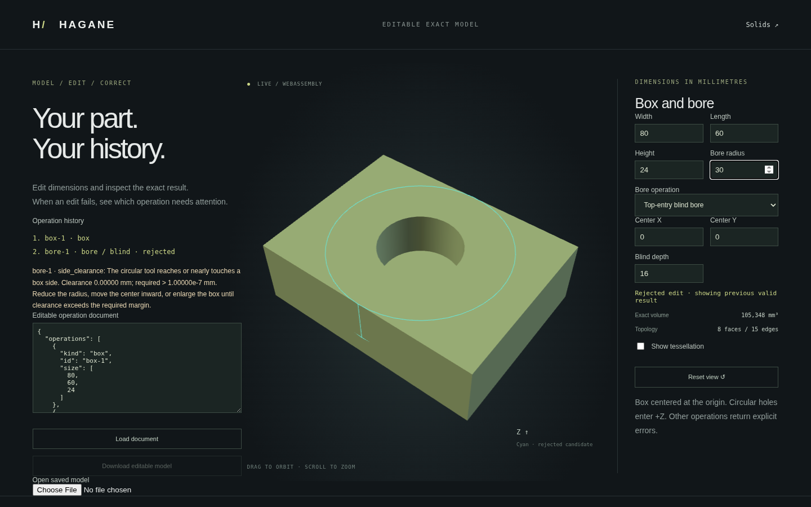

## Save and rebuild modeling intent

**Download editable model** saves the current validated operation document.
**Open saved model** or **Load document** reconstructs and validates the exact
shape, then restores its dimensions and operation IDs. Invalid imports retain
the prior valid result and report the failure. Download is disabled after a
rejected edit; typing into the document editor requires explicit **Load document**.
The exported document stores modeling intent, not mesh geometry or a B-rep
interchange representation. The kernel constructs the B-rep again on load.

```sh
./scripts/build-web.sh
python3 -m http.server 8000 --directory web
cargo run --example workflow -- docs/workflow-example.json
```

The native library exposes `WorkflowDocument::rebuild()` for the exact solid
and `evaluate_workflow_json(text)` for a serialized report. The default
[operation document](workflow-example.json) is independently usable by both
native and WASM. Angular/relative/linear tolerance policy is stored and checked;
the existing box/polygon paths use its linear component. Rounded-box fillets
and normal bores additionally enforce the stored angular/relative policy.

## Version 1 domain

- Explicit `schema_version: 1` and `units: "mm"` are required. Other versions
  or units are rejected; values are not silently converted.
- History has one centered axis-aligned `box` or `rounded_box`, or world-XY
  `extrusion` or `arc_line_extrusion` operation. Box/polygon histories support
  at most 256 `bore` nodes; rounded boxes support at most 16 through bores.
  Line/arc profiles share a combined 16-opening/128-segment budget with bores. Each input references the immediately preceding operation
  ID (the stock operation for the first bore); IDs are unique and
  contain 1–64 ASCII letters, digits, hyphens or underscores.
- Box size is `[width, length, height]`. Rounded boxes additionally require
  a positive resolved `corner_radius`; blind rounded-stock cuts reject.
  Bore center is world XY in mm.
  `mode: "through"` has no depth (null is treated as absent), while `"blind"`
  requires finite positive depth entering the top/+Z cap. Through tools are
  generated with strict cap overhang, not inferred from blind depth.
- Finite resolved dimensions, strict side clearance, and retained blind floor
  thickness exceeding ten linear tolerances are required. All pairs of circular
  XY footprints must have separation greater than ten linear tolerances,
  including mixed blind/through pairs. Overlap, nesting and contact are rejected
  even if blind floors differ. No automatic repair
  or shape approximation is applied to make an edit succeed.
- Unknown fields, operations, references and duplicate JSON fields are errors.
  Malformed/nonfinite JSON numbers and invalid tolerance policies are rejected.
- Documents are at most 64 KiB. WASM input is bounded and checked UTF-8.
- Operation IDs identify history nodes, not persistent face/edge names. Side-entry/history transforms, general Boolean nodes, constraints,
  Imported STEP geometry/history and collaborative editing are not document
  operations in version 1. A separate [convex planar importer](step-import.md)
  now validates, displays and re-exports supported STEP solids.
  Supported current solids can now [export exact STEP](step-export.md), including
  through/blind circular cuts, with mm units and explicit periodic seam pcurves.
- Display uses a 0.05 mm chord tolerance and the existing browser camera. A
  model that rebuilds but cannot produce a finite valid display transport has
  a rejected display report, not an invented successful mesh.

## Diagnostics and transport

Reports contain an authoritative `ok` boolean. Successful reports include
canonical operation document and derived display mesh. Failed reports include
`diagnostic`, display-only `candidate_segments`, and, when typed parsing succeeds,
`attempted_document`; they do not contain a replacement mesh.

Diagnostic fields are category, stable code, optional operation ID/field,
message, optional suggestion, and optional measured/required clearance in mm.
Known geometric preconditions have dedicated codes such as `side_clearance`
`floor_thickness` and `bore_clearance`. The last code identifies the failed
operation and names the earlier conflicting operation, reporting their XY gap. Unrepresentable clearance is `numerically_unresolved`.
Low-level geometry failures retain their actual reason and category; the API
does not pretend to classify every existing kernel failure numerically or
invent a recovery action. Parser failures may lack a geometric operation ID.

The WASM input ABI avoids unchecked pointers: call `hagane_workflow_begin()`,
then `hagane_workflow_push_byte(byte)` for each UTF-8 byte, and finally
`hagane_workflow_finish()`. Invalid bytes or excess length latch an input error
until the next begin. Read the existing output pointer/length afterward.
A zero finish status means the report was processed; it does **not** mean the
model succeeded. Always inspect `ok`. Output transport remains valid until the
next kernel output call and must be copied before further calls.

## Verified value and remaining work

Native tests independently check box/through/blind volumes, document round trips,
IDs/references, tolerance policy, unknown schema/units/fields, malformed documents,
clearance diagnostics, rejected-mesh absence and correction. WASM checks repeat
native geometry parity and analytic volumes across dimensions, bounded/invalid
UTF-8 input and recovery. Browser checks edit dimensions, reject/correct a bore,
retain the prior model, download/import JSON, switch modes and orbit the result.
Mixed-history checks add a hole, edit an earlier depth without losing the later
cut, reject/correct pair contact, reload all nodes and remove/relink a node.
The images above capture that renderer. CI executes these existing suites.

This delivers the first scoped milestone in [product direction](product-direction.md).
It does not establish superiority over existing CAD products. User task success,
rebuild performance and comparative measurements remain future validation work.
The browser now uses an incremental `WorkflowSession` for the supported linear
history. Other operation types, persistent topology names and more precise
low-level numerical diagnostics remain planned.

Serialization uses Serde/serde_json in pure Rust; geometric modeling remains
Hagane's independent implementation. Dependency versions, sources and licenses
are in [references](references.md), with bundled
[license notices](workflow-dependency-notices.txt). Original code is MIT OR
Apache-2.0; no OCCT source was used.


## Mixed-bore native API

`subtract_box_bores(BoxSpec, &[BoxBore], Tolerance)` constructs the exact result
from the stock box and all independent tools. The
[mixed history example](workflow-multiple-example.json) is ready to import in the
browser or pass to `cargo run --example workflow -- <file>`. Each `BoxBore` stores XY center,
radius and optional depth (`None` means through). It supports up to 256 bores
and enforces the same ten-tolerance side/pair/floor margins as the workflow.
Existing single-mode APIs retain their original contracts. All result edges,
cap hole wires, cylindrical walls and blind floors use shared exact geometry
and pcurves; mesh Boolean operations are not used.


## Incremental B-rep evaluation

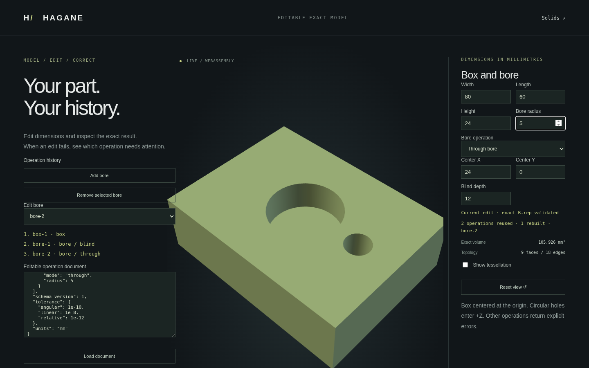

`WorkflowSession` retains a validated exact solid after each accepted operation.
An edit compares the new history with the last accepted document and reuses the
longest unchanged prefix. Only the changed node and following nodes append new
exact B-rep geometry. Stock, units, schema or any tolerance-policy change prevents
prefix reuse (unsupported units/schema still fail). IDs and input references
participate in the comparison; renamed nodes are rebuilt conservatively.
Identical reloads and removing a suffix reuse the existing solid directly.
Removing an interior node relinks the chain and rebuilds the remaining suffix.

All parameter, reference, containment and pair-separation checks still run on
each request. Invalid inputs and failed geometry construction leave the accepted
snapshots intact. `evaluate_json` also stages cache changes until display
sampling/JSON succeeds, so a display-budget failure cannot replace the cache.
Returned geometry uses `Arc<Solid>`; mutating a caller-owned copy cannot corrupt
the session snapshots. `reset()` releases the session's snapshots.

```rust
use hagane::{WorkflowDocument, WorkflowSession};
let document: WorkflowDocument = serde_json::from_str(
    include_str!("../docs/workflow-multiple-example.json")
).unwrap();
let mut session = WorkflowSession::new();
let first = session.rebuild(&document).unwrap();
assert_eq!(first.stats.rebuilt_operations, 3);
let same = session.rebuild(&document).unwrap();
assert_eq!(same.stats.rebuilt_operations, 0);
```

Run `cargo run --example workflow_session` for three sequential reports (initial
build, identical reload, second-hole edit). Alternatively pass several JSON file
paths to evaluate them in order in one session. Successful incremental JSON
reports add `rebuild` with `reused_operations`, `rebuilt_operations`, and
`rebuilt_operation_ids`. These count actual stock/tool geometry evaluations;
they are not timings, display-cache counts or performance-comparison results.
Failed reports omit `rebuild` and replacement mesh. Browser statistics distinguish
an accepted rebuild from a rejected edit retaining the previous cache.

The stateless `WorkflowDocument::rebuild`, `evaluate_workflow_json` and WASM
`hagane_workflow_finish` preserve their existing API/report behavior. Incremental
WASM clients use the same bounded begin/push-byte input, then
`hagane_workflow_finish_incremental`; `hagane_workflow_reset_session` drops cached
history. One session belongs to each WASM instance. Documents contain no cached
geometry and still rebuild independently in native code or another browser.

This is geometry-construction reuse for a scoped linear history, not a general
constraint or dependency-graph solver. Complete input validation, topology
validation on newly built prefixes and final display tessellation are still
performed; there is no incremental mesh cache or performance superiority claim.
The session holds at most 257 prefix snapshots, with cumulative topology storage
quadratic in the number of holes. It has no persistence across page reloads or
cache of older edit branches. Browser Undo/Redo stores documents separately and
uses the session to reconstruct them. Native/WASM tests compare incremental results to fresh exact
rebuilds, exercise failure recovery and reset, and verify the rebuilt IDs. Browser
tests check the displayed counts, earlier/later edits, policy/stock invalidation
and cached suffix removal.


## Undo and redo browser edits

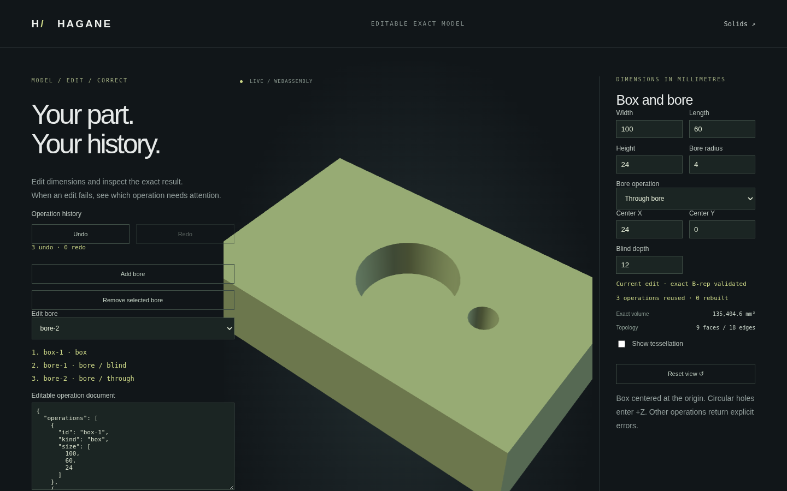

**Undo** and **Redo** restore accepted operation documents, including dimensions,
operation IDs, references and the selected bore. Dimension changes, adding or
removing a bore, and successful JSON imports all participate. Each accepted
input event is one edit; identical model reloads do not add duplicate entries.
The editor keeps up to 64 previous accepted edits in memory. Old entries are
removed when that limit is exceeded.

A rejected geometry or document edit is never added to accepted history.
While a rejected edit is visible, Undo first discards that edit and restores the
current accepted model without stepping back another accepted edit. A second
Undo steps through accepted history. Redo is disabled until the rejected edit
is discarded or corrected. A failed edit preserves an existing redo branch;
a new successful changed edit after Undo clears that branch.

Restoration sends the saved document through the same pure Rust/WASM incremental
session, validates it and regenerates its display mesh. The undo cursor moves
only after successful restoration. It does not restore a mesh as a CAD model,
skip supported-domain checks, or claim cached old geometry is available.
Rebuild statistics describe this restoration's actual geometry work.

With focus outside text, numeric or selection controls, **Ctrl/Cmd+Z** undoes
and **Ctrl/Cmd+Shift+Z** or **Ctrl/Cmd+Y** redoes. Input controls retain their
normal text-editing shortcuts. Buttons are available regardless of focus.
Unloaded text in the JSON editor is not a model edit; use Load document to apply
it. Undo/Redo does not restore camera position, unsubmitted JSON text or rejected
input text. Download still saves only the current validated modeling document,
not undo stacks. Reloading the page starts a new edit history while restoring the locally saved
current document as described below.

Browser regression checks exercise exact restored documents and volumes, bore
selection, add/remove/import recovery, rejected edits without lost redo,
branch replacement, keyboard focus and the 64-edit bound. Existing native/WASM
session parity and geometry validation remain the modeling path.


## Local autosave and recovery

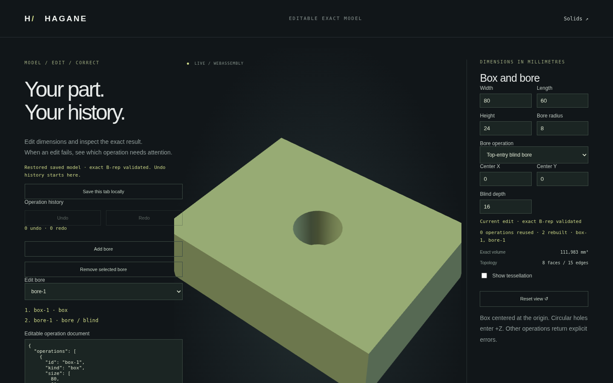

Every accepted edit saves the current operation document and selected bore to
this browser's local storage. Undo/Redo and selection changes update that saved
current model too. On page reload, Hagane reconstructs it through the same
Rust/WASM validation and B-rep tessellation; it does not trust or save a display
mesh. The restored model starts a fresh Undo/Redo history and geometry session.
Rejected edits never replace the saved accepted document.

A local wrapper uses `storage_version: 1`, `document` and `selected` under
`hagane.workflow.autosave.v1`. Unknown wrapper versions/fields, invalid selection,
malformed/oversized data and unsupported or invalid model documents are rejected.
The wrapper is bounded to 65 KiB, and the kernel document retains its separate
64 KiB input limit. Invalid saved data remains intact while the default part is
shown with a recovery message. **Save this tab locally** explicitly replaces
that data with the current validated part. Correct/discard a rejected edit before
using that button; it cannot save a failed tool as a valid model.

If another tab writes or clears the saved model, this tab keeps its current
part and pauses automatic writes. Each write also checks the last saved value,
so a missed or delayed storage event cannot silently overwrite a newer value.
Use **Save this tab locally** to choose this tab's valid model deliberately.
This is conflict detection for local tabs, not collaborative editing or an
atomic cross-tab transaction; simultaneous read/write races remain possible.

Unavailable storage or quota errors display a save failure without rejecting
a successfully constructed model. Download editable model remains available
for a portable JSON copy. Local storage belongs to the browser profile and
site origin: another browser, port or origin has a separate saved model. This
is not cloud synchronization, a backup guarantee or persistent Undo/Redo.
Browser checks cover reload/selection recovery, rejected-edit preservation,
malformed/invalid saved data, explicit recovery, competing tabs, quota failures
and storage denial without breaking modeling.


## Editable polygon extrusion and subsequent holes

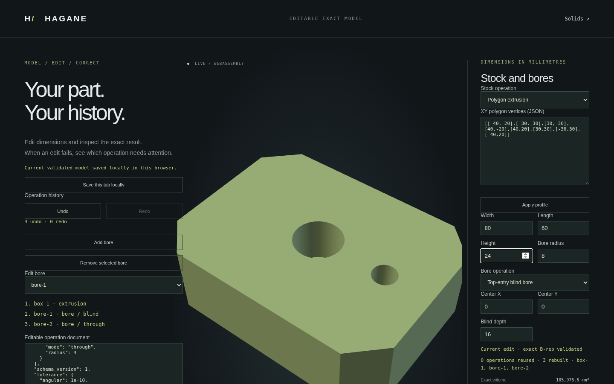

Select **Polygon extrusion** under Stock operation to replace the root box with
an eight-corner polygon using its current width/length. Select Box to explicitly
replace the polygon (including its profile openings) with a centered box of its
displayed bounding width/length.
Switching stock type changes the part geometry; it is an accepted undoable edit.
The root operation ID is preserved and bores still reference the preceding node.

For an extrusion, **XY polygon vertices (JSON)** and **Apply profile** edit the
actual boundary. Height remains editable; width/length display the profile's
bounds and are disabled. Apply profile and full-document Load pass input to the
Rust parser and kernel validation. There is no triangulated mesh used as stock.
The [extrusion example](workflow-extrusion-example.json) is ready to load in the
browser or with `cargo run --example workflow -- <file>`.

Version 1 now accepts this additional root operation:

```json
{"kind":"extrusion","id":"extrusion-1",
 "outer":[[-40,-20],[-30,-30],[30,-30],[40,-20],
          [40,20],[30,30],[-30,30],[-40,20]],
 "height":24}
```

`outer` has 3–256 finite world-XY vertices with an implicit closing edge, in
either winding. The profile may be concave but must be simple, resolved and have
no redundant corners or self-intersections. Polygon profile openings are supported as described below; curved profiles
and arbitrary-plane extrusion frames are outside this document scope. Skew
directions for polygon stock are supported as described below. Height must be positive and exceed ten linear tolerances; stock spans
Z = −height/2 to +height/2. Negative/zero heights and unknown fields are rejected.
Existing box documents keep their prior behavior and schema version.

Up to 256 independently separated top/bottom-entry blind/through bores can
follow the extrusion (see opposing-cut separation below). Each
circular footprint must lie entirely inside the polygon, with clearance greater
than ten linear tolerances from every straight boundary segment. Center-inside
classification plus nearest-segment distance checks actual concave boundaries,
not only a bounding box. Outside centers have a negative signed margin; boundary
contact, overlap, nesting and unresolved floors are rejected. `side_clearance`
identifies the failed bore and reports the measured/required margin.
`profile_rejected` identifies an invalid or unsupported typed stock profile.
Malformed JSON/coordinate types produce the existing document-parser diagnostic.

Native `subtract_polygon_prism_bores(outer, height, &[BoxBore], tolerance)` exposes
the same scoped exact operation; `BoxBore` is the shared existing center/radius/
optional-depth tool specification. The stock is created with `extrude_polygon`.
Plane cap wires share exact circle edges with inward cylindrical walls and
blind floors. Display tessellation follows B-rep validation. No OCCT source or
additional dependency is used.

Changing height or the profile invalidates the stock node and all following
cuts. A later bore edit still reuses unchanged earlier B-rep snapshots. Browser
Undo/Redo, JSON downloads/imports and local autosave include the extrusion root.
Tests cover analytic area×height minus bore volumes, both windings, tiny/large
and translated XY profiles, material under blind floors, profile/bore contact
and self-intersection rejection, incremental results equal to fresh builds,
native/WASM parity and the real browser workflow. Mesh-volume comparison uses
the circular chord-error bound; the display mesh is not treated as exact volume.


## Polygon profile openings

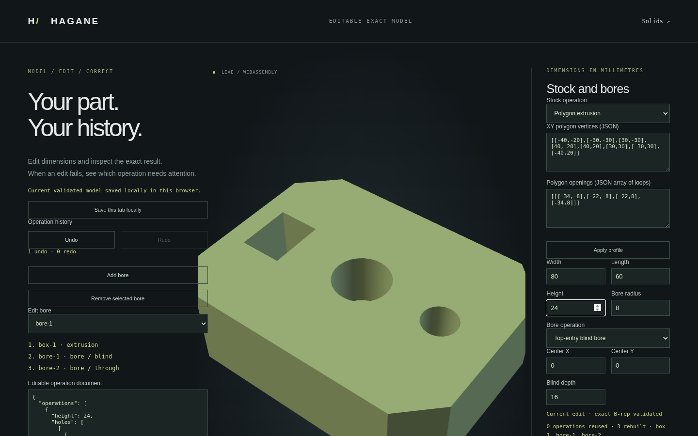

An extrusion root may now include optional `holes`, an array of simple polygon
loops in the same world-XY coordinate system as `outer`. These are through
openings in the stock profile, distinct from later bore operations. Missing or
empty `holes` preserves all existing version-1 extrusion documents; empty holes
are omitted from canonical exports. Null, malformed coordinates and unknown
fields are errors. Load the [opening example](workflow-extrusion-openings-example.json)
in the browser or native workflow example.

```json
"holes": [[[-34,-8],[-22,-8],[-22,8],[-34,8]]]
```

Use **Polygon openings (JSON array of loops)** and **Apply profile** to edit
these loops alongside the outer boundary. Each loop has at least three finite,
resolved corners and an implicit closing edge, in either winding. The stock
supports up to 64 profile openings and 256 total corners across outer/inner
loops. Loops must be strictly inside the outer boundary, mutually disjoint,
non-nested and separated by more than ten linear tolerances. Self-intersections,
duplicate/redundant corners, overlap and contact are rejected as
`profile_rejected` on the stock operation. Changing openings invalidates the
stock node and its following cuts; height and bore edits preserve openings.

A circular bore must lie in stock material and remain more than ten linear
tolerances from every outer and inner boundary. A tool inside an existing
opening, touching or crossing an opening, or enclosing an opening is unsupported.
`profile_hole_clearance` identifies the bore, gives the signed margin and required
margin, and names the conflicting profile opening by zero-based index. Failed
edits return no replacement mesh, retain the accepted cache/model and do not
replace local autosave. Correcting or Undoing them restores the prior document.

Native `subtract_polygon_region_prism_bores(outer, holes, height, bores, tolerance)`
uses the existing exact polygon-region extrusion and circular-cut construction.
The original `subtract_polygon_prism_bores` remains the empty-profile-hole
convenience API. Polygon opening side walls, cap boundaries, circular bore walls
and blind floors all use shared exact edges and surface pcurves. The displayed
mesh is generated afterward; no mesh Boolean or polygon-to-circle replacement
is used. JSON save/load, autosave and Undo/Redo preserve the actual opening loops.

Tests verify independent area-minus-openings volumes minus mixed bore volumes,
closure/orientation, material and void probes, both windings, small/large scales,
mesh-volume chord bounds, profile/opening/tool rejection, incremental cache
recovery, native/WASM equality and the browser edit/download/reload workflow.
Rounded/curved opening loops, general intersecting cuts and arbitrary-plane
extrusion nodes remain later work. Skew polygon stock is supported below. Mathematical provenance remains the planar
containment/boundary-distance references recorded in [references](references.md);
no new dependency or OCCT source was introduced.


## Skew extrusion direction in history

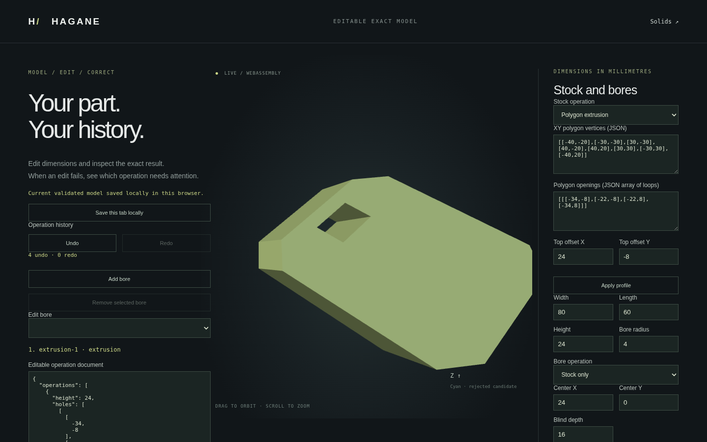

Polygon roots now accept optional `offset: [dx, dy]` in mm. The lower cap uses
the original world-XY profile at Z = −height/2; the upper cap is translated by
`[dx, dy, height]`. This specifies a skew translation, not a rotation of the
profile plane. Height remains the positive Z span, not the slanted path length.
All profile openings sweep along the same vector. Finite offsets are required;
malformed arrays/nonfinite JSON are rejected. Omitted or zero offset retains the
old vertical operation; zero offsets are omitted from canonical exports.

The native workflow reuses the existing pure Rust `extrude_polygon` direction
API, preserving exact planar caps, side walls, shared line edges and surface
pcurves. Native results also support classification, bounds and B-rep-derived
mesh generation. Volume is profile material area × height regardless of the
XY offset. The [skew example](workflow-skew-extrusion-example.json) is ready for
native evaluation and browser import.

Edit **Top offset X/Y** in the polygon controls. Direction changes invalidate
the stock node; Undo/Redo, downloads, local autosave and reload preserve direction
and profile openings. Applying profile edits also preserves offsets. Switching
to Box explicitly replaces skew stock with a centered box and clears offsets.

## Z-axis through bores in skew stock

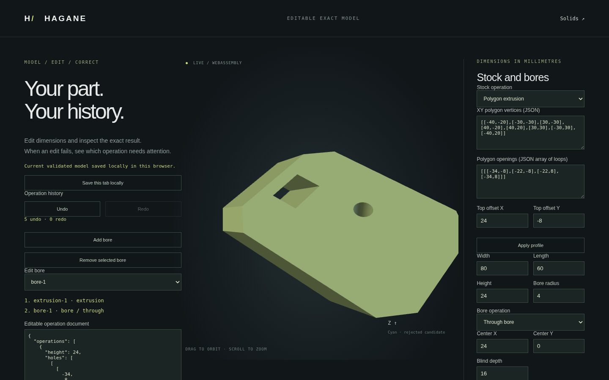

Skew polygon roots now accept disjoint `through` bore nodes. The bore center is
fixed in **world XY**, not translated along the stock direction. Both caps
retain exact circular inner wires, shared with the inward-facing Z-axis cylinder
wall and its seam pcurves. The existing cylinder/plane intersection constructs
the actual cap rims; display meshes are generated only after B-rep validation.
The [skew-bore example](workflow-skew-bores-example.json) works with the native
workflow example and browser document import. Its exact volume is
`(4408 - 16*pi) * 24` cubic millimetres.

The entire cylinder footprint must stay inside material throughout the Z span.
In moving profile coordinates its center traces the segment from `center` to
`center - offset`. Exact filtered segment-contact predicates and minimum
segment/boundary distances test that complete path against every polygon edge,
including openings and concave boundaries. Two clear cap footprints alone do
not certify a valid cut: an opening or notch can cross the tool midway.
A conservative slope factor `sqrt(1 + (length(offset)/height)^2)` converts the
footprint gap into a lower bound on physical side-wall clearance. That bound
must exceed ten linear tolerances. Pairwise circle separation also exceeds ten
linear tolerances. `side_clearance` and `profile_hole_clearance` retain the bore
ID, measured lower bound and required margin; profile hole indices are zero-based.
This certificate is conservative and may reject valid tightly spaced geometry.

The native operation is `subtract_skew_polygon_region_prism_bores(outer, holes,
height, offset, bores, tolerance)`. Existing limits remain 256 total profile
corners, 64 openings and 256 disjoint tools. Stock height must be positive and
resolved; tool radii, centers and offsets must be finite. Through nodes omit
`depth`. The same operation is evaluated incrementally by the document session;
adding/editing a bore reuses unchanged prefixes, while changing an offset
invalidates the root. Undo/Redo, downloads, autosave and validated reload retain
both direction and machining nodes.

Side-crossing, touching, overlapping and unresolved tools are rejected, with no
replacement mesh or accepted-cache change. Offsets smaller than tolerance are
not snapped to zero. General curved Boolean operations, side-entry and
oblique-axis tools remain outside this workflow's domain. The blind extension
below retains the same explicit restrictions.

Native tests cover independently calculated volume, shared topology/pcurves,
material/hole/rim classification, sagitta-bounded display, tiny/large geometry,
contacts, concave re-entry and an opening crossing between clear caps.
Native/WASM comparisons check full reports and meshes; browser checks exercise
through-bore editing, Undo/Redo, download/reload, breakthrough rejection and recovery.

## Top-entry blind bores in skew stock


Skew polygon stocks now also accept `blind` nodes. `depth` is a positive finite
world-Z distance inward from the upper cap, not a distance along the skew
extrusion vector. The cut floor is at `Z = height/2 - depth`; its exact circular
boundary is shared between an inward-facing cylindrical wall and an outward
+Z planar floor. The lower stock cap is unchanged. Exact removed volume is
`pi * radius^2 * depth`. The
[blind example](workflow-skew-blind-example.json) has volume
`4408 * 24 - 16 * pi * 8` cubic millimetres and can be imported in the workflow
page or evaluated with `cargo run --example workflow --
docs/workflow-skew-blind-example.json`.

For a blind cut the moving-coordinate center path starts at
`center - offset * (1 - depth/height)` and ends at `center - offset`. Only that
segment is tested against every profile boundary; the same slope factor gives
a conservative physical wall-clearance lower bound. A shallow hole may lie
outside the original lower footprint while remaining wholly inside the upper
stock. Tool validation therefore uses the envelope of both translated caps,
while the swept profile certificate determines actual containment. A deeper
edit may hit a side or opening and is rejected. Through cuts still test the
full-height path. Mixed blind/through nodes use the pair-separation rules described below; a
more general Boolean would be needed to resolve interacting tools.

Both depth and remaining floor thickness must exceed ten linear tolerances.
Invalid depths return `invalid_depth`; breakthrough and unresolved floors return
`floor_thickness` with measured thickness and required margin. Swept-side and
opening failures retain `side_clearance` / `profile_hole_clearance`. No
unsupported case is treated as a through cut or silently shortened.
`subtract_skew_polygon_region_prism_bores` accepts `BoxBore.depth: Some(depth)`
for these top-entry blind cuts; `None` remains through. No schema version or
additional dependency is needed.

Browser mode/depth edits, incremental prefix reuse, Undo/Redo, JSON downloads,
local autosave and validated reload use the same Rust kernel. Tests check exact
volume, true material below the floor, floor/rim classification, bounds,
opposite shared-edge mesh uses and cylinder sagitta at microscopic/normal/large
scales. Native checks cover reversed profiles, shallow cuts beyond the lower
footprint, deep-cut interference with openings/sides, breakthrough and cache
recovery. Native/WASM reports and meshes agree; browser tests edit depth, reject
breakthrough, recover and restore the saved blind model.

## Bottom-entry blind nodes

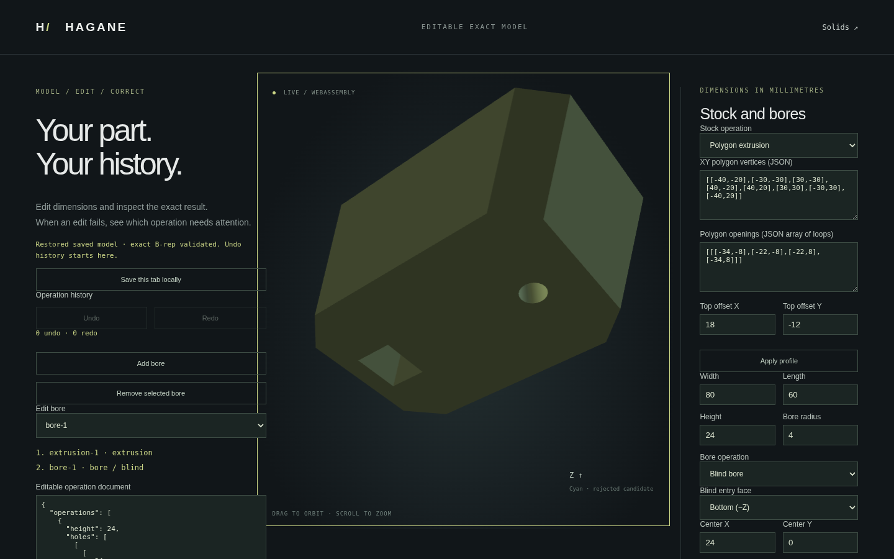

Blind bore nodes accept optional `entry: "top" | "bottom"`. Omitted `entry`
defaults to top, and explicit top is omitted on canonical export, preserving
existing documents. Bottom entry applies to both centered box and skew polygon
stocks. Unknown entry values are rejected. Through nodes must omit entry or
use top; explicit bottom through nodes return `unexpected_entry` rather than
silently ignoring machining intent.

For bottom entry the opening lies at `Z = -height/2`, and the floor at
`Z = -height/2 + depth`. Shared exact circle edges join the lower cap opening,
inward cylinder wall and floor. The floor outward normal is −Z, into the cut.
Depth remains a positive world-Z distance, with depth and remaining stock
thickness exceeding ten linear tolerances. The moving-profile center path is
`center` to `center - offset * depth/height`; the same swept-boundary certificate
checks only the actual cut interval. Diagnostics and rejected-tool outlines
use the selected entry face. Top/bottom/through nodes may coexist with the pair-separation certificates
described below; intersecting cuts remain unsupported.

Use **Blind entry face** in the browser controls. Entry changes rebuild only the
selected node and its dependent suffix; Undo/Redo, JSON download and validated
local reload preserve entry. The
[bottom-entry example](workflow-bottom-blind-example.json) can be imported or
run with `cargo run --example workflow -- docs/workflow-bottom-blind-example.json`.
Native tests check exact volume, lower opening/floor/material classification,
−Z floor orientation, closed B-rep and opposite display-edge uses across scales,
depth/opening interference, malformed/through-entry rejection and cache recovery.
Native/WASM reports and meshes agree; browser tests exercise entry/depth edits,
Undo/Redo, breakthrough rejection, download and reload. General side-entry
polygon machining and interacting tools remain outside this document domain.

## Opposing blind cuts with a retained web

The [opposing-cut example](workflow-opposing-blind-example.json) creates two
coaxial blind holes from opposite caps, with radii 4 and 6 mm and depths 8 and
10 mm in 24 mm stock. The 6 mm axial web remains material. The exact removed
volume is the sum of the independent cylinders: `pi * (16 * 8 + 36 * 10)`.
Every opening, cylindrical wall and circular floor retains its own shared
B-rep edges and pcurves. No mesh union or Boolean approximation is used.

A pair is accepted when either the radial footprint gap or, for opposite-entry
blind tools, the axial interval gap exceeds ten linear tolerances. The latter
is `height - bottom_depth - top_depth`. The maximum of these signed gaps is
a conservative separation certificate. This accepts overlapping/coaxial XY
footprints with sufficient web thickness. Radially separated tools remain
accepted even if their depth intervals overlap. Same-entry cuts and through
cuts still require resolved radial separation. Touching, near-touching and
intersecting tools remain unsupported, including cuts that could form one
connected hole in a general Boolean engine.

`bore_web_thickness` identifies a rejected opposing pair, names the earlier
operation and reports the best separation certificate plus the required margin.
Reducing depth or separating footprints corrects the edit. Rejection preserves
accepted geometry, incremental cache, Undo/Redo and local save. No schema
change is needed. This extension applies to WorkflowDocument/WorkflowSession;
the standalone BoxBore array APIs retain their documented radial-only pair rule.

Native tests cover independent volume, both floor orientations, web membership,
closed shared topology/meshes, tiny/large dimensions, cut ordering, contact,
near contact, overlap and unchanged-prefix recovery. Native/WASM full reports
and meshes agree; browser checks edit opposing depths, reject loss of the web,
recover, undo/redo and restore downloaded/local documents.

## Rounded stock extension

A `rounded_box` root now connects actual four-edge fillets and disjoint normal
through bores to this same session, editor and saved format. See
[rounded workflow](workflow-rounded.md) for the example, limits and validation.
Blind bores on rounded stock reject explicitly.

## Line/arc profile extension

`arc_line_extrusion` now stores authored lines and signed quarter arcs, including
noncentered world-XY stock and initial profile openings, followed by normal
through bores. See [line/arc workflow](workflow-arc-line.md) for the actual
example, geometry/tolerance limits and validation. Blind cuts on this stock
reject explicitly. The display centers accepted positions while reports,
JSON and STEP retain original world coordinates.

## Plane cuts in curved-stock history

`plane_split` nodes now keep a specified actual halfspace after rounded-box or
line/arc stock and pass that closed body to later cuts/through bores. World-XY
normal angle (radians), signed offset and retained side are saved in JSON.
The same linear chain supports cut/bore editing, removal/relinking, prefix reuse,
Undo/Redo and accepted-model exports. Existing Box/Polygon histories reject
these nodes explicitly. Shared admission uses initial segments + 4 per bore +
3 per cut <=128 and initial openings + bores <=16; it is conservative even
when a cut discards an opening. Terminal all-line children can be displayed
and exported, while subsequent curved-source operations reject. See
[editable plane cuts](workflow-plane-split.md) for the complete domain/example.

Plane cuts additionally cross resolved line/arc openings using the component
partition. The selected side must contain exactly one closed connected body;
multiple bodies on that side reject atomically. The unselected side may have
more than one component. The +3 segment reservation above remains an early
history check; actual child certificates separately enforce 128 segments,
including extra segments from crossed openings. See
[partitions across openings](arc-line-prism-split-components.md) and the
[cut-through-opening history](workflow-plane-split-components-example.json).
