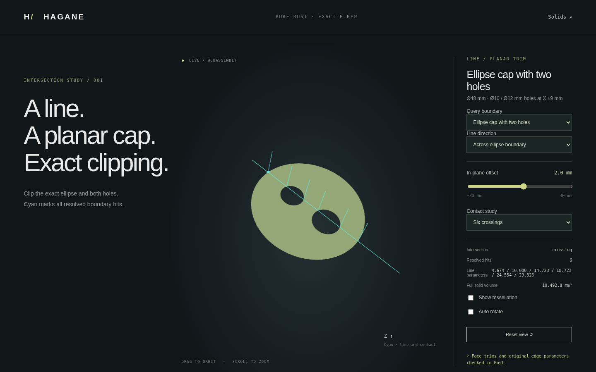

# Planar ellipse caps with multiple holes

This document describes the original homothetic subdomain and its fixtures.
The current validator also accepts unequal-axis/rotated complete ellipse holes
under a conservative enclosing-circle certificate; see
[the expanded supported domain](tilted-bore.md). Homothety requirements below
apply to the original fixtures, not to every currently supported planar hole.




A complete ellipse outer wire now accepts up to sixteen disjoint, strictly
interior, aligned homothetic complete ellipse holes. This extends the
[offset-hole domain](ellipse-eccentric-planar.md). Each wire retains two pi-sweep
ellipse edges, original edge parameters, pcurves and traversal. Hole sizes and
centers can differ. Nonorthogonal well-conditioned outer axes remain supported.
Hole aspect ratios differing from the outer ellipse, arbitrary relative arc phase,
touching/overlapping/
nested holes, holes in arc/chord regions and larger hole counts are unsupported.

## Validation and analytic intervals

Each hole maps to a circle of radius `k_i` and center `q_i` through the inverse
outer-axis matrix. The existing containment bound
`(1-k_i-norm(q_i))*sigma_lower` checks its physical clearance from the outer wire.
Every hole pair must also satisfy
`(norm(q_i-q_j)-k_i-k_j)*sigma_lower > guard`, with ten model linear tolerances
and checked coefficient/arithmetic margins in the guard. This rejects crossing,
contact, near contact and nesting without sampled topology decisions.
Whole-curve edge/pcurve correspondence and orientation remain checked.

Line clipping solves each validated wire, sorts events by the original line
parameter, verifies the outer endpoints and paired hole events, and emits the
material gaps between them. It does not depend on input hole order or line
direction. A line crossing N holes returns N+1 material intervals and 2N+2
boundary events; holes it misses contribute no events. Tangencies, near contacts,
vertex hits and unresolved event separation return errors. Planar-face intersection
uses the same gaps to return exact shared-parameter segments.

Classification subtracts every hole and checks physical boundary bands on all
wires. Exact signed area/volume includes each hole's area and first moment.
B-rep-derived tessellation preserves hole contours and shares edge samples with
every inward wall. Display meshes never perform the modeling operation.

## Closed-solid fixture and demo

```sh
cargo run --locked --example ellipse_multi_hole_planar -- 9 2 0
cargo run --locked --example ellipse_multi_hole_planar -- 12 5.5 0.37
./scripts/build-web.sh
```

Arguments are hole-center spread along X, line V offset and rigid rotation in
radians. `hagane_ellipse_multi_hole_planar_demo` exposes the same native operation
through the existing WASM JSON/error buffer. The two demo hole radii are 5 and
6 mm; their centers are `[-spread,0]` and `[spread,0]`.

`EllipseCapHole { radius, center }` describes a circular hole in source XY.
`ellipse_multi_hole_planar_demo_solid(radius, height, slope, holes, tolerance)`
accepts zero through sixteen such holes, extrudes from `z=-height/2`, retains
material below `z=-slope*x`, and closes the top with exact ellipse wires.
All source rims must stay strictly across the cutting plane. This restricted
fixture constructor is not a general curved partition or Boolean API.
The independent retained volume is

`pi*radius^2*height/2 - sum(pi*r_i^2*(height/2-slope*cx_i))`.

Default outer radius 24 mm, height 24 mm, slope 0.25 and spread 9 mm produce
eight faces and eighteen edges enclosing approximately `19492.7970173613 mm³`.

Serve `web/` using the README, open `intersections.html`, and select
**Ellipse cap with two holes**. Offset 2 mm gives six crossings and three material
intervals, 5.5 mm crosses one hole, 14 mm misses both holes, 5 mm reports an
inner tangent error and 30 mm returns empty. The displayed cap mesh is extracted
from the validated closed parent B-rep; its volume is that of the parent solid.
Orbit and zoom remain available.

Native tests cover three holes with differing sizes, reordered inputs, reversed
and rotated lines, independent roots/first-moment volume, material/hole/boundary
classification, microscopic dimensions, nonorthogonal trim validation, sampled
chord error on every wall and closed oriented meshes with no filled holes.
Four exact polygon/cap intersection segments are verified. Sixteen-hole input
succeeds; excess counts, overlap, nesting, contact and malformed wires fail.
Native/WASM parity and independent one/two/three-interval checks and browser
controls, provenance, errors, recovery and orbit are verified.

Original code is MIT OR Apache-2.0, adds no dependencies and uses no OCCT source.
References are affine circle maps, triangle-inequality/singular-value distance
bounds, sorted interval subtraction, Green's theorem, circle first moments and
the existing chord/distance arguments in [references](references.md).
