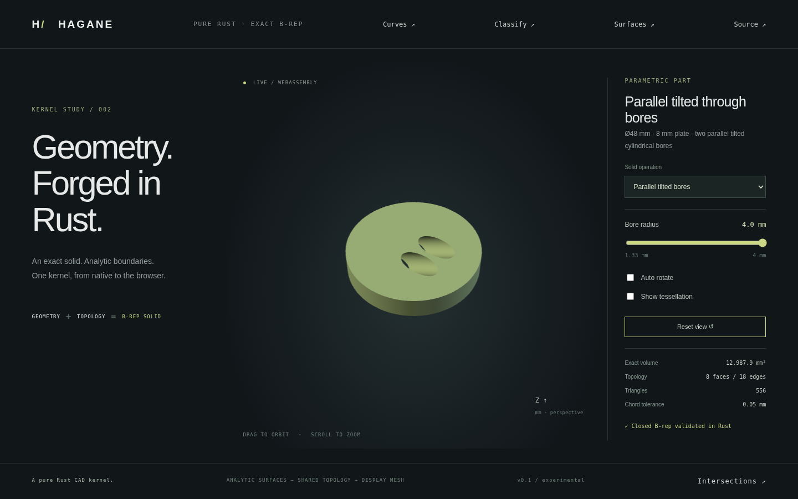

# Supporting-line separation of ellipse holes



Complete ellipse holes whose normalized enclosing circles overlap can now be
accepted when an analytic supporting-line certificate proves separation.
Containment in the outer ellipse still uses the conservative enclosing-circle
certificate. This extends the [unequal-axis hole domain](tilted-bore.md).

For unit direction n and ellipse `c + A cos(t) + B sin(t)`, its projection
radius is exactly `hypot(n·A, n·B)`. Two ellipses are disjoint if
`abs(n·(c2-c1)) - radius1 - radius2` exceeds the physical tolerance,
curve coherence and checked floating-point margins. The validator first tries
the inexpensive enclosing-circle test, then up to 64 evenly spaced directions
starting with the center direction. Each accepted direction proves a gap for
the whole analytic ellipse, not merely sampled points. The finite direction
search can reject valid configurations; failure returns unsupported, never a
claim of intersection. Contact, near-contact, overlap and nested holes fail.

## Parallel tilted bore construction

`tilted_bores_demo_solid(radius, height, bores, tolerance)` creates a circular
plate with zero to sixteen translated parallel cylindrical through bores.
`TiltedBore` supplies radius, tilt about Y in radians, and XY center. The original parallel subdomain used exactly equal bore tilts.
[Independent inclinations](divergent-tilted-bores.md) now require an additional
analytic full-height separation certificate, since cap separation alone does
not guarantee separation inside the solid. For parallel
bores every horizontal section translates the same ellipse arrangement, so
certified cap separation holds throughout the height. Each tool also has a
conservative whole-height outer clearance check. This is a restricted analytic
construction; general curved Boolean operations remain unsupported.

Exact ellipse rims, cylinder surfaces, harmonic height pcurves, shared oriented
edges and closed topology are retained. With N bores the solid has `4+2N` faces,
`6+6N` edges and volume `pi*(R²-sum(r_i²/cos(tilt)))*H`.

```sh
cargo run --example separated_tilted_bores
cargo run --example part -- 26
./scripts/build-web.sh
python3 -m http.server 8000 --directory web
```

Select **Parallel tilted bores** in the main web demo. The 48 mm diameter,
8 mm high plate has centers at Y=±5 mm and tilt 1 radian. The slider controls
both radii from 1.33 to 4 mm; at 4 mm the enclosing circles overlap while the
actual holes have a 2 mm gap. Orbit, zoom and tessellation views display the
B-rep-derived mesh. The native cap query example uses radii 3 mm and Y=±4 mm;
its WASM counterpart is `hagane_separated_tilted_bores_demo(offset)`.

Native tests cover closed topology, independent analytic volume, classification,
small dimensions, contact/near-contact, actual overlap and unsupported divergent
axes. WASM tests independently check volume/material intervals, native geometry
parity, error recovery and preset controls. Browser tests exercise the new solid
and slider; the image above is captured from the actual renderer.

The projection identity follows directly from the maximum of `a*cos(t)+b*sin(t)`
and elementary convex separating-line geometry. This independent pure Rust
implementation adds no dependencies and uses no OCCT code; original code is
MIT OR Apache-2.0. See [references](references.md).
