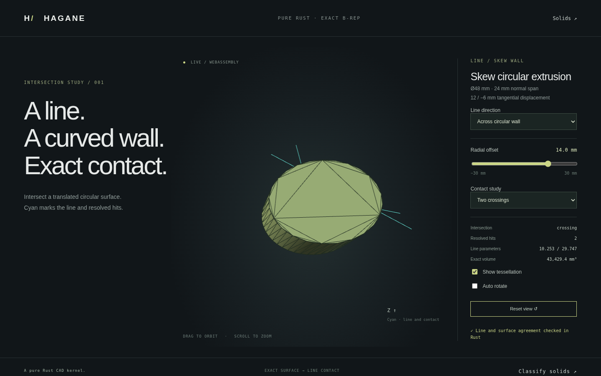

# Lines against skew circular translation surfaces



`intersect_line_extruded_circle(anchor, direction, surface, policy)` intersects an
infinite line with `Surface::ExtrudedCircle`. It returns the existing typed
`LineCylinderIntersection` data: `Empty`, sorted `Points` with original line
parameters, world points, UV and `Crossing`/`Tangent` contact, or a `Coincident`
generator parameter interval. This API intersects the full angular lateral
surface over `[0, height]`; it does not clip angular face trims or intersect caps.
The ordinary `intersect_line_cylinder` API retains its original surface domain.

```rust
use hagane::*;
let wall = Surface::ExtrudedCircle {
    frame: Frame3::IDENTITY, radius: 2., height: 4., drift: [1., 0.5],
};
let hits = intersect_line_extruded_circle(
    Point3::new(-3., 1., 2.), Vec3::new(2., 0., 0.),
    &wall, GeometryTolerance::default(),
)?;
# Ok::<(), hagane::Error>(())
```

The query gives two crossings at parameters `1.5` and `3.5`. The same surface
supports an exact tangent and finite overlap along its extrusion generator.
Line direction length is arbitrary; it is normalized only internally, and
returned parameters always reconstruct `anchor + original_direction * t`.

## Coordinate reduction and checks

In the surface's rigid frame, the shear inverse
`T(x,y,z) = (x - drift.x*z, y - drift.y*z, z)` maps the circular translation wall
to a radius-`R` cylinder. It preserves line parameters and the normal-span trim.
The existing closest-approach solver computes stable radial roots, applies
bounded axial membership, and distinguishes contacts and generator overlaps.
The result is mapped back through the original world line and checked against
the actual skew surface.

The local physical extent is `max(radius, height * generator_length)`. The
length budget is `max(linear, relative * extent)`. Since
`||T|| <= 1 + hypot(drift.x, drift.y)`, proxy contact guards use the physical
budget times this conservative stretch bound. Final line/surface agreement
uses physical world tolerances. A separate original-space angular guard rejects
near-generator lines; proxy angular checks can conservatively reject more cases.

Local reconstructed dimensions are also checked: two world points rounding to
the same large coordinate do not establish that the small-radius geometry was
preserved. Nonfinite reductions, excessive conditioning, unrepresentable line
parameters, unresolved root spacing, near tangencies/generators, and unresolved
axial end levels return explicit errors. Radius and height must exceed ten
linear tolerances and the cylinder reduction must remain resolved under its
inflated budget. This may reject strongly conditioned but mathematically valid
queries; it does not return approximate contacts as exact topology.

## Run the actual demo

```sh
cargo run --locked --example extrusion_intersections -- 0 14 0
cargo run --locked --example extrusion_intersections -- 0 24 0
cargo run --locked --example extrusion_intersections -- 1 0 0
```

Arguments are mode (`0` transverse, `1` generator, `2` reverse generator), radial
offset and rigid rotation in radians. Output includes typed contacts, the
original line and a mesh generated from an exact skew circular B-rep solid.

Build and serve `web/`, then open `intersections.html`, linked from the solids
demo. Move the radial offset, choose the contact studies, and orbit or zoom.
Cyan shows the query line and normal stems at resolved hits. Unresolved queries
clear the contacts instead of showing stale successful results.

Native tests compare independent analytic roots over 56 transverse/axial/placed
cases, exact rims, tangent and forward/reverse overlaps, zero drift, microscopic
geometry, relative tolerance, direction scales from `1e-200` to `1e300`, invalid
inputs and world-coordinate precision loss. WASM checks compare native queries
and meshes plus independent expected roots, errors and recovery. Browser checks
cover all contact studies, slider changes, ambiguity/recovery, marker rendering,
orbit and mobile layout, alongside the existing 23 solid presets.

[Angular face clipping](circular-face-intersections.md) is now supported separately
with original edge provenance. [Solid classification](skew-classification.md)
now uses these supporting intersections and Euclidean boundary bands. Curved-face
subdivision and general Booleans for skew circular translation walls remain
unsupported.

Implementation is original MIT OR Apache-2.0 Rust, with no added dependencies or
OCCT source. Mathematical sources are affine line parameter preservation,
the triangle inequality for operator norms, and circle closest-approach roots.
See [existing intersection references](intersections.md) and
[skew surface geometry](skew-arc-extrusion.md).
