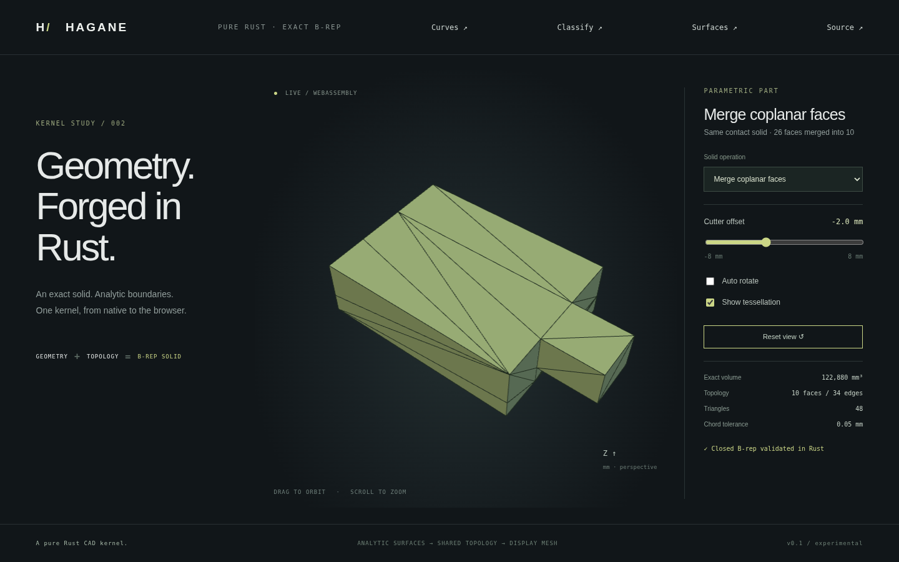

# Coplanar face merging



`merge_coplanar_faces(&solid, GeometryTolerance)` joins edge-connected planar
straight-edge faces on certified identical supports. It returns a newly validated
`Solid`; the operand is unchanged. It removes internal face boundaries and rebuilds
outer/hole wires, shared topology and pcurves. Display triangles are generated
only after the resulting analytic B-rep is validated.

## Supported domain

The input must be a geometrically valid, closed planar straight-edge solid, with
at most 512 faces and 4096 coedges. Plane identity is deliberately conservative:

- Faces with exactly equal origin, U/V frame and orientation can merge. This
  includes subdivisions retaining an original frame and rigid placement of them.
- Axis-aligned planes can merge across different UV origins/frames when their
  plane coordinate and signed outward unit normal are exactly equal.
- Other representations, nearly parallel features and near coplanarity remain
  separate. The function performs no tolerance-based plane snapping or healing.

Only adjacency through a shared edge joins a component. Edge-disconnected regions
on the same plane remain separate faces. Curved input and invalid topology fail
explicitly. Pinched or ambiguously branching component boundaries are unsupported.
Structural validation is not a general geometric self-intersection detector.

## Boundary construction and invariants

Group adjacent faces with certified equal supports. Remove coedges whose two
incident faces belong to the same group. Traverse the remaining directed boundary
graph into closed loops, using the representative face's UV orientation. Positive
UV area identifies outer rings; negative rings must belong to exactly one outer
ring. This supports concave boundaries and planar holes without filling the holes.

Strict planar sewing reconstructs the solid. Every output vertex and edge must
correspond to an original boundary vertex/edge. When the merged face retains an
original UV frame, its affine pcurves are copied with edge-parameter reversal as
needed. This avoids reprojection drift of collinear knots after rigid placement.
Frames changed within an axis-aligned plane receive checked reconstructed pcurves.

The result must retain exact bounds, conserve analytic volume within relative
`1e-10`, and not increase the face count. Final validation checks trims, plane
geometry, pcurves, signed edge uses, vertex links and closed connectivity. Internal
vertices/edges disappear; exterior collinear subdivisions remain. Collinear edge
simplification, arbitrary differently parameterized rotated planes and tolerant
healing are future work. Applying this operation again preserves topology counts.

## Usage

```rust
use hagane::*;
fn main() -> Result<()> {
    let a = BoxSpec { min: Point3::new(0., 0., 0.), size: Vec3::new(4., 4., 4.) };
    let b = BoxSpec { min: Point3::new(4., 1., 1.), size: Vec3::new(2., 2., 2.) };
    let policy = GeometryTolerance::default();
    if let BoxBooleanResult::Solid(part) =
        boolean_boxes(a, b, BoxBooleanOperation::Union, policy)? {
        let merged = merge_coplanar_faces(&part, policy)?;
        assert_eq!(merged.shell.faces.len(), 11);
        // The remaining contact-plane face has an inner boundary.
    }
    Ok(())
}
```

```sh
cargo run --locked --example face_merge -- -2
cargo run --locked --example part -- 18
./scripts/build-web.sh
python3 -m http.server 8000 --directory web
```

Select **Merge coplanar faces**. This applies merging to the previous **Fuse
contacting boxes** B-rep. Its exact volume stays **122880 mm³**; faces decrease
from **26 to 10** and edges from **52 to 34**. The slider changes attachment
position, and the same Rust operation runs natively and in WASM.

Native tests cover a full-face union reduced to six faces, a partial-face union
with a planar hole, rectangular through-hole caps, concavity and disconnected
coplanar regions, rigid placement with preserved UV, small dimensions, nearly
parallel feature preservation, invalid/curved inputs and idempotence. Tests compare
bounds, volume and material/boundary classification and check outward triangles
and closed mesh seams. WASM verifies native geometry parity at four offsets and
error recovery. Browser tests exercise all 19 presets and capture the actual demo.
