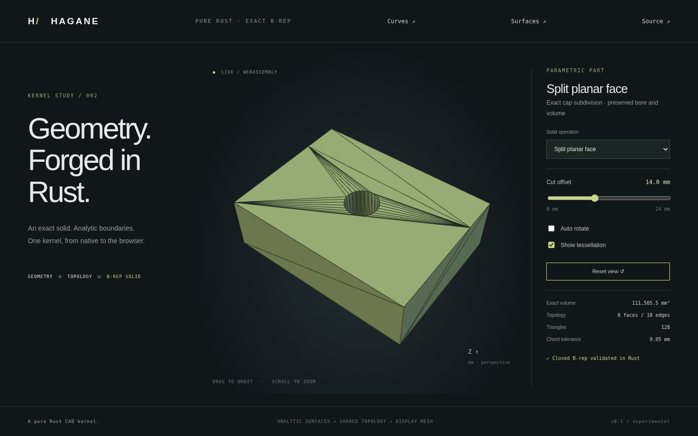

# Scoped planar face subdivision



`split_planar_face` subdivides one planar B-rep face into two faces while
preserving a closed solid. It updates shared boundary edges and their coedges
on adjacent faces. The result is a topological refinement of the same shape,
not a solid cut, mesh operation, union or difference.

```rust
use hagane::{BoxSpec, Point3, Vec3, GeometryTolerance, make_box, split_planar_face};
let tol = GeometryTolerance::default();
let solid = make_box(BoxSpec {
    min: Point3::new(-4.0, -3.0, 0.0), size: Vec3::new(8.0, 6.0, 2.0),
}, tol.absolute())?;
let split = split_planar_face(&solid, 0,
    Point3::new(0.0, 0.0, 0.0), Vec3::new(1.0, 0.0, 0.0), tol)?;
split.solid.validate(tol.absolute())?;
assert_eq!(split.solid.shell.faces.len(), 7);
assert!((split.solid.volume()? - 96.0).abs() < 1e-10);
```

Run `cargo run --locked --example face_split` for this example or
`cargo run --locked --example part -- 7` for the browser mesh fixture. Select
**Split planar face** in the browser. The offset slider moves the new cap
boundary; **Show tessellation** reveals the boundary and triangulation.
The fixture has a fixed 7 mm bore, eight faces and eighteen edges, with unchanged
volume `115200 - pi*49*24`. The same Rust operation executes in WASM.

## Supported domain

- A validated planar face with a straight polygon outer ring. Concavity works
  when the line produces exactly one interior interval and two proper crossings
  on distinct outer edges.
- Holes may be full circles or straight polygons. The cut must not cross or
  touch a hole. Each unchanged hole wire is assigned to exactly one child face;
  circular geometry and shared wall edges remain analytic.
- Split boundary edges must have planar neighboring faces with affine/circular
  trims. Neighbors containing bounded arc trims, curved neighbors and partial
  cylinder boundaries remain unsupported.
- Both subedges created at each crossing must exceed ten linear tolerances.
  Vertex passage, tangencies, boundary overlap, multiple intervals, disjoint
  cuts, curved outer boundaries and unresolved geometry return errors.
- Repeated splits, either direction, checked rigid placement and small dimensions
  work within these conditions. The line must lie in the supporting plane under
  the [clipping contract](face-intersections.md).

## Shared topology and parameters

The operation first computes analytic [trim clipping](face-intersections.md).
It works on a clone, so failures leave the input unchanged. Each boundary event
creates one shared vertex and replaces its straight edge by two straight
subedges. The original edge index keeps the first half; the second is appended.
Every coedge using that edge is updated, including its neighboring face. Reverse
uses reverse the subedge order. Each affine pcurve is reparameterized to the
new edge's normalized [0,1] interval.

The outer wire is partitioned into two directed paths between the cut vertices.
One new straight cut edge closes both paths with opposite coedge directions.
Child faces retain the parent's supporting plane and face orientation. Hole
ownership uses checked point containment in the child polygon trims. Closure,
shared uses, vertex links, winding, pcurve consistency and positive volume are
validated before return. Face-integrated volume must agree with the original
within 1e-10 relative error.

`PlanarFaceSplit` returns the new `solid`, both child `faces`, the `cut_edge`
and `cut_vertices`. The first child replaces the input face index; the second
is appended. Other original face indices remain stable. The operation introduces
two vertices, three net edges and one face, preserving the Euler characteristic.

Planar B-rep trim validation now permits forward collinear boundary subdivisions
needed for shared vertices; backtracking, short edges, self-intersection and
near contacts remain invalid. Profile constructors still reject redundant
corners. Display triangulation restores straight boundary vertices even on
caps with circular holes, preserving conformity with neighboring face meshes.
For mixed bounded-arc caps the existing sampled-boundary restoration remains.

## Evidence and remaining work

Native tests verify exact box volume/bounds, shared-edge closure, hole ownership,
conforming oriented display meshes, side-face cuts, repeated/reversed cuts,
concavity, rigid placement, microscopic dimensions, and rejected curved/contact
cases. Native/WASM mesh parity and cut-offset/error recovery tests exercise the
eighth browser preset. Browser tests check the offset label, unchanged volume,
wireframe rendering, orbit/zoom and the existing demos.

This is a bounded face-splitting implementation. Circular/arc edge subdivision,
curved face trims, cuts through holes, multiple cut intervals, vertex/tangent
handling, intersection graphs, sewing and general Boolean operations remain
future work. No OCCT source or additional dependency is used.
