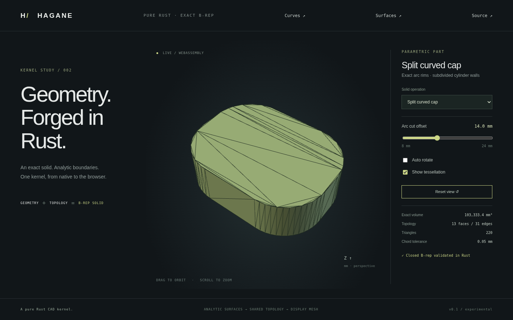
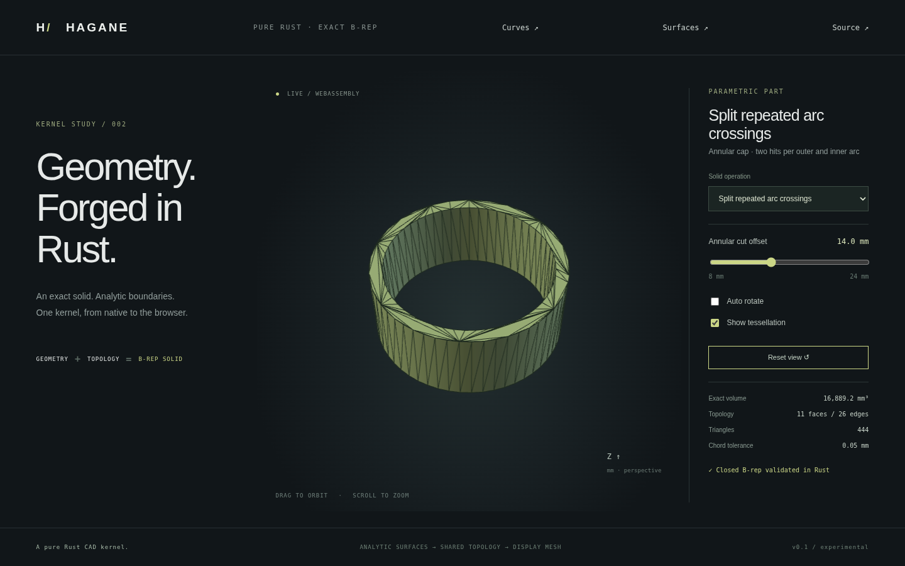

# Scoped planar face subdivision



`split_planar_face` subdivides one planar B-rep face into two faces while
preserving a closed solid. Straight boundary cuts update adjacent planar faces.
Bounded arc cuts additionally subdivide the neighboring cylinder wall and its
opposite rim. The result refines topology while preserving geometry and volume;
it is not a solid cut or mesh Boolean.

```rust
use hagane::{Point3, Vec3, GeometryTolerance, rounded_rectangle_profile,
    extrude_arc_line, split_planar_face};
let tol = GeometryTolerance::default();
let profile = rounded_rectangle_profile(
    Point3::new(0.0, 0.0, 0.0), 12.0, 10.0, 1.0, tol.absolute(),
)?;
let solid = extrude_arc_line(&profile, 2.0, tol.absolute())?;
let split = split_planar_face(&solid, 0,
    Point3::new(0.0, 4.5, 0.0), Vec3::new(1.0, 0.0, 0.0), tol)?;
split.solid.validate(tol.absolute())?;
assert_eq!(split.solid.shell.faces.len(), 13);
```

Run `cargo run --locked --example arc_face_split` for this example or
`cargo run --locked --example part -- 8` for the browser fixture. Select
**Split curved cap** in the browser and enable **Show tessellation**. The cut
crosses two circular corner rims of an 80×60×24 mm rounded solid with fixed
24 mm corner radius. Its offset slider ranges from 8 to 24 mm. It has thirteen
faces and thirty-one edges, with unchanged volume
`[4800 - (4-pi)*576] * 24`. The same Rust operation executes in WASM.

The earlier straight cap with a fixed bore remains preset 7, with its
[actual screenshot](face-split.png). Run `cargo run --locked --example face_split`
for a simple box subdivision.

## Single-interval API supported domain

- A validated planar face with a simple line/arc outer ring. Concavity works
  when the line produces exactly one interior interval and two proper crossings
  on **distinct** outer edges.
- Holes may contain lines, bounded arcs or full circles. The cut must not cross
  or touch them. Analytic containment assigns each unchanged hole wire to one
  child; no polygonized boundary is used for ownership.
- Straight crossed edges require planar neighbors and affine coedge pcurves.
  Planar neighbors can themselves contain circular or bounded arc trims.
- Crossed bounded arcs require one framed-cylinder neighbor with its existing
  four-coedge rectangular UV trim. Both bottom/top rims must be bounded arcs
  with angular ranges identical to the cylinder span. This operation refines
  the wall into two rectangles; it does not introduce arbitrary cylinder trims.
- Both pieces of each split boundary edge, including opposite rims, must have
  resolvable chord/length beyond ten linear tolerances. Full-circle outer edges
  must first be represented by bounded arcs; periodic single-circle refinement
  is not implemented.
- Vertex passage, tangencies, boundary overlap, multiple intervals, two hits on
  the same original edge, hole crossings and unresolved geometry return errors.
- Repeated cuts, reversed direction, top/bottom caps, inward notch walls, checked
  rigid placement and small dimensions work within these conditions. The line
  must satisfy the [planar clipping contract](face-intersections.md).

## Shared topology and parameters

The operation computes analytic trim clipping and works on a clone, so failures
leave the input unchanged. Each straight boundary event creates one vertex and
two subedges. The original edge index retains the first half; the second is
appended. Every coedge use is updated, with reverse uses reversing subedge order.
Affine pcurves are reparameterized to each new edge's normalized [0,1] interval.

For an arc event at angular parameter t, both cylinder rims split at that same
angle. The first subarc keeps its frame and range [0,t]; the second rotates its
frame's radial axes by t and restarts its angular parameter at zero. Planar arc
pcurves shift their start angles consistently. No circle is replaced by chords.

A new axial generator joins the bottom/top split vertices. The cylinder wall
becomes two faces sharing that generator with opposite signed uses. Each wall
retains a four-coedge rectangle starting at u=v=0, with spans t and span-t.
The second wall's frame rotates by t. The original wall orientation is retained,
including inward walls. The opposite planar cap receives matching rim subedges,
even when that cap is not the face selected for subdivision.

The selected outer wire partitions into two paths between cut vertices. A new
straight cut edge closes both paths with opposite coedge directions. Child faces
retain the parent's plane and orientation. Hole ownership uses analytic line/arc
classification of the child trims. Closure, shared uses, vertex links, winding,
pcurves and positive volume are validated before return; face-integrated volume
must agree with the original within 1e-10 relative error.

`PlanarFaceSplit` returns the new `solid`, both selected-face children in `faces`,
the `cut_edge` and `cut_vertices`. The first child replaces the selected face;
the second is appended after any newly refined cylinder faces. Original face
indices remain stable, though a refined cylinder face now represents its first
angular portion. For a straight event, V/E increase by 1/1. For an arc event,
V/E/F increase by 2/3/1. The selected face's chord adds another E/F increase of
1/1, preserving the Euler characteristic.

Planar B-rep trim validation permits forward straight subdivisions, including
mixed trims, while profile constructors still reject redundant corners.
Backtracking, short edges, self-intersection and near contacts remain invalid.
Display triangulation restores subdivision vertices. Arc cap and refined wall
sampling use the same subarc counts, preserving mesh seams and the circular
sagitta bound. Numerical checks remain f64 tolerance checks, not certified
circular or 3D predicates.

## Evidence and remaining work

Native tests cover box/rounded/disk/notch parts, polygon and curved holes,
analytic volume, top/bottom and repeated/reversed cuts, inward cylinder walls,
rigid placement, microscopic dimensions, shared pcurves and closed oriented
meshes. Native/WASM fixture parity and browser offset controls exercise eleven
solid presets. Vertex, tangent, unresolved and same-edge cuts are rejected.

Periodic full-circle subdivision, arbitrary
curved-face trims, contact graphs, sewing and general Boolean operations remain
future work. No OCCT source or additional dependency is used.

## Multi-interval cut graphs


`subdivide_planar_face(solid, face_index, anchor, direction, tolerance)` returns
`PlanarFaceSubdivision { solid, faces, cut_edges }`. Unlike the original
`split_planar_face` API, it cuts every strict material interval and permits
crossings on polygon/arc holes. It can produce more than two children when a
half-plane intersection of a concave face is disconnected. The first child
replaces the original face; others follow any refined cylinder walls.

Crossings require bounded line or arc edges. Two hits on the same arc are
supported. Periodic circle crossings, vertex/tangent/overlap
contacts, unresolved side decisions and intervals shorter than ten linear
tolerances return errors. Arc neighbor requirements match the single-interval
API. Uncrossed full-circle hole wires remain exact. `split_planar_face` retains
its existing one-interval contract for API compatibility.

On a clone, shared boundaries are refined before tracing the graph. Analytic
edge midpoint evaluations assign subedges to the two open half-planes; each
material interval adds one exact line with two opposite coedge uses. Directed
cycles yield outer boundaries and hole rings. Signed analytic wire area
identifies their winding, and analytic containment assigns each remaining hole
to exactly one child. Ambiguous branches, open cycles and unresolved ownership
fail explicitly. Final B-rep validation and unchanged analytic volume are
required before return. This changes the face partition, not the solid's shape.

Run `cargo run --locked --example cut_graph` or `--example part -- 9`.
The **Split across two holes** browser preset contains an 80×60×24 mm extrusion
with two 12×20 mm rectangular holes. Three shared cut intervals produce two
cap children. Its volume stays at 103680 mm³, with 15 faces and 45 edges.
The slider maps 8..24 to cut offsets -8..8 mm; its displayed value is the actual
offset. Enable tessellation to inspect all three seams.

Regression tests cover two crossed holes, remaining hole ownership, concavity
with three children, reversed direction, rigid placement, tiny dimensions,
arc-hole inward-wall refinement, contact rejection, unchanged input, volume,
bounds and closed oriented mesh seams. Native/WASM geometry parity and browser
controls exercise the same Rust fixture. No modeling boundary is polygonized.

## Repeated crossings on one arc



Intersections keep their original edge parameter even as subdivision changes
edge ranges. Events are grouped by original edge and sorted by **descending**
parameter. Each split retains the first subedge at its original index, so the
next smaller angular parameter still refers to that subedge. Straight subedges
use normalized parameters and are rescaled by the original interval end.
Cut vertices are keyed by both original edge and original parameter; two hits
on one edge no longer overwrite one another. This also keeps topology independent
of the input line's traversal direction.

For two arc crossings at t1 < t2, shared rims and rectangular cylinder walls
become three angular pieces: [0,t1], [t1,t2] and [t2,span]. Both newly created
generators and both opposite-cap vertices are retained. All pieces must still
clear the ten-tolerance chord/length guards; near-tangent and vertex cuts fail.
The original single-interval `split_planar_face` contract stays unchanged;
use `subdivide_planar_face` for repeated crossings.

Run `cargo run --locked --example repeated_arc_split` or `--example part -- 10`.
**Split repeated arc crossings** builds an exact annular extrusion from two
bounded semicircles per ring (outer radius 30, inner radius 26, height 24 mm).
The offset 8..24 mm crosses the same upper outer arc twice and the same upper
inner arc twice. Two material chords yield two cap children, 11 faces and
26 edges, with constant volume `5376*pi` mm³. No periodic circle is converted
or approximated by this operation.

Tests cover both upper/lower arcs and input directions, opposite-cap cuts,
rigid placement, microscopic geometry with huge line direction, unchanged
analytic metrics, positive triangle winding, closed shared mesh seams and
cylinder sagitta within 0.01. Native/WASM parity, invalid offsets and recovery,
and browser offset controls run the same annular fixture.
