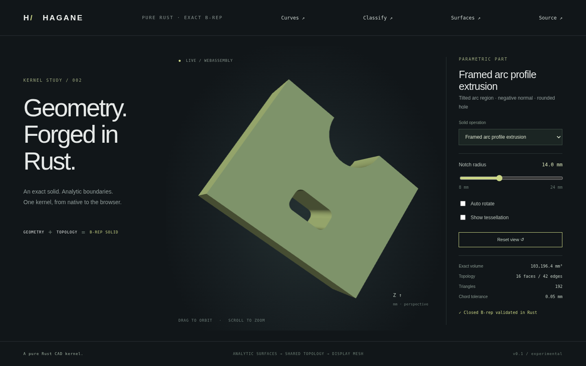

# Mixed profiles on arbitrary planes



`extrude_arc_line_in_frame` and `extrude_arc_line_region_in_frame` create exact
solids from frame-local line/arc profiles and a world-space extrusion vector.
Both normal signs work; regions retain disjoint curved or polygon holes. The
result uses exact planes, circular arcs, rectangular cylindrical walls and
oriented shared edges with pcurves. No display mesh participates in construction.

```rust
use hagane::*;
let t = Tolerance::default();
let frame = Transform::rotation(Vec3::new(1., 2., 3.), 0.7)?;
let profile = rounded_rectangle_profile(Point3::new(0., 0., 0.), 12., 10., 1., t)?;
let direction = frame.vector(Vec3::new(0., 0., -4.));
let solid = extrude_arc_line_in_frame(&profile, direction, frame, t)?;
solid.validate(t)?;
# Ok::<(), hagane::Error>(())
```

`profile.origin` and ring coordinates are local to the supplied rigid frame;
the ring coordinates are XY offsets from that origin. `world_direction` is a
displacement vector, not a terminal point. Each length uses the caller's common
unit. The normal span must exceed ten linear tolerances. Either input winding
is normalized by the existing mixed-region builder.

For negative span, the builder moves its base to the terminal local Z plane,
constructs a positive-span extrusion, and applies checked rigid placement.
The material extends from the original profile plane to the requested terminal
plane. Face indices do not promise that the first cap is the input plane.
Analytic geometry, topology and volume survive this change of construction base.

Skew vectors are now supported with exact circular translation walls; see
[skew extrusion](skew-arc-extrusion.md). The previous normal conversion allowance
of `64 * f64::EPSILON * world_direction.norm()` is retained for vectors differing
from normal only by rigid-frame roundoff. Larger tangential components are kept
in the exact skew surface. Zero/near-zero spans, nonfinite input, overflow and
invalid/touching/nested holes return errors.
The legacy height-only XY builders continue requiring positive height.

Run `cargo run --locked --example framed_arc_extrusion -- 14` for the B-rep-derived
mesh JSON. Build the web demo with `./scripts/build-web.sh`, serve `web/`, and
select **Framed arc profile extrusion**. Its notch radius is interactive; the
profile is on a tilted plane and extruded along the negative normal.

Tests cover both signs and windings, curved holes, analytic volume, input/end
vertices, inside/void/boundary queries, perpendicular-plane bounds, microscopic
dimensions, closed oriented mesh edges and cylinder chord error. Native/WASM
parity checks the tilted fixture at several radii and invalid-input recovery;
browser tests exercise all 22 solid presets and the new radius control.

This is original MIT OR Apache-2.0 Rust, with no new dependencies or OCCT code.
The mathematical basis is rigid orthonormal coordinate conversion (inverse is
the transposed basis), translation of a normal extrusion interval, and
`volume = profile_area * abs(normal_span)`. Profile-area and tessellation
references remain in [mixed profiles](mixed-profiles.md) and
[frames](frames.md). General surface trims and queries on skew walls remain future work.
