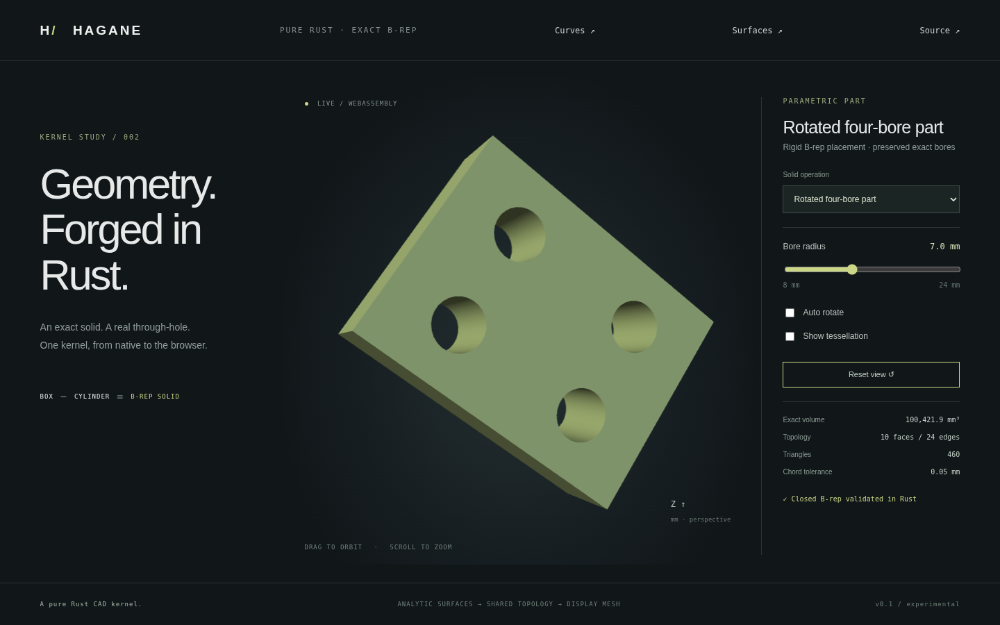

# Coordinate frames and rigid placement



`Frame3` and `Transform` name the same immutable right-handed orthonormal
local-to-world mapping. Points include the origin; vectors and normals do not.
`outer.compose(inner)` applies `inner` first. Rotation uses Rodrigues' formula,
with angles in radians about an axis through the world origin. Translation
and all lengths use the caller's consistent unit.

```rust
use hagane::{Transform, Vec3};
let rotation = Transform::rotation(Vec3::new(1.0, 2.0, 0.5), 0.8)?;
let placement = Transform::translation(Vec3::new(8.0, -4.0, 6.0))?
    .compose(rotation)?;
let placed = solid.transformed(placement, tolerance)?;
```

`Transform::new` validates finite origin and all three basis lengths, pairwise
orthogonality, and handedness. Its existing linear argument is validated but
basis checks use default angular/relative budgets independently of length units.
`new_with_tolerance` accepts an explicit [geometry policy](tolerances.md).
Basis acceptance is capped at 1e-10; accepted roundoff is orthonormalized. Scale,
shear, and reflections are rejected. Frame components have getters rather than
public mutation. `inverse`, composition, and constructors reject nonfinite
results. Raw point/vector evaluation returns f64 coordinates; use checked
solid placement for validated modeling results.

`Solid::transformed` validates its input and output. Lines and planes transform
directly. `Curve::FramedCircle` and `Surface::FramedCylinder` keep exact radius,
height, angular parameters, and axial lengths in a local frame. The legacy XY
circle and Z-cylinder variants remain available. Shared indices, coedge
orientation, face orientation, and pcurves are unchanged. No mesh is involved
in this operation. Volume is integrated analytically; a relative change over
1e-10 is rejected as loss of placement precision. Endpoint/pcurve and topology
checks also reject placements that cannot retain features at the requested
linear tolerance. This is a numerical guard, not a claim of arbitrary precision.

World-axis bounds use the exact circle extent
`radius * hypot(u_i, v_i)` in each coordinate, rather than a rotated local box.
Tessellation evaluates placed surfaces and rotates analytic normals; its circle
sagitta bound is preserved by rigid placement.

`extrude_polygon_in_frame(profile, world_direction, frame, tolerance)` uses the
existing polygon validation and construction in local coordinates, followed by
checked rigid placement. `profile.origin` is frame-local; outer and hole rings
are XY offsets from that origin. The direction is world-space and must have a
normal component exceeding ten linear tolerances. Both signs and skew
extrusions work; holes retain the existing separation and simplicity limits.

Run `cargo run --locked --example placement` for a placed through-bore part,
or select **Rotated four-bore part** in the browser. This preset calls the same
Rust operation on native and WASM; it is distinct from moving the viewer camera.

Remaining limits: the through-bore difference constructor and cylinder/plane
intersection routine still accept their documented axis-aligned inputs only;
perform the supported operation before placement. There is no general Boolean
on placed solids, mixed arc/line trim support, or NURBS B-rep integration yet.
Standalone NURBS data is not transformed by `Solid::transformed`.
