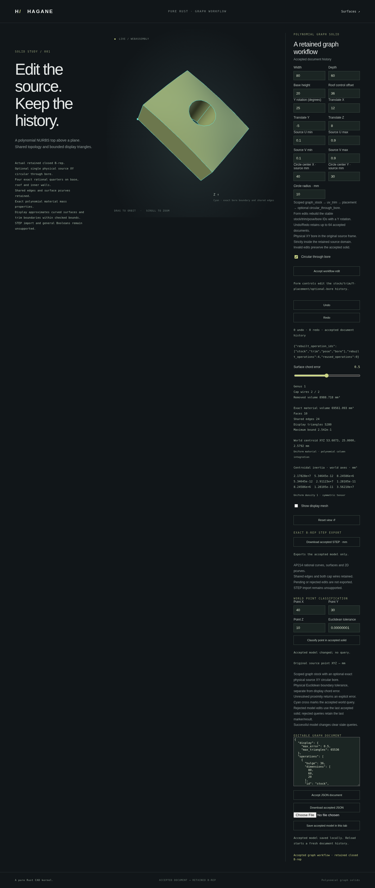

# Editable NURBS graph workflow

This dedicated version-one document connects the supported NURBS graph stock,
rectangular UV restriction, rigid placement and one circular through bore to
reproducible editing. It records modeling intent in millimetres, not a saved
mesh or general B-rep interchange format. The existing analytic box/extrusion
workflow format remains separate.

The [example document](graph-workflow.json) builds an 80 × 60 × 20 mm stock with
bulge 36, restricts its UV domain to `[0.1, 0.9]²`, rotates it 25 degrees about Y,
translates it by `(12, -5, 8)` mm and removes a source-XY circle of radius 10 mm
at `(40, 30)` mm. All operations use the existing checked typed geometry APIs.



This screenshot records the actual example document: a 10-face, 24-edge solid
with 5,280 display triangles, material volume approximately 69,561.093 mm³ and
maximum reported display bound approximately 0.2542 mm at a requested 0.5 mm.
The initial replay builds all four operations.

## Native and browser use

```sh
cargo run --locked --example graph_workflow
./scripts/build-web.sh
python3 -m http.server 8000 --directory web
```

The CLI evaluates the example document and returns the actual retained shape,
bounded display, mass properties and rebuild statistics as JSON. The browser
page is `graph-workflow.html`. Edit dimensions, roof bulge, trim, placement,
hole and display error; inspect the generated solid, query a world point and
download its exact AP214 STEP or editable JSON document.

```rust
use hagane::*;

let mut session = GraphWorkflowSession::new();
let report = session.evaluate_json(include_str!("graph-workflow.json"))?;
// Check the report's `ok` field: rejected documents have structured diagnostics.
```

`GraphWorkflowDocument::rebuild` and `GraphWorkflowSession::rebuild` are
geometry-only native APIs. They validate retained typed geometry without
generating a display. `GraphWorkflowSession::evaluate_json` also generates and
serializes the bounded display before accepting the candidate. A geometry,
display or serialization failure keeps the previous accepted document and
prefix cache. A custom `evaluate_json_with` callback is responsible for its
own display/serialization work; its failure also leaves the session unchanged.

## Document and replay rules

The schema accepts 1–16 operations. A single `graph_stock` must come first.
`uv_trim` and `placement` operate on plain stock. An optional
`circular_through_bore` must be last; it uses physical source-XY coordinates,
even after world placement. Every input names the immediately preceding
operation. IDs are unique ASCII identifiers of at most 64 bytes.

Unknown fields and operation kinds, other schema versions or units, invalid
numbers, broken references and unsupported histories are rejected. JSON input
is limited to 64 KiB. Tolerance fields are checked and retained; graph
construction uses the absolute length tolerance. Point queries explicitly
specify a positive absolute Euclidean tolerance. Display settings specify a
positive maximum error and a triangle budget from 32 through 65,536; they never coarsen silently
to make a rejected mesh fit.

Accepted operation prefixes share immutable typed shape snapshots. Editing only
the final bore reuses the stock, trim and placement. Editing stock rebuilds the
dependent suffix. Changes to construction tolerance invalidate the geometry
cache; display-only changes reuse geometry and still validate a new display.
Reported reused/rebuilt counts correspond to actual operation evaluation.

Each `uv_trim` selects an absolute rectangle in the original source UV domain;
it can expand an earlier selection. It does not intersect the previous trim.
The browser's form edits its simple stock/trim/Y-placement/bore history. More
complex accepted histories remain editable through the JSON document editor;
the form is disabled when it cannot represent them without changing intent.

The browser keeps bounded history of accepted documents. Undo and Redo replay
the chosen document through Rust. A rejected edit preserves the body, accepted
document, query/marker and export state. Accepting a new document clears stale
query and export results. Autosave stores intent under a dedicated versioned
storage key; reload validates and rebuilds it in Rust. Invalid saved data, quota
failures and conflicting tabs do not replace accepted geometry.

## Limits

This is a linear workflow for the documented quadratic graph family. It does
not support blind graph holes, multiple circular tools, post-bore transforms,
arbitrary operation graphs, general NURBS solids or generic curved Booleans.
JSON stores supported modeling intent; importing these circular-bore STEP files
remains unsupported. Display chordal trim and precision/resource limits are
those of the [circular graph bore](nurbs-graph-circular-hole.md).

The implementation is original Rust under MIT OR Apache-2.0 and adds no
dependency. See [references](references.md) for mathematical and library provenance.

## Verification

All 783 native tests pass, along with formatting, strict all-target Clippy,
the WebAssembly build, the complete native/WASM suite and the complete browser
regression suite. Independent tests compare actual retained spline controls,
knots, weights, pcurves and topology with direct typed construction and check
material volume from independent polynomial/disk formulas. Session tests verify
real snapshot sharing and changed-suffix evaluation. Browser checks cover
Undo/Redo, JSON restoration, query/STEP coexistence, quota and tab conflicts,
advanced-history protection, rejection recovery and responsive rendering.
