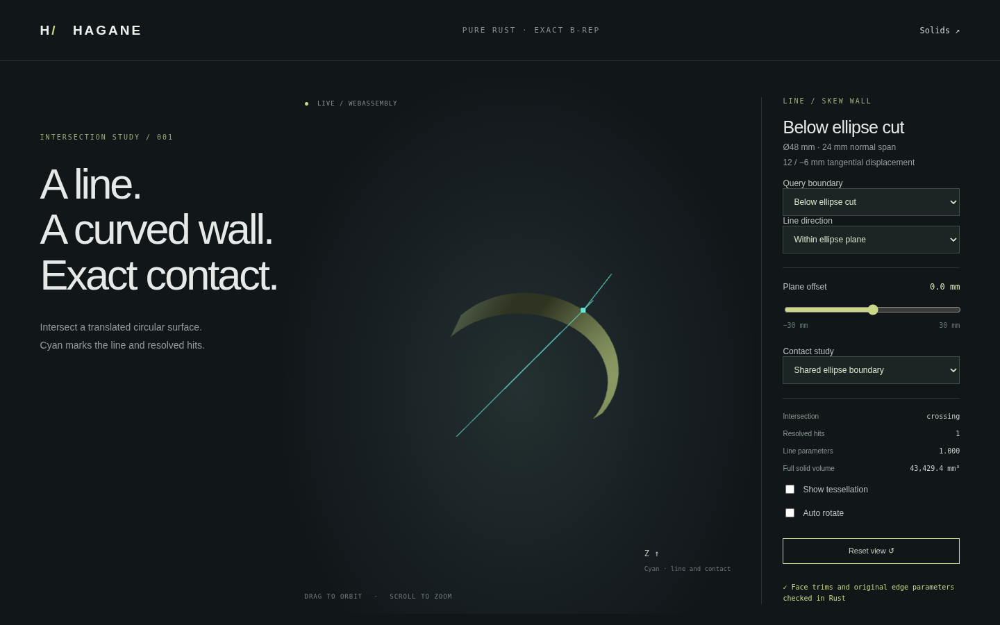

# Line intersections with harmonic circular face trims



`intersect_line_circular_face` now accepts the harmonic height bands created by
[oblique plane boundary subdivision](oblique-boundary.md), as well as the
previous rectangular trims. It queries an actual face of a validated, closed
B-rep solid. Geometry is analytic; tessellation is used only for display.

For a circular translation wall, `S(u,v) = O + R X cos(u) + R Y sin(u) + g v`,
the face domain is `0 <= u <= span`, `lower(u) <= v <= upper(u)`. Each height
bound has the form `a + b cos(u) + c sin(u)`. Supporting-surface intersections
are filtered against these functions. Bounded generator overlaps end at the
two evaluated heights. Results preserve the caller's original line parameter,
face-oriented normal, and owning 3D edge parameters. Reversed generator
intervals remain sorted by line parameter.

The height residual is converted to a physical plane-distance guard. In local
coordinates, the plane normal is `(-b/R, -c/R, 1 + b*dx/R + c*dy/R)`, where
`dx,dy` are generator drift components. The residual guard is the length budget
times the normal's norm. Unresolved coefficient precision, overlapping boundary
bands and lost local dimensions return errors.

Near an ellipse boundary, an ordinary rounded surface hit is insufficient.
Exact dyadic scalar triple products certify that the original line lies in the
plane spanned by the stored ellipse axes. The actual ellipse point, original
line parameter, pcurve and surface must then agree within the explicit length
budget. Lines that merely approach the boundary are rejected instead of being
snapped. Shared straight-generator certificates also retain corner provenance.
This is intentionally conservative: transverse boundary hits without these
certificates and some rotated near-coincident generators remain unresolved.

## Native and browser demo

```sh
cargo run --locked --example harmonic_face_intersections -- 0 0 14 0
cargo run --locked --example harmonic_face_intersections -- 1 3 0 0.37
./scripts/build-web.sh
```

Arguments are band selection (0 below / 1 above), mode (0 across wall, 1 forward
generator, 2 reverse generator, 3 in the ellipse plane), offset and rotation in
radians. Mode 3 uses the stored ellipse center and sine axis; offset translates
along world Z. The fixture has radius 24, normal height 24 and drift `(0.5,-0.25)`.
Its full solid retains volume `pi * 24^2 * 24`; only boundary faces are divided.

Serve `web/` using the README instructions and open `intersections.html`.
Choose **Below ellipse cut**, **Above ellipse cut**, or the **Shared ellipse
boundary** probe. The displayed mesh comes from the selected B-rep face, and
cyan marks resolved contacts and oriented normals. Orbit, zoom and tessellation
controls remain available. `hagane_harmonic_face_intersections_demo` exposes the
same JSON fixture through the existing WASM output/error buffer contract.

Native tests check analytic roots, shared ellipse metadata, tangency, corners,
forward/reverse generator intervals, placement, tiny skew geometry and rejection
of almost-coplanar lines. WASM checks compare native results and independently
computed roots. Browser tests exercise band selection, shared-edge identity,
ambiguity and recovery. No dependencies were added. This is an independent
implementation of analytic plane/parametric-curve substitution and IEEE-754
dyadic determinant arithmetic; no OCCT source was used.

[Solid point classification](harmonic-classification.md) now supports these
height bands. Arbitrary trim loops, repeated harmonic-band subdivision, capped
solid partitions and general curved Booleans remain unsupported.
