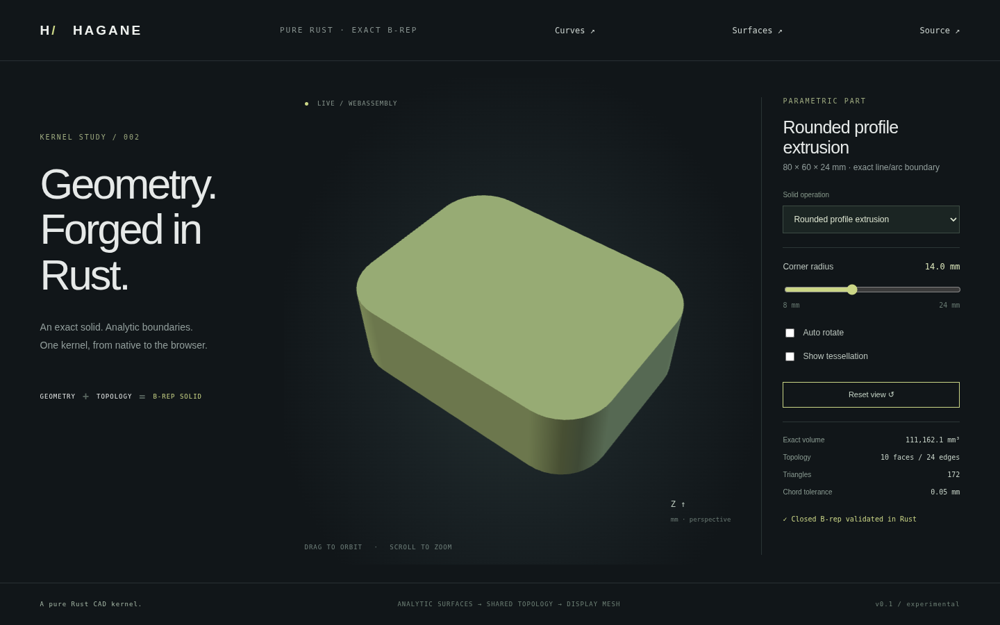

# Exact line/arc profiles



Hagane can extrude a convex, counterclockwise, tangent-connected line/arc
boundary into a closed B-rep solid. This is an exact profile construction,
not a mesh operation or a fillet of an existing solid.

## Usage

```rust
use hagane::{Point3, Tolerance, rounded_rectangle_profile, extrude_arc_line};
let tolerance = Tolerance::default();
let profile = rounded_rectangle_profile(
    Point3::new(0.0, 0.0, -12.0), 80.0, 60.0, 14.0, tolerance,
)?;
let solid = extrude_arc_line(&profile, 24.0, tolerance)?;
solid.validate(tolerance)?;
let mesh = solid.tessellate(0.05, tolerance)?;
```

Run `cargo run --locked --example part -- 5` for the browser fixture, or
`cargo run --locked --example rounded` for a rigidly placed example. Select
**Rounded profile extrusion** in the browser and change its corner radius;
the same Rust B-rep constructor runs in WASM.

`ArcLineProfile` stores an origin and an ordered `Vec<PlanarSegment>`. Segment
coordinates are XY offsets from that origin:

- `Line { a, b }`: endpoints; normalized edge parameter in [0, 1].
- `Arc { center, radius, start_angle, sweep }`: a circular arc in radians,
  counterclockwise from `start_angle` through `start_angle + sweep`.

`PlanarSegment::evaluate(fraction)` evaluates the profile over [0, 1]. The 3D
`Curve::Arc` instead stores a local frame whose X axis is the starting radius,
and uses the angular edge parameter in [0, sweep]. Its planar `PCurve::Arc`
evaluates **that same angle**, with the profile's start angle added explicitly.
Traversal direction does not alter the stored parameterization. Rigid placement
transforms the frame, preserving shared indices, pcurves and orientation.

## Supported domain

- One outer ring with 2..1024 segments; no holes in the mixed-profile API.
- Positive radius, positive line length, positive extrusion height, and arc
  length/chord resolvable beyond ten linear tolerances.
- Each CCW arc has sweep in (0, pi]; start angle is in [-2pi, 2pi]. All values
  and intermediate geometry must remain finite.
- Neighboring endpoints coincide within the linear tolerance. Their oriented
  unit tangents agree within 1e-10. Consecutive straight segments must be merged.
- Arc sweeps sum to one full CCW turn within a floating summation budget of
  `64 * epsilon * 2pi * segment_count`.
- Nonadjacent segments must not intersect, touch, or approach within the linear
  tolerance. The loop must have finite positive analytic area.
- Extrusion follows positive local Z. For an arbitrary plane, construct the
  solid first and use checked `Solid::transformed` placement.

For a closed tangent-connected curve, positive arc curvature and one total
turn delimit the convex supported class. Rounded rectangles, capsules, and
circles split into two semicircles or four quadrants fit this representation.
The rounded-rectangle helper requires four straight sides that remain longer
than ten tolerances; its limiting capsule/disk cases require explicit segments.

Clockwise arcs, concave profiles, sharp line/arc corner joins, multiple turns,
open rings, mixed-profile holes, negative/skew extrusion and unresolved features
are outside this milestone. The API returns explicit errors for input outside
its domain; it never substitutes a polygonized model. Existing polygon-only
extrusion retains its separate concave/holes/skew/reversed support.

## Geometry and validation

Cap boundaries contain exact lines/arcs. Straight segments create plane walls;
arcs create exact cylinder walls with rectangular parameter domains
`[0, sweep] × [0, height]`. Two cap edges and the two vertical boundaries are
shared with neighboring faces. Partial-cylinder walls have distinct vertical
boundaries; the existing full-cylinder representation retains its periodic
shared seam.

Planar validation reconstructs the supported line/arc boundary from pcurves.
It checks arc intervals, closure, tangency, turning, nonadjacent separation,
winding, and area, in addition to the existing vertex/edge/face manifold checks.
A partial cylinder currently accepts only its ordered four-coedge rectangle,
starting at u=v=0 and ending at u=span, v=height, with span in (0, 2pi]. Arbitrary
trim loops, face splitting, and general sewing are still future work.

Nonadjacent line/arc separation uses analytic candidates: endpoints, radial and
normal extrema, line/circle roots, circle/circle intersections, and concentric
arc cases. Straight crossings use the existing exact 2D predicate. Circular
metric/intersection calculations remain checked f64 mathematics, with a
conservative 1e-10 angular membership allowance; they are not certified exact
predicates. No display sampling is used to accept a modeling boundary.

## Analytic metrics and bounded display

Arc area contributions follow Green's theorem. With translated circle center
`(cx, cy)`, radius r and start/end angles a,b, the oriented contribution is:

`0.5 * [r * (cx * (sin b - sin a) - cy * (cos b - cos a)) + r² * (b-a)]`.

The solid integrates divergence over its actual faces. Unlike full cylinders,
a partial cylinder retains center/reference translation terms. For a span s
starting at local angle zero its contribution before face orientation is:

`r*h/3 * [r*s + (center-reference)·u * sin(s) + (center-reference)·v * (1-cos(s))]`.

These terms preserve volume after rigid placement. For a rounded rectangle,
`volume = [width*depth - (4-pi)*radius²] * height`. For a capsule with straight
length L, `volume = [2*radius*L + pi*radius²] * height`. These independent
formulas are tests, not construction history stored in the solid.

Bounds include arc endpoints and coordinate extrema only within their angular
intervals. Cap and wall tessellation use the same arc subdivision count and
analytic normals. `arc_segments` scales the existing full-circle sagitta count
to a span and rounds upward; the chord error remains in model length units.
Changing display accuracy does not change the B-rep or analytic volume.

Tests check rounded rectangles/capsules/disks, partial bounds, rigid placement,
shared topology/pcurves, closed oriented display triangles, sagitta and volume
convergence, small dimensions, malformed pcurves, and rejected inputs. Unit
tests independently cover interior line/arc and arc/arc distance candidates.
Native/WASM fixture parity and browser radius changes verify the actual demo.
