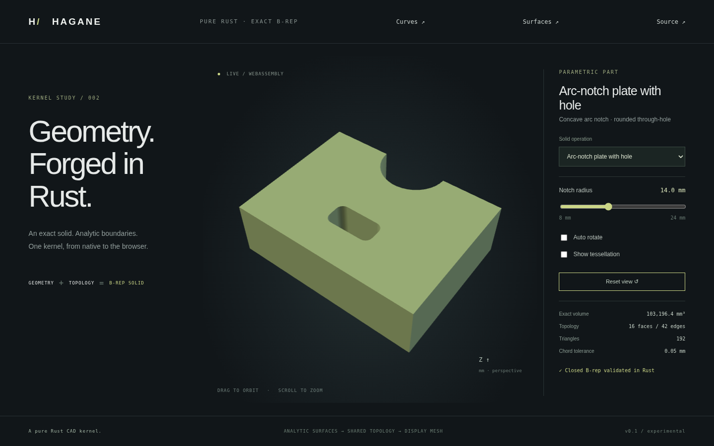

# Exact line/arc regions



Hagane extrudes simple line/arc regions into closed exact B-rep solids.
Outer rings can be concave, joins can be sharp or tangent, and disjoint holes
can mix lines and circular arcs. Both input windings and signed arcs work.
This constructs analytic geometry; it does not polygonize the modeling boundary
or fillet an existing solid.

## Usage

```rust
use hagane::{Point3, Tolerance, PlanarSegment, ArcLineRegion,
    rounded_rectangle_profile, extrude_arc_line_region};
use std::f64::consts::PI;
let tolerance = Tolerance::default();
let outer = rounded_rectangle_profile(
    Point3::new(0.0, 0.0, 0.0), 12.0, 10.0, 1.0, tolerance,
)?;
let hole = [0.0, PI].map(|start_angle| PlanarSegment::Arc {
    center: [0.0, 0.0], radius: 2.0, start_angle, sweep: PI,
}).to_vec();
let solid = extrude_arc_line_region(&ArcLineRegion {
    origin: outer.origin, outer: outer.segments, holes: vec![hole],
}, 3.0, tolerance)?;
solid.validate(tolerance)?;
let mesh = solid.tessellate(0.01, tolerance)?;
```

Run `cargo run --locked --example region` for this example or
`cargo run --locked --example part -- 6` for the browser fixture. Select
**Arc-notch plate with hole** in the browser and change its notch radius;
the same Rust constructor runs in WASM. The earlier rounded rectangle remains
available as preset 5 and `cargo run --locked --example rounded`.

`ArcLineRegion` stores an origin, one ordered outer ring and ordered hole rings.
`ArcLineProfile` and `extrude_arc_line` remain convenient no-hole APIs. Segment
coordinates are XY offsets from the origin:

- `Line { a, b }`: endpoints; normalized parameter in [0, 1].
- `Arc { center, radius, start_angle, sweep }`: circular arc in radians;
  positive sweep is counterclockwise, negative is clockwise.

`PlanarSegment::evaluate(fraction)` follows the signed arc over [0, 1].
`reversed()` reverses traversal. Construction normalizes the outer ring to CCW
and holes to CW without changing their exact geometry. Stored `Curve::Arc`
and `PCurve::Arc` always have positive angular ranges; a clockwise traversal
uses the shared edge in reverse through its coedge. No duplicate reversed
curve is required. Rigid placement preserves indices, pcurves and orientation.

## Supported domain

- One outer ring with 2..1024 segments, at most 256 holes, and at most 4096
  total segments. Rings must be simple and have finite nonzero analytic area.
- Positive radius, line length and extrusion height, with arc length/chord
  resolvable beyond ten absolute linear tolerances.
- Each arc has nonzero signed sweep with `abs(sweep) <= pi`; split larger arcs.
  Start angles lie in [-2pi, 2pi]. All geometry and intermediate results must
  remain finite.
- Neighboring endpoints coincide within the linear tolerance. Sharp and tangent
  joins work; unresolved backtracking cusps are rejected. Consecutive redundant
  or near-collinear straight segments must be merged.
- Adjacent segments may meet only at their intended join(s); secondary crossings,
  overlapping intervals and near contacts away from the joins are rejected.
  Nonadjacent segments must not intersect, touch or nearly touch.
- Holes lie strictly inside the outer boundary and remain separated from it and
  each other. Touching, crossing, overlapping, nested and near-touching holes
  are rejected. Separation uses the linear tolerance plus a conservative
  `64 * epsilon * local segment scale` floating calculation allowance.
- Height-only extrusion follows positive local Z. The [framed APIs](framed-arc-extrusion.md)
  accept world-space vectors with either sign on arbitrary rigid planes, including
  [skew extrusion](skew-arc-extrusion.md) with exact circular translation walls.

Nested islands, unresolved cusps and
arbitrary cylindrical trims remain unsupported. Existing polygon-only extrusion
retains its separate arbitrary-plane/holes/skew/reversed support. Errors never
substitute a polygonized model or a silently repaired boundary.

## Geometry and validation

Cap boundaries contain exact lines/arcs. Straight segments create plane walls;
arcs create exact cylinder walls with rectangular parameter domains
`[0, abs(sweep)] × [0, height]`. Each rim and vertical edge is shared by two
oppositely oriented coedges. Clockwise arcs produce inward-oriented cylinder
walls, including concave notches and hole walls.

Planar validation reconstructs rings from pcurves and checks closure, intervals,
area, winding, intersections, containment and separation, in addition to the
existing vertex-link and connected manifold shell checks. Full circular trims
can be represented by two semicircles for the analytic ring checks. A partial
cylinder still accepts only its ordered four-coedge UV rectangle. General
surface trims, face splitting and sewing remain future work.

`classify_arc_line_point` validates a ring and returns Inside, Boundary or
Outside. Boundary means distance within the absolute linear tolerance. Other
points use half-open ray crossings, splitting arcs at Y extrema and solving
ray/circle roots analytically. The boundary-free tolerance neighborhood permits
a small vertical ray displacement to avoid floating endpoint seams and gaps
permitted by the endpoint tolerance; unresolved
endpoint levels return an error. Display sampling never determines whether a
modeling ring or hole is accepted.

Line/arc separation uses analytic candidates: endpoints, stationary radial and
normal extrema, line/circle roots, circle/circle intersections and concentric
arc cases. Straight crossings use exact 2D signs. Circular metric/intersection
calculations remain checked f64 mathematics, with a conservative 1e-10 angular
membership allowance; they are not certified exact circular predicates.

## Analytic metrics and bounded display

Green's theorem gives arc area. For translated center `(cx, cy)`, radius r
and signed start/end angles a,b, the oriented contribution is:

`0.5 * [r * (cx * (sin b - sin a) - cy * (cos b - cos a)) + r² * (b-a)]`.

Volume integrates divergence over the actual oriented faces, including partial
cylinder center/reference translation terms. Independent expected volumes are:

- Rounded rectangle: `[width*depth - (4-pi)*radius²] * height`.
- Annulus: `pi * (outer_radius² - inner_radius²) * height`.
- Browser notch/rounded-hole plate:
  `[4600 + (4-pi)*9 - pi*notch_radius²/2] * 24`.

Construction history is not stored as a substitute for face-integrated metrics.
Bounds include arc endpoints and world-coordinate extrema within their spans.
Cap and wall tessellation share arc subdivision counts and analytic normals.
The circular sagitta bound uses the requested chord error in model length units.

Before triangulating a mixed cap, the sampled rings are checked for unresolved
corners, self-crossing, hole containment and inter-ring separation. A coarse
chord can move an inscribed outer boundary across a nearby exact hole: this
returns `Tessellation` instead of an invalid display mesh. Reduce chord error
or revise the model tolerance. Checks are limited to 4096 total trim samples
per mixed planar face. Collinear vertices removed by earcut hole bridging are
restored on triangle edges so caps remain conforming with the side walls.
Changing display accuracy never changes the exact B-rep or analytic volume.

Tests cover sharp D profiles, concave clockwise notches, rounded rectangles,
capsules, disks, annuli, multiple curved/polygon holes, both windings, analytic
classification at arc extrema/endpoints, rigid placement, shared topology and
pcurves, closed oriented triangles, sagitta and volume convergence, coarse-trim
rejection, contact/near-contact, adjacent secondary intersections, microscopic
features and invalid inputs. Native/WASM geometry parity and browser radius
changes exercise the actual seventh demo preset.
