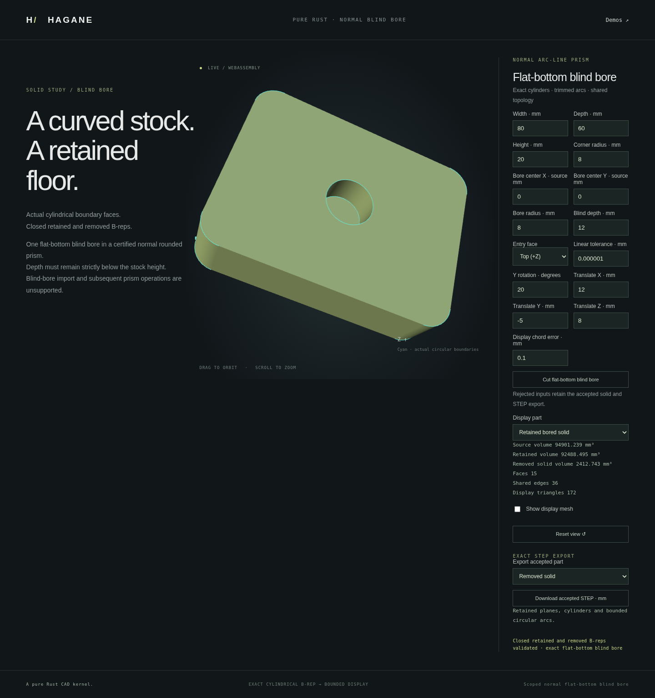

# Normal-prism flat-bottom blind bore



This operation creates one exact circular blind pocket in certified normal
line/quarter-arc or all-line prism stock. It preserves every existing source
edge and face parameterization, adds a circular inner wire to the selected
entry cap, and shares actual quarter-circle edges between four inward cylinder
walls and a planar floor. The removed material is a separate closed cylinder
solid. Display meshes are generated from these B-reps after validation.

## API and domain

```rust
use hagane::*;
let tolerance = GeometryTolerance::default();
let stock = make_box(BoxSpec {
    min: Point3::new(-20., -15., 0.),
    size: Vec3::new(40., 30., 12.),
}, tolerance.absolute())?;
let cut = blind_bore_normal_prism(
    &stock, Point3::new(0., 0., 12.), 3., 7.,
    Vec3::new(0., 0., 1.), NormalPrismBoreEntry::Positive, tolerance,
)?;
cut.kept().validate(tolerance.absolute())?;
# Ok::<(), hagane::Error>(())
```

The supplied extrusion axis selects the actual normal cap family. Its sign
is meaningful here: `Positive` enters the cap whose outward normal follows
the supplied axis, and `Negative` enters the opposite cap. Reversing both
axis and entry selects the same physical cap. The world-space center must
lie on that cap, within the reserved representation budget. Radius, depth
and remaining floor thickness must be resolved at the caller's tolerance.

Existing disjoint through openings, concavity, rigid placement and all-line
children of prior normal-plane cuts are supported through the source
certificate. The projected disk must stay strictly inside actual material
and away from all existing openings. Contact, tangency, intersecting pockets,
skew extrusion, unresolved world-coordinate arithmetic, breakthrough and
unsupported full-periodic rim representations fail explicitly.

The shared clearance certificate conservatively reserves the candidate disk
as four profile segments and one opening: source stock therefore admits at
most 124 total cap segments and 15 existing through openings. Geometric source
certification and finite resource limits apply before any graft. Coordinate,
radius, depth and linear tolerance values use the same caller-selected unit;
the provided demo and STEP export interpret them as millimetres.

This first API accepts normal-prism source stock, rather than a source already
containing blind floors. The result is no longer a uniform extrusion:
subsequent normal-prism bore/plane-partition calls reject it. The later
[single-cavity STEP certificate](normal-prism-blind-step.md) admits a separately
verified re-import subset. Editable workflow blind nodes retain their existing
domains; this API does not silently broaden them. General blind-feature
coverage and continued machining are future work.

The result exposes `kept()`, `removed()`, `hole_faces()`, `floor_face()` and
`direct_removed_volume()`. The latter evaluates `pi * radius^2 * depth`
directly, avoiding subtraction of nearly equal stock volumes.

## Native and browser example

```sh
cargo run --locked --example normal_prism_blind_bore
./scripts/build-web.sh
python3 -m http.server 8080 --directory web
```

Open `normal-blind-bore.html` to edit rounded stock dimensions, pocket center,
radius, depth, entry and rigid placement; inspect retained/removed/source
solids; and download their actual analytic STEP exports. Rejected edits retain
the last accepted shape and export. The bounded analytic reader supports the
separately certified single-cavity subset.

The default stock is 80 x 60 x 20 mm with 8 mm corner radii. A central
8 mm-radius pocket of depth 12 mm removes `768*pi` mm³. Source volume is
`90880 + 1280*pi`, and retained volume is `90880 + 512*pi` mm³.

## Geometry and provenance

Disk clearance uses the existing independently certified normal through-bore
domain. A trusted shallow four-quarter cylinder supplies the actual cavity
boundaries. Its entry rim is mapped at the same edge parameters into the
existing cap's UV frame; the retained solid shares its remapped edges with
the cavity walls and oppositely oriented floor. Source topology is cloned,
not approximated or replaced with display triangles. Closed-topology checks,
source precision reservations and analytic divergence-theorem volumes apply
before a result is returned.

Mathematics: elementary circular parameterization, rigid Euclidean frames,
the divergence theorem and the cylinder volume formula. Implementation is
original MIT OR Apache-2.0 Rust, with no OCCT source and no new dependencies.

## Verification

Native regression checks cover both entry caps, reversed/micro/large signed
axis hints, rigid placement and dimension scales 1e-4, 1 and 10. Concave and
noncentered profiles, disjoint rectangular/circular through openings, rounded
stock and actual all-line plane-cut children are exercised. They check analytic
volume, exact original geometry/pcurve retention, opposed shared edge uses,
dense same-parameter curve/surface agreement, inward cavity walls, the actual
entry-facing floor, mesh closure and explicit immutable rejection paths.
The removed cylinder survives bounded STEP round-trip. The later single-cavity
certificate also verifies the retained-body import.

The new browser route passed on the actual release WASM binary: top depth
12 mm and rigidly placed bottom depth 7 mm, independent volumes, floor normals,
15 faces/36 shared edges, same-parameter pcurves, native report parity,
actual retained/removed STEP downloads, and orbit/zoom/mobile inspection.
Contact, breakthrough and blank input preserve accepted GPU pixels, camera and
STEP export before recovery. The screenshot above was captured from that
implementation with Y rotation 20 degrees and translation (12, -5, 8) mm.

Formatting, strict all-target Clippy, 916 native tests plus 2 documentation
examples, and the release WASM build passed. Browser coverage for this milestone
is the new dedicated route; the complete suite passed immediately before this
milestone for the unchanged shared viewer.
The complete WASM runtime suite also passed on this same frozen binary,
including the existing Box/Polygon/rounded/line-arc cut histories and their
unchanged rejection contracts, followed by the new blind-bore cases.
