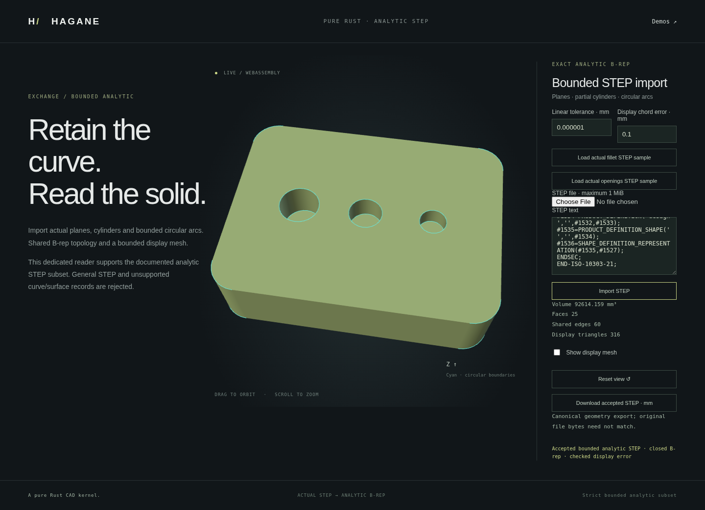

# Verified multiple-pocket analytic STEP import



The opt-in bounded analytic STEP reader imports 1–16 resolved, strictly
projection-disjoint flat-bottom circular pockets in certified normal stock.
It preserves the parsed geometry, vertices, shared edges, face orientations
and surface pcurves. A rebuilt solid is a validation witness, never a
replacement for the imported body.

## Supported domain

Stock has planar caps and straight or quarter-circular profile boundaries
extruded in the cap-normal direction.
Existing disjoint through openings, concave profiles, rigid placement and
pockets on either cap are supported. Each pocket has four quarter-cylinder
walls, one planar floor and one four-quarter inner boundary on its entry cap.
The restored profile and cavity projections share the constructor's limit of
128 boundary segments and sixteen total through openings plus pockets.
Lengths are interpreted in millimetres; supported STEP metre units are converted.

Projected circular tool footprints must be strictly separated, even for
opposite entries with a resolved axial web. Contact, nesting, breakthrough,
insufficient floor thickness, excessive resources and unresolved world-coordinate
precision reject explicitly. This is not a general nonuniform-solid reader.
Other quarter-arc representation restrictions in the
[bounded reader](step-bounded-import.md) continue to apply.
Import does not enable subsequent blind machining or workflow nodes on these
bodies; uniform-source operations retain their existing domain checks.

## Actual-shape certificate

The certificate identifies every candidate disk floor, its four adjacent
cylinder walls and its exclusive cap entry wire. Each cavity must have five
faces, twelve edges and eight vertices; these sets must be pairwise disjoint
and isolated from retained source boundaries.

Only a proof clone removes all cavities and their entry wires simultaneously.
It remaps the remaining actual topology and certifies that restored source as
a normal prism. Actual entry centers, radii, floor depths and signed cap entries
then feed the existing multiple-pocket constructor. That operation enforces
source containment, projected tool separation, floor thickness and shared
resource and arithmetic budgets.

Bijective matching compares the entire imported cavity geometry against the
witness, allowing equivalent entity ordering and cyclic wire starts. Affine
line and trigonometric circle coefficients certify whole curve intervals and
surface pcurves; shared effective coedge directions, cylinder support endpoints,
inward wall normals, floor normals and analytic volume must agree. Reserved
world-coordinate and angular-phase roundoff checks accompany physical tolerance
budgets. The reader returns the original parsed body only after this proof.

The formerly unsupported `step-two-quarter-blind-pockets.step` is now a positive
regression: a closed two-pocket box with volume `1600 - 4*pi` mm³. The new
`step-opposing-quarter-blind-pockets.step` is also genuinely closed, but its
opposite pockets overlap in projection while retaining an axial web. It stays
unsupported, demonstrating the distinction between valid topology and this
reader's deliberately limited domain.

## Run the actual demo

```sh
cargo run --example normal_prism_blind_bores
cargo run --example step_bounded_import -- docs/step-two-quarter-blind-pockets.step
./scripts/build-web.sh
python3 -m http.server 8000 --directory web
```

Generate a part in `normal-blind-bores.html`, download the retained STEP, then
load it in `step-bounded.html`. Inspect the actual imported floors and walls,
rotate/zoom, and download its analytic STEP again. The default rounded stock
has three top-entry pockets and volume `90880 + 552*pi` mm³. The screenshot
above records that real imported B-rep, rather than a substituted preview mesh.
Rejected imports preserve the previously accepted body, camera and export.

## Provenance

The implementation uses elementary circle and cylinder geometry, affine and
trigonometric coefficient identities, oriented shared boundaries, normal
extrusion and the divergence theorem. See [references](references.md) and
the [batch constructor](normal-prism-blind-bores.md). Original Pure Rust code
is MIT OR Apache-2.0. No OCCT source or new dependency is used.

## Verification

Four dedicated native tests and the existing batch regressions cover
2, 3 and 16 cavities, mixed entries, rigid
placement, small/ordinary/large dimensions, retained through openings, concave
stock and all-line cut children. They check actual curves and pcurves, opposed
shared edge uses, analytic volume and bounds, floor/wall orientation, closed
chord-bounded meshes and Euler characteristic. Entity labels/order, cyclic wire
starts, face order and equivalent floor UV origins preserve the actual body.
Tampered floor sense, planar pcurve radius and cylinder radius reject. Valid
opposing-projection pockets with an axial web and a valid seventeen-pocket body
return `Unsupported`; imported blind bodies still reject uniform-source modeling.

Formatting, strict all-target Clippy, 929 native tests plus two documentation
examples, the release WASM build, the complete WASM runtime suite and the full
all-pages browser suite passed on the repaired final binary. Browser checks
include actual file/text imports, posed mixed entries, original geometry and
pcurves, each floor, canonical STEP fixed points, rejected corruption/unsupported
overlap with unchanged accepted view/export, and orbit/zoom/mobile layout.
The screenshot records the default three-top-pocket imported body (25 faces,
60 edges). Positive file-upload tests now wait for actual import completion
before examining the accepted report; geometry assertions are unchanged.

A sixteen-pocket native import exposed a display defect: three noncollinear UV
samples became exactly collinear when evaluated into world coordinates.
The planar tessellator preserves valid UV connectivity. Only when an actual
emitted triangle has zero world area does it repair connectivity using a stable
projection of the evaluated display points, retaining those points and every
original sampled boundary segment. Exact-zero bridge ears can be removed only
when the final boundary/interior incidence proof succeeds; unresolved world-area triangles
reject. A captured actual WASM STEP fixture and a separately generated native
rounded sixteen-pocket round trip protect this behavior. Conditional repair
preserves existing tilted straight subdivisions, whose closure regressions
also pass. The B-rep, pcurves and chord sampling remain unchanged.

Display triangulation is not a canonical interchange representation. Tiny
native/WASM transcendental differences can select different valid cap diagonals.
The new import tests retain the existing 32-EPS comparisons for B-rep, metadata
and STEP, and independently validate both meshes for closure, outward nonzero
triangles and chord bounds. Same-face cap material coverage and oriented areas,
normal/error bounds, and curved triangles are compared without requiring identical
array ordering. Existing runtime comparison helpers remain unchanged.

The complete WASM runtime suite passed on the repaired release binary, including
2–16 cavities, mixed/placed entries, renamed/reordered STEP entities, genuine
metre conversion and native analytic report parity. Valid overlapping projected
opposite pockets reject and recovery succeeds. Initial direct mesh-index parity
and independent semantic mesh validation exposed the actual native sixteen-pocket
zero-area defect described above; the source repair and native regressions
address it.
