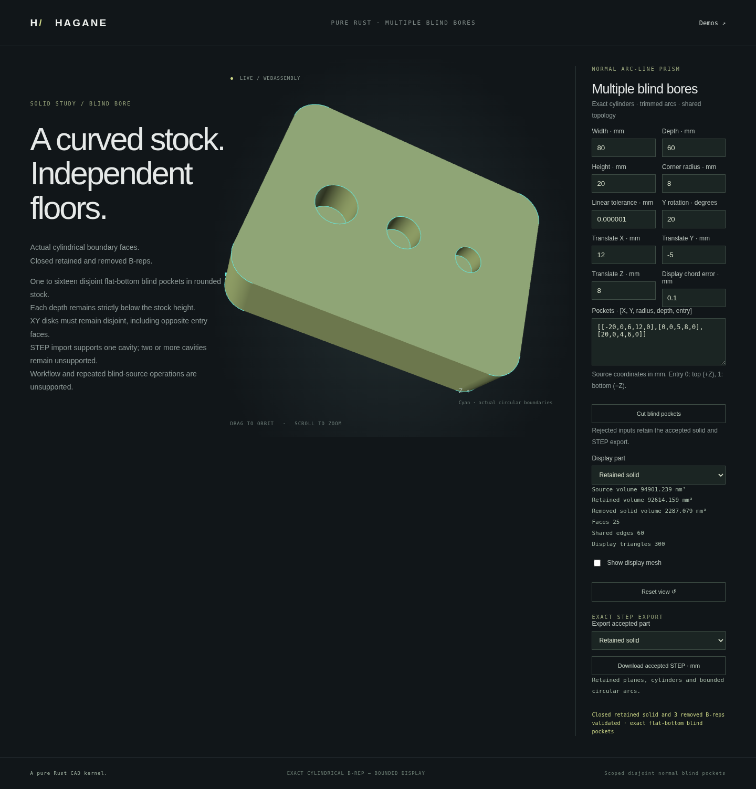

# Multiple disjoint normal-prism blind pockets



`blind_bores_normal_prism` creates 1–16 exact flat-bottom circular pockets
in certified normal line/arc or all-line stock. Each pocket retains four
quarter-cylinder walls and a shared planar floor. The result supplies one
retained body, an independently closed removed cylinder for every input, actual
wall/floor face indices and a compensated sum of direct removed volumes.

## Supported domain

The source must be uniform normal-prism stock, optionally with disjoint through
openings. Rounded stock, noncentered/concave profiles, rigid placement and actual
all-line children from normal plane cuts use the existing source certificates.
Existing blind floors are not accepted as source by this API. The combined
source-through-opening plus pocket count is at most 16, and total source cap
segments plus four per pocket must not exceed 128.

Each center lies on its selected actual entry cap within the reserved physical
budget. Positive/Negative entry follows the signed supplied extrusion axis.
Radius, depth, floor thickness and source/world arithmetic must be resolved.
All projected disks must be strictly disjoint, including opposite-entry tools:
overlapping XY footprints with an axial web are deliberately outside this
operation, even where the separate legacy box API supports them. Contacts,
nesting, breakthrough, meaningful skew and out-of-domain representations reject.

The source is cloned. Each existing single-pocket operation runs against that
same immutable source, verifying material containment and exact cavity geometry.
Only its validated eight-vertex/twelve-edge/five-face cavity and actual entry
inner wire are grafted with checked index remapping. Original source curves,
surfaces and existing pcurves remain exact. Display meshes are generated after
closed-topology validation, never used as CAD Boolean geometry.

```rust
use hagane::*;
let tolerance = GeometryTolerance::default();
let stock = make_box(BoxSpec {
    min: Point3::new(-20., -15., 0.),
    size: Vec3::new(40., 30., 12.),
}, tolerance.absolute())?;
let pockets = [
    NormalPrismBlindBoreSpec {
        center: Point3::new(-8., 0., 12.), radius: 3., depth: 7.,
        entry: NormalPrismBoreEntry::Positive,
    },
    NormalPrismBlindBoreSpec {
        center: Point3::new(8., 0., 0.), radius: 3., depth: 5.,
        entry: NormalPrismBoreEntry::Negative,
    },
];
let result = blind_bores_normal_prism(
    &stock, &pockets, Vec3::new(0., 0., 1.), tolerance,
)?;
result.kept().validate(tolerance.absolute())?;
# Ok::<(), hagane::Error>(())
```

Removed bodies and wall/floor index arrays follow input order. Each removed
volume is independently checked against `pi*r^2*depth`; compensated totals and
retained/source conservation are checked separately. Blind pockets preserve
the source's genus, unlike through openings.

## Run the actual example

```sh
cargo run --locked --example normal_prism_blind_bores
./scripts/build-web.sh
python3 -m http.server 8080 --directory web
```

Open `normal-blind-bores.html`. Edit the pocket list, stock and placement;
inspect retained/source/each removed cylinder; download the accepted analytic
STEP per body. Invalid candidates preserve the accepted shape and export.
The default rounded 80 x 60 x 20 mm stock with 8 mm corners has volume
`90880 + 1280*pi`. Three top-entry pockets at X=-20, 0, 20 mm with radii
6, 5, 4 mm and depths 12, 8, 6 mm remove `728*pi`; retained volume is
`90880 + 552*pi` mm³.

The operation does not activate workflow nodes or machining of a source already
containing blind floors. The existing [single-cavity STEP reader](normal-prism-blind-step.md) admits the count-one result and individual removed
cylinders; two or more retained cavities still return Unsupported on import.
Export preserves actual analytic geometry regardless of this reader limitation.

Provenance: elementary circular parameterization, rigid frames, oriented shared
boundaries, cylinder volume and the divergence theorem; compensated floating
summation uses the standard Kahan algorithm. Original MIT OR Apache-2.0 Rust,
no OCCT code and no new dependencies.

## Verification

Three independent native tests exercise 2, 3 and 16 pockets, mixed cap entries,
axis sign/magnitude equivalence, reversed input order, rigid placement and
dimension scales 1e-4, 1 and 10. Rounded stock, actual all-line cut children,
noncentered concave stock and prior through openings are covered. Checks include
exact source geometry/pcurve prefixes, dense same-parameter pcurves, opposed
shared uses, closed tessellation and sagitta bounds, actual floor/wall normals,
each removed analytic volume and conserved compensated totals. Contacts, near
contacts, nested/opposite overlapping footprints, invalid depths/floors,
zero/17 count and combined resource excess reject without source mutation.

Formatting, strict all-target Clippy, 923 native tests plus 2 documentation
examples and the release WASM build passed. The dedicated browser route passed
on that binary: actual three-top and posed mixed-entry pockets, independent
volumes/floors/curve-pcurves, native report parity, retained and each removed
STEP downloads, and orbit/zoom/mobile layout. Rejected contact, nesting, depth,
type and JSON edits preserve accepted GPU pixels, camera and STEP before recovery.
Its first temporary focused-runner attempt accidentally included unrelated
bounded-import execution; that helper extraction was corrected, with product
code and all assertions unchanged, before the successful run. The screenshot
above records actual three-top-pocket stock at Y rotation 20 degrees and
translation (12, -5, 8) mm; all three floors are visible. Shared renderer and
legacy pages are unchanged; browser validation covers the new dedicated route.

The complete WASM runtime suite passed on the same frozen binary, including
three-pocket top/mixed/placed cases and a valid 90-value, 16-pocket model.
Native numerical report and per-body STEP parity, per-pocket floor/wall
geometry, all owning pcurves and closed chordal meshes are checked. Contact,
depth, precision and transport errors recover. Individual removed cylinders
re-import; the unchanged multiple-cavity retained-body import guard still
returns Unsupported.
