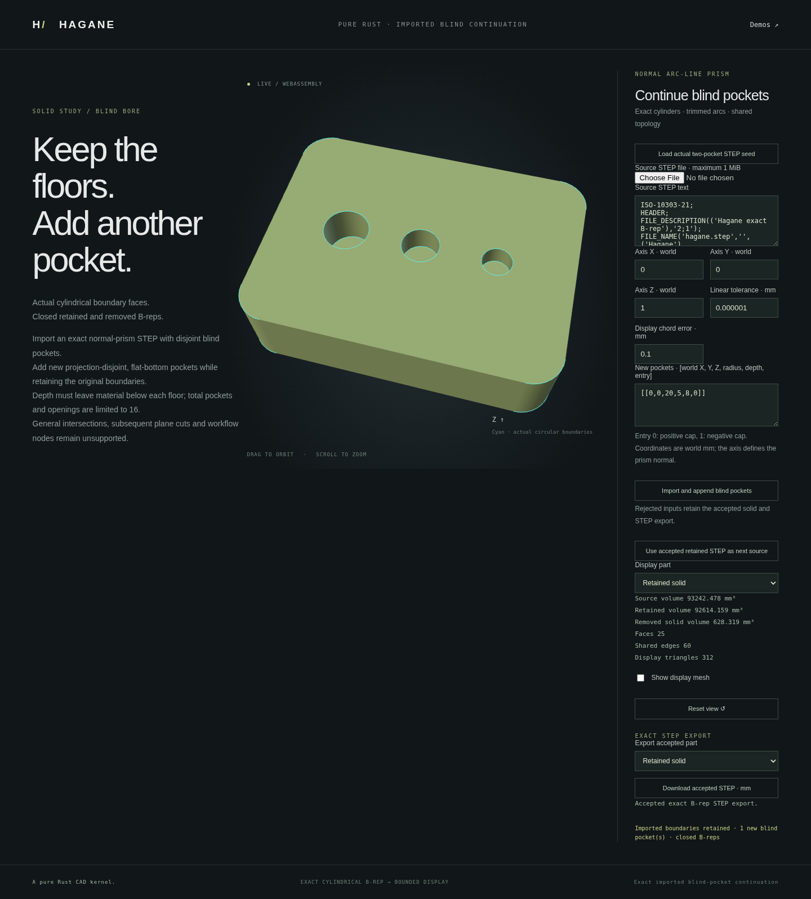

# Continued blind machining



`append_blind_bores_normal_prism` adds flat-bottom pockets to actual uniform
normal stock or a certified previously machined body, including bounded analytic
STEP imports. It preserves every original vertex, edge, face, surface and pcurve;
only new cavity topology and entry-cap inner wires are appended. Removed bodies,
wall/floor identifiers and removed volume describe the new pockets only.

```rust
use hagane::*;
# fn example(source: &Solid) -> Result<()> {
let result = append_blind_bores_normal_prism(
    source,
    &[NormalPrismBlindBoreSpec {
        center: Point3::new(0.0, 0.0, 20.0),
        radius: 5.0,
        depth: 8.0,
        entry: NormalPrismBoreEntry::Positive,
    }],
    Vec3::new(0.0, 0.0, 1.0),
    GeometryTolerance::default(),
)?;
result.kept().validate(Tolerance::default())?;
# Ok(()) }
```

The signed axis defines positive/negative entry. Centers lie on the selected
entry cap. Previous cavities are recovered only after a complete analytic
certificate; a combined witness checks all old and new pockets, then only the
new suffix is grafted onto the actual input. The witness never replaces old
geometry. Source volume minus new analytical `πr²d` volumes is checked.

Limits: at most 16 total pockets/openings and 128 source/profile segments after
adding circular trims. All projected tool disks must be strictly separated,
even for opposite-side pockets with an axial web. Pocket radius, depth, wall
clearance and remaining floor must exceed the conditioning/tolerance bands.
Only certified normal prisms with supported line/quarter-circle profiles and
analytic planar/cylindrical boundaries are accepted. Contacts, overlapping
projections, general curved Booleans, subsequent plane cuts and workflow nodes
remain unsupported. Existing single/batch APIs retain their original domains.
Invalid or unsupported inputs return explicit errors without changing the source.

Run the native demo against an actual exported part:

```sh
cargo run --example normal_prism_blind_continue -- part.step \
  '[0,0,1,0.000001,0.1,0,0,20,5,8,0]'
```

The numeric payload is axis XYZ, linear tolerance, display chord tolerance,
then one or more world-center XYZ, radius, depth, entry (`0` positive, `1`
negative) records. STEP input is limited to 1 MiB. The report contains source,
kept, newly removed bodies and exact bounded AP214 STEP exports in millimeters.

Build with `./scripts/build-web.sh`, serve `web` using `python3 -m http.server
8000 --directory web`, then visit `/blind-continue.html`. Load the two-pocket
seed or a supported STEP file, add pockets, inspect/download each body, and
choose **Use kept STEP as next source** to continue machining. Rejected operations
retain the last accepted display and exports. Display meshes are tessellated
from the exact B-rep; no mesh Boolean is used.

Regression coverage includes actual imported/reordered bodies with equivalent
plane UV origins, exact old-boundary retention, repeated continuation, analytical
volumes, closed topology, curve approximation, extreme signed axes, scales,
resource limits and immutable rejection of corrupted or unsupported sources.

Validation: `cargo fmt`, strict all-target Clippy, 935 native/doc tests,
release WASM build and the full WASM regression suite passed. The browser checks
actual two-to-three-to-four-pocket STEP histories, per-face mesh coverage and
orientation, native B-rep/STEP parity, failed-operation retention, mobile layout
and orbit controls. The image above is captured from that implementation.
