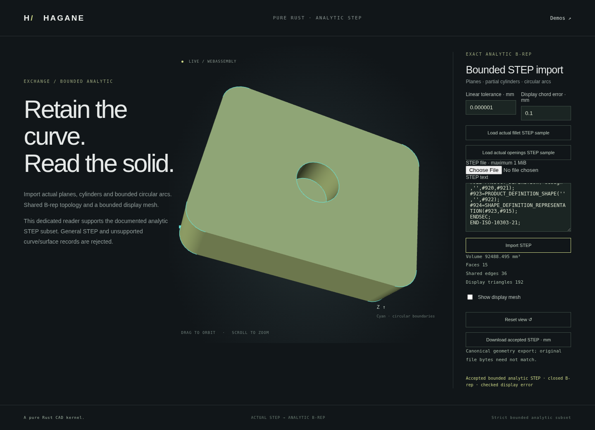

# Verified single-cavity analytic STEP import

This records the original single-cavity milestone. The subsequent
[multiple-pocket certificate](normal-prism-blind-bores-step.md) broadens the
reader to 1–16 projection-disjoint cavities. Its positive regression corpus
includes the previously unsupported two-quarter-pocket fixture below; other
restrictions and original verification results remain documented here.



The opt-in bounded analytic STEP reader now accepts the supported single
flat-bottom quarter-circle pocket from the [normal-prism blind-bore API](normal-prism-blind-bore.md).
Actual vertices, curves, surfaces, shared topology
and owning pcurves are retained; an independently rebuilt witness is used for
verification rather than substituted for imported geometry.

## Supported subset

One strictly contained circular pocket with four resolved positive quarter
arcs, four rectangular inward cylinder walls and a planar floor is supported
on structurally certified normal line/arc or all-line stock. Existing disjoint
quarter-arc or polygon through openings, concavity, noncentered coordinates,
either entry cap, rigid placement and SI metre/mm conversion use the existing
bounded parser and source certificate.

Arbitrary splitting/reversal of the quarter representation, long/full-periodic
arcs in this cavity domain, multiple blind pockets, arbitrary cylinder origin
parameterizations, contacts, breakthrough, meaningful skew, unresolved
coordinates and general STEP remain unsupported. Existing periodic circular
and planar readers retain their separate documented domains. Import does not
enable subsequent normal-prism operations on a nonuniform blind body.

## Proof before admission

The reader first validates the actual closed B-rep and original world-coordinate
precision. If ordinary line/arc prism certification reports Unsupported,
the additional certificate identifies the disk floor, four cavity walls and
one actual cap inner wire. It requires exactly five cavity faces, twelve
exclusive edges and eight exclusive vertices; external uses reject.

Only a proof clone removes those boundaries and restores the cap. The actual
restored stock must validate and pass normal-prism recognition. The strict
blind constructor then supplies a witness for disk clearance, depth, remaining
floor thickness and source precision. The original cavity's full analytic
curves, owning pcurves, cylinder dimensions and effective face orientations
must agree with that witness within reserved physical budgets. Cyclic wire
order and record IDs are not shape identity. A successful import returns
the original parser result.

## Use

```rust
let solid = hagane::import_step_bounded_analytic_mm(
    &step_text, hagane::Tolerance::new(1e-6)?,
)?;
let canonical = hagane::export_step_bounded_analytic_mm(&solid, 1e-6)?;
```

Build the web demo, open `normal-blind-bore.html`, download the retained
STEP, then upload it in `step-bounded.html`. Both pages render actual Rust/WASM
B-reps. Rejected files retain the previously accepted shape and STEP export.

The tracked `step-two-quarter-blind-pockets.step` fixture is a genuinely closed
two-pocket body made from two disjoint single-operation results on identical
stock. Its independent volume is `1600 - 4*pi` mm³. It is intentionally outside
this one-pocket certificate and must return Unsupported, rather than pass
because its topology and volume alone appear plausible.

Mathematics and provenance: exact circular coefficients and affine line
parameterization, rigid frames, shared manifold boundaries, the divergence
theorem and analytic cylinder volume. All new code is original MIT OR
Apache-2.0 Rust; no OCCT source or new dependencies are used.

## Verification

Four additional native tests verify both entry caps, rigid placement, signed
axis equivalence, curved/all-line stock and prior through openings, micro/large
dimension scales, analytic volume and bounds, dense original curve/pcurve
agreement, opposing shared uses and closed display meshes. Record renumbering
and reordering, cyclic floor-wire rotation, shell-face reordering and equivalent
plane-origin/UV shifts are accepted. Changed floor orientation, UV circle
radius, cylinder radius and the genuinely valid two-pocket fixture reject.

Formatting, strict all-target Clippy, 920 native tests plus 2 documentation
examples and the release WASM build passed. The complete WASM runtime suite
also passed, including native numeric geometry/STEP parity, one-pocket
round-trips, renamed/reordered records, real metre/mm conversion and
orientation/unit/unsupported-two-pocket rejection with recovery.

The focused browser import route passed on the same frozen binary. It uploads
actual retained-pocket STEP, accepts placed top/bottom cases, compares original
curves/pcurves and floor normals, and verifies canonical export/re-import.
Corrupted floor orientation and the valid unsupported two-pocket file preserve
accepted GPU pixels, camera, data and STEP export; recovery, orbit and mobile
inspection passed. The screenshot above records the actual imported top pocket
at Y rotation 20 degrees, translation (12, -5, 8) mm and volume 92488.495 mm³.
Shared renderer and generic import-page code are unchanged; this milestone's
browser validation covers the new import path rather than rerunning every page.
