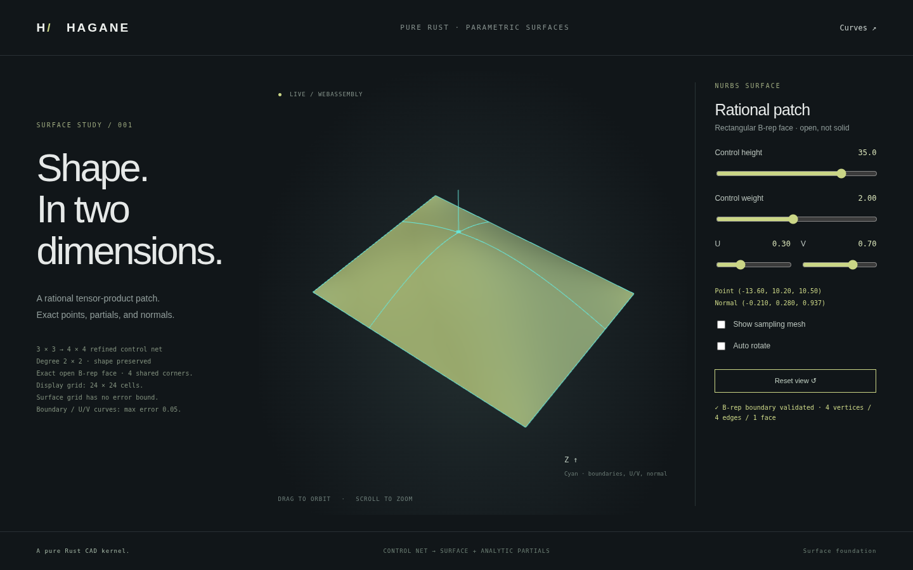

# Rectangular open NURBS B-rep face

`NurbsFace` retains a complete rectangular rational surface as the kernel's
existing `Face`, with four `Vertex` objects, four `Edge` objects, one `Wire`
and four oriented `Coedge` objects. The geometry enums now contain
`Curve::Nurbs(Box<NurbsCurve>)` and `Surface::Nurbs(Box<NurbsSurface>)`.
This is an open B-rep face with exact rational geometry; it is not a closed
solid, a general trimmed patch or a NURBS Boolean implementation.



## Construction and retained topology

```rust
use hagane::{NurbsFace, NurbsSurface, Point3, Tolerance};
let knots = vec![0.0, 0.0, 1.0, 1.0];
let surface = NurbsSurface::new(
    [1, 1], [knots.clone(), knots], [2, 2],
    vec![Point3::new(0.0, 0.0, 0.0), Point3::new(0.0, 1.0, 0.0),
         Point3::new(1.0, 0.0, 0.0), Point3::new(1.0, 1.0, 0.0)],
    vec![1.0; 4],
)?;
let face = NurbsFace::new(surface, 1, Tolerance::default())?;
face.validate_boundary(Tolerance::default())?;
let mesh = face.sample_grid([24, 24], Tolerance::default())?;
```

The face retains its exact `Surface::Nurbs`. Its boundary edges are exact
isocurves of that surface, using the original knot domains, not polyline
substitutes. The four corner vertices are shared by neighboring edges through
indices. Bottom and right coedges traverse forward; top and left traverse
backward. Each coedge retains an affine `PCurve` evaluated at the same parameter
as its 3D edge curve. Surface UV orientation and face orientation are separate:
`orientation` is +1 or -1, while the outer wire remains counterclockwise in UV.

The fields are public for inspection. Editing them does not preserve validation;
call `validate_boundary` before using modified data. The supported form is
exactly one complete rectangular-domain wire with these four canonical edges.
Additional wires, arbitrary trims, altered UV maps, incorrect references or
traversal, and noncanonical rational boundaries are rejected.

## What boundary validation establishes

Validation checks face orientation, wire/cardinality, canonical edge order,
shared corner references, coedge direction, same-parameter affine UV maps,
canonical boundary curves and curve-to-vertex endpoint agreement. Boundary
curve degree, knot vectors and weights must exactly equal those regenerated
from the retained surface. Control coordinates and vertices are compared using
the supplied linear tolerance.

Strict weight equality is intentional: small absolute weight differences can
produce large geometry changes when canonical weights are tiny. A mathematically
equivalent boundary represented by common-scaled weights, a refined knot basis
or another parameterization is currently rejected rather than treated as a
canonical boundary. Geometric equivalence of arbitrary rational representations
is not implemented.

The checks establish this restricted structure and its geometric boundary
identity. They do **not** certify global surface regularity, injectivity,
non-self-intersection, watertightness or compatibility with neighboring patches.
A singular surface can define valid structural boundary data; display sampling
then rejects singular sampled tangent planes rather than inventing normals.
This distinction avoids treating boundary validation as a manifold certificate.

`transformed(transform, tolerance)` places the exact surface controls and
regenerates canonical boundary geometry/topology. The face orientation is
retained. The rebuilt face is checked; no mesh transform replaces the rational
geometry. Different faces do not yet share boundary-edge storage or sewing.

## Geometry dispatch and checked evaluation

`Curve::range()` returns the NURBS curve's original parameter domain. Rigid
`Curve::transformed` and `Surface::transformed` preserve degrees, knots, weights
and exact mathematical shape through transformed control points, subject to
`f64` rounding and checked numerical range.

Use `Curve::try_evaluate(t)` or `Surface::try_evaluate(u,v)` for explicit errors
on invalid rational parameters or numerical range. `Surface::normal_at(u,v)`
uses both parameters and the checked analytic rational partials. C0 knot-line
normal requests still require the underlying surface's explicit side APIs.
`Surface::try_parameters(point)` rejects general NURBS point inversion as
unsupported; no approximate inverse is returned as exact success.

The older infallible compatibility methods retain their signatures. Rational
`evaluate` failures produce NaN coordinates. `normal(u)` cannot evaluate a
NURBS normal with the missing V parameter and returns NaN; `parameters(point)`
also returns NaN for unsupported rational inversion. Checked APIs are the
recommended route for rational geometry.

## Display and supported operations

`NurbsFace::tessellate_bounded(error, max_cells, tolerance)` now provides
[bounded multi-span surface display](nurbs-surface-tessellation.md), preserving
shared grid vertices and applying face orientation after boundary validation.
[C0 knot lines](nurbs-surface-crease.md) keep separate side normals with shared
geometric nodes; arbitrary trims remain unsupported. [Bezier extraction](nurbs-surface-extraction.md)
handles the source spans.

`trimmed(ranges, tolerance)` now restricts an existing validated face to a
[rectangular UV subset](nurbs-surface-trim.md), preserving orientation and exact
rational geometry by knot insertion/control selection. It regenerates canonical
boundaries on the new clamped surface; it does not store arbitrary trim loops.


`NurbsFace::sample_grid(cells, tolerance)` validates the retained boundary and
samples the actual retained surface. Negative face orientation reverses mesh
triangle winding and normals. The grid has the existing uniform surface sampling
limits: 1..256 cells per axis, checked sampled normals/triangle orientation,
and explicit rejection of unsupported C0 grid splitting.

**This compatibility grid has no certified chord-error or coverage guarantee.**
The demo's boundary/section polylines separately use the bounded curve API;
those bounds do not certify the surface triangles. The display is generated
from the retained open B-rep, while its exact surface, curves, pcurves and shared
corner references remain available independently of the mesh.

Generic `Solid` validation, volume, classification, transformation and mesh
operations reject NURBS geometry; STEP export rejects it through validation.
Existing analytic intersection and Boolean operators remain limited to their
documented geometry domains. Raw infallible `Solid::bounds()` can enclose
rational controls using their positive-weight convex hull, but these are
conservative bounds, not exact rational extrema or a validation certificate.
Adding a NURBS variant does not enable unsupported solid operations.

```sh
cargo run --locked --example nurbs_face
cargo run --locked --example nurbs_surface_bounded
./scripts/build-web.sh
python3 -m http.server 8000 --directory web
```

The native `nurbs_face` example constructs an exact rational quarter-cylinder
open face with four vertices and four edges. Its 32-by-8 display grid emits
512 triangles; the JSON explicitly reports `closed: false` and a null
whole-surface error bound.

The **Surfaces** browser page now generates bounded triangles from the retained
single-span, optionally refined C1 multi-span, or C0 ridge open face (see
[bounded display](nurbs-surface-tessellation.md)),
with exact boundaries and selected sections evaluated by Rust/WASM. Tests cover
actual topology types, canonical validation, shared vertices and UV identity,
orientation reversal, exact placement, singular display failure, geometry enum
dispatch and explicit rejection of generic solid operations.

## Next steps

Shared edges across adjacent NURBS patches, general trims and trim validation,
patch regularity diagnostics, arbitrary trimmed face meshing, sewing, intersections and
STEP interchange remain future work. This milestone supplies the first retained
rectangular rational face and makes those next steps concrete; it does not
complete general NURBS B-rep integration.
