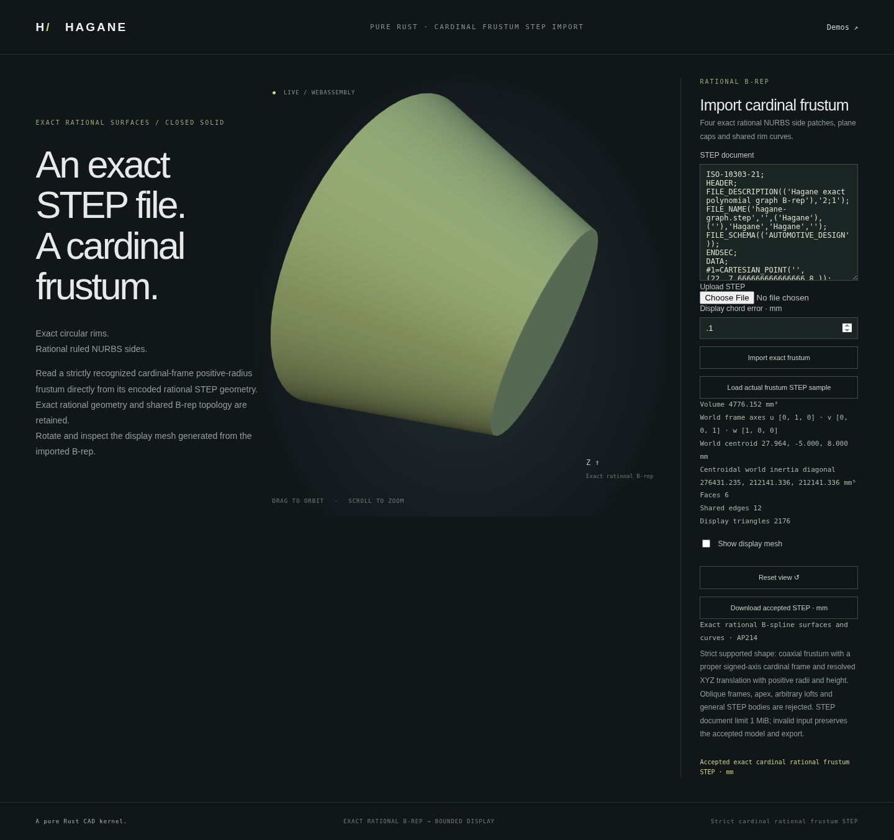

# Cardinal-frame rational frustum STEP import



`import_step_nurbs_frustum_cardinal_mm` accepts the same checked rational
frustum family with a translated, right-handed signed coordinate basis.
There are 24 supported bases: local axes are distinct world X/Y/Z directions
with signs, and the third axis is the cross product of the first two. This
includes X- and Y-oriented parts, reversed Z axes and exact quarter-turn frames.
It does not accept arbitrary-angle rotations.

```rust
use hagane::*;
# fn example(text: &str) -> Result<()> {
let policy = GeometryTolerance::default();
let body = import_step_nurbs_frustum_cardinal_mm(text, policy)?;
let frame = body.frame();
let mesh = body.tessellate(0.1, policy)?;
let step = body.export_step_mm(policy)?;
# Ok(()) }
```

Run `cargo run --example nurbs_frustum_cardinal_step_import` for an actual
X-oriented upper-child export/import. The parent uses local axes `[Y, Z, X]`
and origin `(12, -5, 8)`; after a cut at local height 10 mm, the imported upper
child has origin `(22, -5, 8)`, height 14 mm and volume
`4776.151675724216` mm³. Pass a file path to read another supported body; the
example limits documents to 1 MiB.

```sh
cargo run --example nurbs_frustum_cardinal_step_import_demo
cargo run --example nurbs_frustum_cardinal_step_import_demo -- part.step 0.1
./scripts/build-web.sh
python3 -m http.server 8000 --directory web
# Open /nurbs-frustum-cardinal-step-import.html.
```

The separate browser loads [an actual exported STEP sample](nurbs-frustum-cardinal-example.step),
imports it through the shared kernel and displays the retained B-rep. The sample
was generated from the default native demo report's `step` field, rather than
handwritten geometry. Uploaded and edited files use the same path. Rejected
input or display requests preserve the accepted model, camera and STEP export.
The report's placement contains the actual translation and three frame axes;
it does not describe these frames as a single Y-axis rotation angle.

## Exact admission

Each raw STEP cap-plane normal and reference direction must contain exactly
one component equal to `+1` or `-1`, with all other components zero. The two
directions must be orthogonal. Their cross product reconstructs the omitted
plane axis exactly within this domain. Scaled or approximately cardinal
directions are rejected, even when they describe a nearby or equivalent plane.
The caps must share the same axes and have positive separation along the
declared local third axis, with no transverse displacement.

Radii come from retained local rational UV coefficients; height comes from
represented cap separation. The complete candidate certificate checks every
actual vertex, rational curve/surface basis and control net, oriented shared
topology, UV boundary and serialized LINE/affine preimage. The returned body
retains actual parsed geometry. Source construction height bits are not
promised when translated coordinates lose information, and unresolved
precision returns an error.

The [origin-only](nurbs-frustum-step-import.md) and
[translation-only](nurbs-frustum-translated-step-import.md) APIs and browser
pages keep their existing restrictions. This new API shares the native/WASM
kernel and has a separate bounded byte ABI and browser page. The transport limit
is 2 MiB; the parser and demo CLI limit documents to 1 MiB. Other unit
systems, arbitrary rotations, apex bodies, general NURBS shells and STEP
assemblies remain unsupported.

## Verification and sources

Tests exercise all 24 bases with tapered, reversed-taper and cylindrical
bodies and their actual axial upper children. Independent checks cover
retained control nets, UV geometry, closed display meshes, mass properties,
re-export, altered raw directions and coefficient corruption, precision
refusal and the unchanged earlier API scopes.
Native/WASM reports compare actual frame axes, rational geometry, mass and
inertia, closed bounded displays and exact STEP across X/Y/Z and reversed-axis
fixtures. The browser regression also checks file/text input, native parity,
re-export, rejected-state retention, orbit and mobile layout. Run
`node scripts/test-frustum-cardinal-step-import-browser.mjs` after building
WASM; CI includes this regression.
This uses original MIT OR Apache-2.0 code, no new dependencies and no OCCT
source. See [references](references.md) for the representation conventions.
