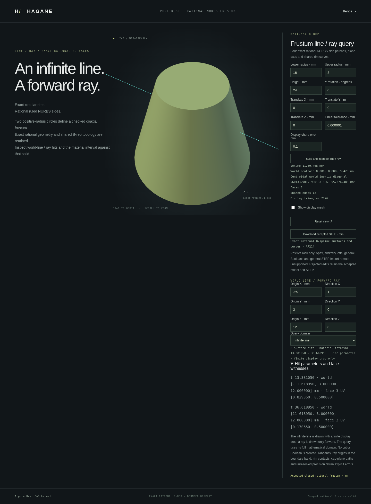

# Infinite line and ray queries on rational frusta

`NurbsFrustumSolid::intersect_line(origin, direction, policy)` and
`intersect_ray(origin, direction, policy)` query the validated finite rational
B-rep without tessellation. Their `NurbsFrustumLineIntersection` result contains
sorted boundary hits, actual face IDs/UV witnesses and an optional material
interval. Parameters use the caller's original direction:
`point = origin + direction * parameter`. Directions need not be unit vectors.
Line parameters can be negative; ray parameters are nonnegative.

```rust
use hagane::*;
# fn example() -> Result<()> {
let policy = GeometryTolerance::new(1e-6, 1e-10, 0.)?;
let body = NurbsFrustumSolid::new(Frame3::IDENTITY, [16., 8.], 24., policy)?;
let query = body.intersect_ray(
    Point3::new(-25., 3., 12.), Vec3::new(2., 0., 0.), policy,
)?;
assert_eq!(query.hits.len(), 2);
assert!(query.material_interval.is_some());
# Ok(()) }
```

At height 12 the radius is 12. This example intersects at
`x = ±sqrt(135)`, with parameters `(25 ± sqrt(135))/2`. A ray starting
strictly inside returns one exit hit and a material interval starting at zero;
a ray pointing away returns an empty result when the exclusion is resolved.
An infinite line can start inside or on the boundary, since its origin does
not delimit the query. A ray origin in the boundary band is unsupported.

## Bounded reduction and precision

The solver checks the original world origin, direction and retained body before
reducing the infinite domain. It clips a normalized physical direction against
an expanded local bounding box containing the complete finite body. This box
is a conservative query bound, not substituted CAD geometry. Artificial
segment endpoints must be outside the body. The checked
[segment solver](nurbs-frustum-segment.md) supplies the boundary events and
actual rational face witnesses; mapped hits are checked again against the
original line. The origin is never moved to conceal insufficient precision.

The triangle inequality first bounds possible unit-speed travel by the original
origin-to-frame distance plus twice the body scale. Expanded slabs include
frame metric drift and arithmetic allowances over that range. This also bounds
the relevance of rounded near-parallel direction components; unresolved slab
division or ordering is refused rather than snapped to parallel.

Bounding in the finite height range avoids unnecessarily extending an ordinary
axial query to the remote apex of the infinite supporting cone. Conservative
guards can still reject unresolved configurations on extended surfaces.
Contact, near-tangency, cap-plane/generator overlaps, cap-rim events, ambiguous
slab/root ordering and unrepresentable parameters return explicit errors.
Nonfinite origins/directions and zero directions are invalid. The original
direction's magnitude does not change the physical tolerance. Extreme
magnitudes are supported only when the resulting parameters and reconstruction
remain representable and resolved. These are engineering floating-point guards,
not formal interval certification.

This API covers typed positive-radius finite coaxial frusta and equal-radius
cylinders in checked rigid frames. It does not implement general NURBS
intersection, face splitting or a Boolean operation. Successful queries leave
the original B-rep and STEP representation unchanged.

## Native, WASM and browser demonstration

Run `cargo run --example nurbs_frustum_line` to obtain the actual body, mesh,
STEP and query report. An optional JSON array supplies exactly 16 finite
values: lower radius, upper radius, height, Y rotation angle in radians,
translation XYZ, linear tolerance, display chord tolerance, query origin XYZ,
direction XYZ and mode (`0` for line, `1` for ray).

Run `./scripts/build-web.sh`, then `python3 -m http.server 8000 --directory web`
and open `/nurbs-frustum-line.html`. The browser displays the actual tessellated
B-rep and a finite visible portion of the query. The display extent does not
bound the mathematical intersection. Rejected edits retain the accepted
geometry, query, camera and STEP export. Hit details report the original
parameters and retained face UV coordinates.



## Validation and provenance

Independent analytic tests check cap/cap and side/side crossings, reversal,
nonunit directions of magnitude `1e-200` and `1e200`, arbitrary rigid placement,
near-parallel directions, actual face evaluations, inside rays and resolved
misses. Contact, boundary-origin, far-anchor and unrepresentable-parameter
tests require rejection. Shared reports preserve query results when display
chord tolerance changes. WASM tests compare complete native reports and STEP,
and check strict finite input limits and recovery. Browser tests exercise the
actual query controls, witnesses, display, export and transactional rejection.

Slab clipping is the intersection of the three coordinate intervals of an
axis-aligned box. Direction normalization, original-parameter recovery and
finite-domain reduction use elementary vector algebra. Actual intersections
use the existing implicit cone/cap equations and rational surface inversion
documented for the segment solver. This is original MIT OR Apache-2.0 Rust
code with no new dependencies or OCCT source. See [references](references.md).
