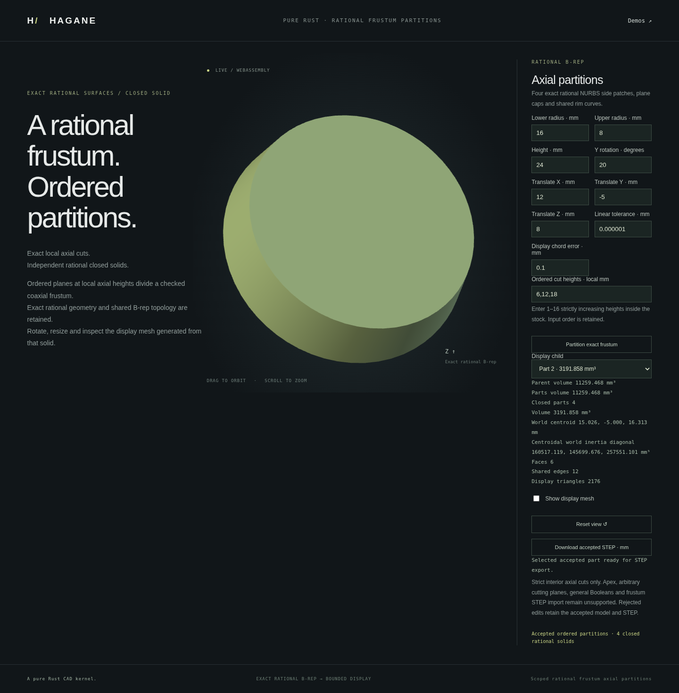

# Multiple axial rational frustum partitions



The shared Rust kernel partitions a certified positive-radius rational frustum
at 1–16 ordered source-local axial heights. Each returned part is a closed
8-vertex, 12-edge, 6-face B-rep with rational ruled sides and planar caps.
Display meshes and exact AP214 STEP come from those actual returned bodies.

```rust
use hagane::*;
# fn example() -> Result<()> {
let policy = GeometryTolerance::default();
let source = NurbsFrustumSolid::new(Frame3::IDENTITY, [16., 8.], 24., policy)?;
let result = source.split_axial_many(&[6., 12., 18.], policy)?;
for part in &result.parts {
    let step = part.export_step_mm(policy)?;
}
# Ok(()) }
```

```sh
cargo run --example nurbs_frustum_partitions
cargo run --example nurbs_frustum_partitions_demo
./scripts/build-web.sh
python3 -m http.server 8000 --directory web
# Open /nurbs-frustum-partitions.html.
```

The demo payload contains the existing nine model/display numbers followed by
1–16 cuts: `[r0, r1, height, Y_rotation_radians, tx, ty, tz, linear_tolerance,
display_chord_error, ...local_cut_heights]`. Physical lengths use mm. The default
is `[16, 8, 24, 0, 0, 0, 0, 1e-6, 0.1, 6, 12, 18]`.
Its four part volumes are 4247.4332676534, 3191.85813604723,
2287.0794518133694 and 1533.0972149518193 mm³; their sum is the source
11259.468070465819 mm³.
The report contains `parent_volume`, `cut_heights`, ordered `parts` with actual
mesh/B-rep/mass/inertia/bounds/STEP, and `sections` with actual rational rim curves.
The native and WASM helpers serialize the returned bodies without reconstructing
them from parameters. The numeric ABI uses `hagane_nurbs_frustum_partitions_begin`,
`push` and `finish`; nonfinite numbers or more than 25 values latch failure until
finish resets the buffer. Missing model values or cuts are rejected.

The browser accepts comma-separated increasing local cuts, selects any returned
part for orbit/zoom inspection and saves that accepted part's exact STEP. It
does not sort or merge input cuts. Invalid inputs preserve the last accepted
parts, display, camera and export; changing part selection uses the accepted
report without invoking the kernel again.

## Certificates and limits

Every interval, including the first and last, exceeds ten full-source effective
tolerance bands plus arithmetic reserve. Repeated partitioning is followed by
a whole-patch rational control-basis comparison against the original source,
not merely sampled agreement. All adjacent rational rims and opposed cap
normals are checked. Normalized total volume and local first moments must agree
with the source; unrepresentable metrics or unresolved physical precision fail.
No partial result is returned and the source is unchanged on success or failure.

This retains the [single-cut API](nurbs-frustum-split.md)'s positive-radius coaxial
domain. Arbitrary NURBS solids, oblique cuts, cap contacts, apex bodies, general
Booleans and frustum STEP import remain unsupported. Original entity IDs and
bit-identical seam coordinates across independently evaluated part frames are
not promised. Each individual part remains closed with shared display edges.
Mathematical sources and MIT OR Apache-2.0 provenance are recorded in
[references](references.md); no new dependency is used.

## Verification

Native tests compare the actual returned coefficients, body meshes and STEP
with the demo report, and cover invalid counts, finite inputs, ordered intervals
and display failures. WASM regression checks also compare independent polynomial
mass and parallel-axis inertia, adjacent sections and native reports, including
transport latch recovery. The focused browser script checks 4 and 17 parts,
rational pcurves, chord bounds, closed mesh incidence, per-part downloads,
camera/pixel preservation after rejected inputs, private accepted-state isolation
and mobile layout. Run `node scripts/test-frustum-partitions-browser.mjs` after
building WASM and installing the locked Playwright dependency and Chromium;
this regression is included in the CI browser job.
