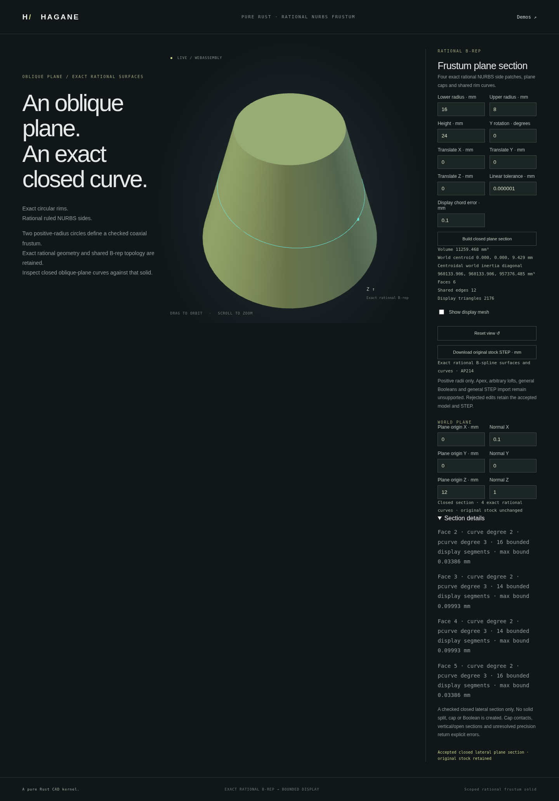

# Closed rational plane sections of frusta

`NurbsFrustumSolid::section_by_plane(&plane, policy)` constructs a closed
four-edge section where a plane crosses every retained lateral quarter strictly
between the two caps. It returns actual rational quadratic spatial edges,
shared cyclic vertices and same-parameter rational cubic UV curves referencing
the original B-rep faces. The source remains unchanged. This operation creates
a section curve, **not a split solid or new cap face**.

```rust
use hagane::*;
# fn example() -> Result<()> {
let policy = GeometryTolerance::new(1e-6, 1e-10, 0.)?;
let body = NurbsFrustumSolid::new(Frame3::IDENTITY, [16., 8.], 24., policy)?;
let normal = Vec3::new(0.1, 0., 1.).normalized()?;
let u = Vec3::new(0., 1., 0.);
let plane = Surface::Plane {
    origin: Point3::new(0., 0., 12.), u, v: normal.cross(u),
};
let section = body.section_by_plane(&plane, policy)?;
section.validate(policy)?;
assert_eq!(section.edges().len(), 4);
assert_eq!(section.uses().len(), 4);
# Ok(()) }
```

The private result retains its checked source and plane. `vertices()`,
`edges()`, `uses()` and `plane()` provide read-only access; each use names its
actual source face and pcurve. Edges follow increasing source-quarter parameter
around the local positive axial direction. Reversing the plane normal changes
its orientation, not the geometric section.

## Exact rational construction

On a source quarter, the unit circle has quadratic Bernstein homogeneous
coordinates `A(u), B(u), W(u)`. In source-local coordinates the plane equation
is `nx*x + ny*y + nz*z = d`. With `dr = r1-r0` and height `H`, define

```
G = nx*A + ny*B
D = nz*H*W + dr*G
N = d*W - r0*G
K = r0*nz*H + dr*d
```

The section has homogeneous spatial coordinates
`[K*A, K*B, H*N, D]`, all quadratic. Its surface parameters are
`[u, N(u)/D(u)]`. Multiplying the quadratic denominator by `u` and elevating
the other two coordinates gives a cubic rational pcurve at the **same** edge
parameter. The world frame transforms the spatial controls; the pcurve stays
in the actual retained lateral face's UV coordinates.

Resolved positive denominator weights and bounded rational control values
certify that the whole section stays away from the caps. Shared seam endpoints,
the plane equation and the source surface correspondence are checked under
explicit arithmetic allowances. The construction retains conic geometry;
display polylines are generated afterwards with the existing bounded NURBS
curve tessellator. Floating-point guards are engineering checks rather than
formal interval certification.

## Supported domain and limitations

The typed source must have positive radii, finite height and a validated rigid
frame. The query must be a resolved finite plane. The admitted domain is a
closed four-quarter section strictly between the caps, including horizontal
circles and oblique ellipses of equal-radius cylinders or conical frusta.
The conservative control bounds may reject a mathematically valid section
when its cap clearance cannot be certified.

Cap/rim contact or crossing, vertical/open sections, unresolved denominator
weights, degenerate conics and insufficient world-coordinate precision return
explicit errors. Non-plane surfaces are unsupported. No polygonal surrogate,
empty fabricated section or partial success is returned. This does not provide
general NURBS surface intersection, trimming, new planar faces, solid splitting
or Boolean operations. Section-only STEP output is not implemented; exporting
the original stock remains available.

## Native, WASM and browser demonstration

Run `cargo run --example nurbs_frustum_plane_section` for the actual default
stock and oblique section. The optional JSON array supplies exactly 15 finite
values: lower radius, upper radius, height, Y rotation angle in radians,
translation XYZ, linear tolerance, display chord tolerance, plane origin XYZ
and plane normal XYZ. The normal is normalized robustly and must be nonzero.

The report contains the actual spatial curves, UV curves, shared vertices,
face IDs and bounded display polylines with parameters and per-chord error
bounds. Display is limited to 16,384 segments per quarter. The stock mesh and
STEP represent the original B-rep.

Run `./scripts/build-web.sh`, then `python3 -m http.server 8000 --directory web`
and open `/nurbs-frustum-plane-section.html`. Plane controls update the actual
section overlay. Rejected changes preserve accepted geometry, section, camera
and stock STEP export.



## Validation and provenance

Independent tests evaluate the actual spatial curve, its cubic UV curve and
the retained source face at the same parameters. They check the plane equation,
analytic radius/height relationships, shared closed incidence and bounded
display interpolation. Equal-radius cylinder ellipses, tapered bodies,
horizontal sections, reversed normals, rigid placements and admitted extreme
scales are covered. Tests require explicit rejection for cap crossings/contact,
vertical sections, malformed planes, far origins and insufficient precision.
Native/WASM reports and original stock STEP are compared; browser rejection
tests preserve the accepted section, geometry, camera and export.

The implicit plane/cone equation and homogeneous rational Bernstein algebra
are public mathematics. Degree elevation and positive-weight convex-hull
properties follow the NURBS references already recorded in
[references](references.md). This is an original MIT OR Apache-2.0 implementation
with no new dependencies or OCCT source.
