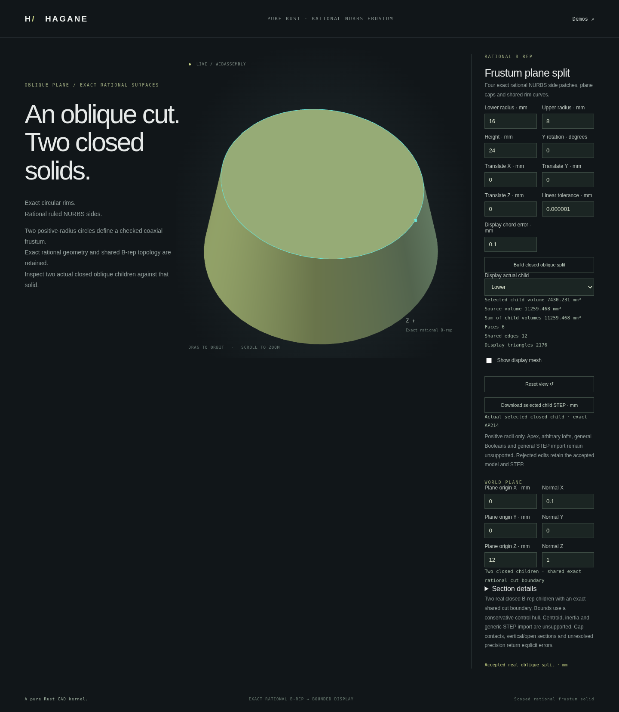

# Oblique splitting of retained rational frusta

`NurbsFrustumSolid::split_by_plane(&plane, policy)` returns two actual closed
`NurbsObliqueFrustumSolid` children and their shared rational section. The plane
must form a resolved closed section strictly between both original caps.
`lower` contains the original lower cap; `upper` contains the original upper
cap, independent of the plane normal's sign. Both have eight vertices, twelve
shared edges and six oriented faces. This is a B-rep construction, not mesh CSG.

```rust
use hagane::*;
# fn example() -> Result<()> {
let policy = GeometryTolerance::new(1e-6, 1e-10, 0.)?;
let stock = NurbsFrustumSolid::new(Frame3::IDENTITY, [16., 8.], 24., policy)?;
let normal = Vec3::new(0.1, 0., 1.).normalized()?;
let u = Vec3::new(0., 1., 0.);
let plane = Surface::Plane {
    origin: Point3::new(0., 0., 12.), u, v: normal.cross(u),
};
let split = stock.split_by_plane(&plane, policy)?;
split.lower.validate(policy)?;
split.upper.validate(policy)?;
let volume = split.lower.volume(policy)? + split.upper.volume(policy)?;
assert!((volume - stock.volume(policy)?).abs() < 1e-8);
let mesh = split.lower.tessellate(0.1, policy)?;
assert!(!mesh.triangles.is_empty());
let step = split.lower.export_step_mm(policy)?;
assert!(step.contains("RATIONAL_B_SPLINE_SURFACE"));
# Ok(()) }
```

## Geometry, topology and display

The [closed rational section](nurbs-frustum-plane-section.md) supplies four
quadratic cut edges. Each child retains one original circular cap and adds a
planar elliptical cap with actual rational pcurves. Positive-weight tensor
patches of degree `[2,1]` join the original rim and cut rim along the original
straight generators. Their geometric image is the corresponding portion of
the original side, although the surface's ruling parameter is reparameterized.

Unequal endpoint weights make this parameter differ from physical line travel.
For a generator with layer weights `w0,w1`, surface parameter `v` corresponds
to physical line parameter `t = v*w1 / ((1-v)*w0 + v*w1)`. Its same-parameter
UV curve is rational linear with inverse weights `[w1,w0]`. Ignoring this would
create mismatched boundaries even when the surfaces look similar.

The typed private result checks its complete deterministic geometry/topology
certificate, shared endpoint relationships, opposed edge incidences and
same-parameter boundary correspondence. Actual cut-cap pcurve controls bound
the whole rational projection residual. `solid()` provides read-only access to
the retained B-rep. Generic unrestricted NURBS trim validation and generic STEP
import retain their unsupported status; this type admits only its certified
construction.

The display tessellator uses actual patches and a common dyadic grid. Shared
edge positions are cached by topology and parameter, including the weighted
generator mapping. Bernstein cell and rim bounds reserve arithmetic and
boundary mismatch budgets. The grid limit is 64 cells per parameter axis,
giving at most 33,280 triangles per child. Excessively fine or ill-conditioned
display requests fail explicitly. The old canonical frustum path retains its
sampling behavior.

## Analytic volume and conservative bounds

In source-local coordinates write the plane as `z = c-a*x-b*y`. Let
`s=(r1-r0)/H`, `R=r0+s*c`, `L²=a²+b²` and `q=sqrt(1-s²*L²)`. The lower volume
is evaluated with the cancellation-avoiding expression

```
Vlower = π / (3*q³) *
    [c*(R² + R*r0 + r0²) + r0³*s*L²*(1+q+q²)/(1+q)]
Vupper = Vsource - Vlower
```

This follows from elliptical cone volume `area*height/3` and rationalizing
the difference of the supporting cone volumes. It avoids division by the
slope and subtracting remote cone volumes when the taper is nearly zero.
The cylinder limit is `π*r0²*c`. Dimensions are scaled before arithmetic;
unresolved cancellation, singular ellipse factors or very small remaining
volume relative to the source are refused. Tests also compare an independent
positive cylindrical-coordinate integration, rather than only this formula.

`bounds(policy)` returns a **conservative rational control-hull enclosure**,
not tight extrema. Volume is implemented; centroid and inertia of these new
children are not implemented and are not substituted from the original stock.

## Supported domain and limitations

The source is the validated positive-radius rational frustum family in a rigid
frame. The cut must remain strictly between both caps on all four quarters.
Horizontal cuts, closed oblique conical sections and equal-radius cylinder
sections are supported under the stated precision guards. Cap/rim contact or
crossing, vertical/open sections and unresolved arithmetic return errors.
There is no partial child result on failure.

General NURBS Booleans, arbitrary surface trimming, repeated cuts of these new
children, centroid/inertia and oblique-child STEP import remain future work.
STEP **export** serializes each actual child, including its retained rational
surface/curve bases and pcurves, without fitting or copying the source body.

## Native, WASM and browser demonstration

Run `cargo run --example nurbs_frustum_plane_split`. An optional JSON array
supplies exactly 16 finite values: lower radius, upper radius, height,
Y rotation angle in radians, translation XYZ, linear tolerance, display chord
tolerance, world plane origin XYZ, world plane normal XYZ and selection
(`0` lower, `1` upper). The report contains both actual children, individual
volumes, conservative bounds, meshes, B-reps and STEP strings.

Run `./scripts/build-web.sh`, then `python3 -m http.server 8000 --directory web`
and open `/nurbs-frustum-plane-split.html`. Choose a child to inspect its real
cut cap and download its STEP. Rejected edits preserve the accepted child,
camera and export.



## Validation and provenance

Independent tests verify every boundary's same-parameter attachment, opposed
two-face edge incidence, whole-source ruled coverage, identical cut curves and
opposite cut-cap orientations. Mesh checks use exact coordinate-bit incidence
and dense actual-patch interpolation tests, including unequal generator
weights. Analytic volumes are compared with independent positive quadrature,
horizontal axial partitions and the cylinder limit. Normal reversal, arbitrary
rigid placement, near-zero taper, admitted scales and thin resolved parts are
covered. Contact/out-of-domain and resource failures must reject. Reports
compare complete actual native/WASM geometry and each child's STEP; browser
rejection tests preserve the accepted child and camera.

Homogeneous rational ruled-surface construction, positive-weight convex hulls,
ellipse area and cone volume are public mathematics. The stable volume formula
above is an independent algebraic derivation. Existing Bernstein error bounds
and the original AP214 writer are reused. This is original MIT OR Apache-2.0
Rust code with no new dependencies or OCCT source. See [references](references.md).
