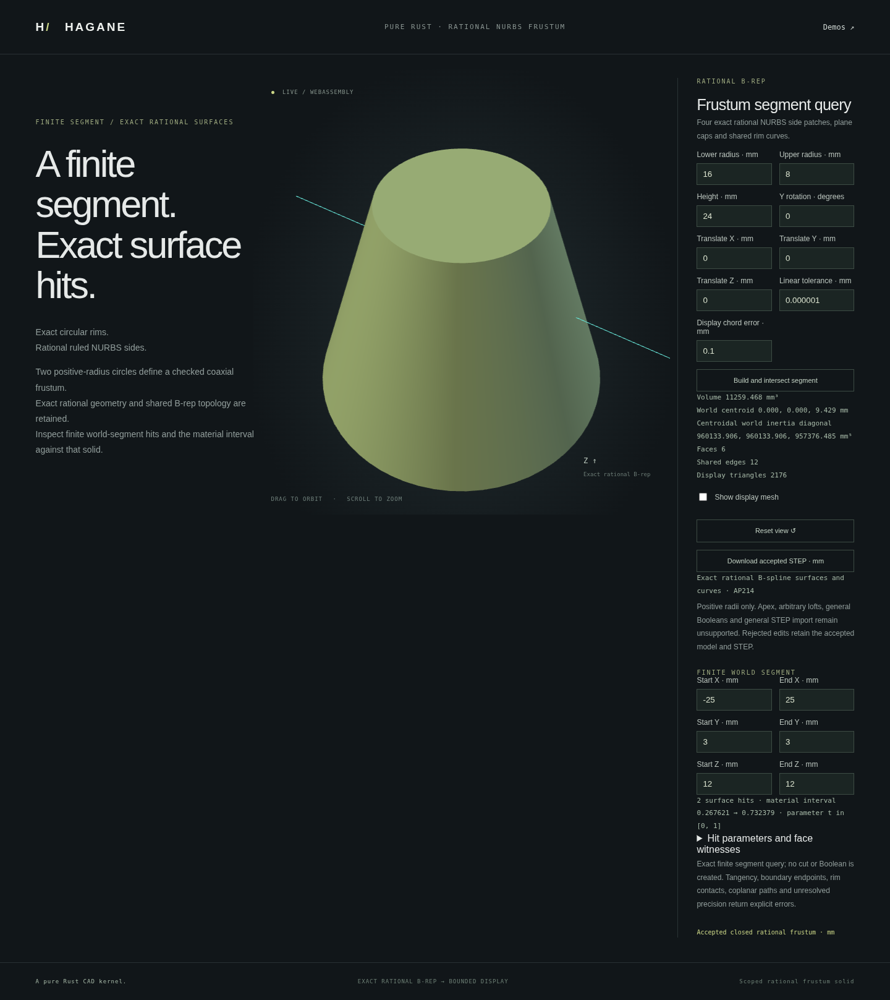

# Finite segment queries on rational frusta

`NurbsFrustumSolid::intersect_segment(start, end, policy)` intersects a finite
world-space segment with the completely validated retained B-rep. It returns
sorted boundary hits with parameters in `[0, 1]`, actual world points and face
IDs/UV coordinates, plus an optional closed material interval. A segment can
start or end strictly inside, be wholly inside, or miss the body. The positive
radius finite frustum is convex, so at most one material interval is returned.

```rust
use hagane::*;
# fn example() -> Result<()> {
let policy = GeometryTolerance::new(1e-6, 1e-10, 0.)?;
let body = NurbsFrustumSolid::new(Frame3::IDENTITY, [16., 8.], 24., policy)?;
let query = body.intersect_segment(
    Point3::new(-25., 3., 12.), Point3::new(25., 3., 12.), policy,
)?;
assert_eq!(query.hits.len(), 2);
assert!(query.material_interval.is_some());
# Ok(()) }
```

The default side intersections occur at `x = ±sqrt(12² - 3²)`. Parameters belong
to the original segment, rather than a normalized direction. Reversing the
segment reverses the corresponding hit positions and maps interval endpoints
through `t -> 1-t`. Witness face IDs index `body.solid().shell.faces`; evaluating
the actual retained face at each reported UV reproduces the hit within the
reserved caller tolerance. An exact quarter seam can report two side witnesses.

## Algorithm and admitted domain

The body is validated before using its certified frame and dimensions. The
local lateral equation is `x² + y² - (r0 + (r1-r0)*z/height)² = 0`. The solver
normalizes dimensions, checks coefficient/discriminant arithmetic allowances
and uses a cancellation-avoiding quadratic root expression. An admitted linear
branch checks derivative resolution across the whole finite parameter interval.
A separate convex norm-minus-positive-affine-radius proof can establish that
both endpoints inside the extended cone have no lateral crossing, even when
an irrelevant remote cone apex would make the quadratic unresolved.

Finite disk cap crossings are tested separately. Roots outside the physical
height or cap disks are excluded; accepted events are checked on the original
segment, actual B-rep surface, boundary classifier and outward normal. Interval
midpoints and endpoint locations must agree with the reported material set.

These are conservative engineering floating-point guards, not a formal interval
arithmetic certificate. The relative distance policy uses body dimensions;
source/query world-coordinate and frame precision can cause explicit rejection.
The geometric core never tessellates or modifies the body.

The initial API rejects boundary-band endpoints, tangencies and near-double
roots, cap-rim contacts, generator/cap-plane overlaps, unresolved nearly linear
coefficients, ambiguous root/endpoint ordering, very short segments and
insufficient world-coordinate precision. Coincident or unresolved extended
surface configurations may be refused even if their contact lies outside the
finite body. Nonfinite or identical endpoints are invalid. Rejection returns an
error, never an invented empty interval. The separate
[line/ray API](nurbs-frustum-line.md) reduces admitted infinite queries to this
solver. General NURBS line intersection, face splitting and Boolean operations
remain unsupported.

## Actionable rejection reasons

Unsupported queries identify the failing geometric or precision condition. The
Rust API retains its `Error::Unsupported` category; the shared demo and WASM
transport propagate the explanation to the browser. Error wording is descriptive
rather than a versioned machine-readable code contract.

| Reported condition | Possible input change |
| --- | --- |
| Endpoint within the boundary band | Move the endpoint away from the boundary. |
| Lateral tangency or unresolved double-root separation | Move the segment away from contact. |
| Cap-plane overlap or cap-rim contact | Use a transverse crossing away from the rim. |
| Near-linear lateral direction | Choose a direction farther from a generator. |
| Unresolved world-coordinate precision | Use a closer coordinate origin or suitable tolerance. |
| Segment too short relative to tolerance | Lengthen the segment or choose a smaller admissible tolerance. |

Changing a tolerance can alter the admissible domain and may itself be rejected;
queries never silently reduce their guard budgets. Tests distinguish the actual
endpoint/contact/overlap/coordinate cases and verify unchanged successful
reports after rejection. Acceptance thresholds and geometric results are
unchanged by this diagnostic improvement.

## Native, WASM and browser demonstration

Run `cargo run --example nurbs_frustum_segment` for the actual default body and
query report. The example accepts one JSON array of 15 finite numbers: lower
radius, upper radius, height, Y rotation angle (radians), translation XYZ,
linear tolerance, display chord tolerance, world start XYZ, world end XYZ.
The shared serializer reports actual full frame axes, retained B-rep/mesh/STEP
and the segment result. The core query is display-independent; the complete
demo also requires successful bounded tessellation and STEP output.

Run `./scripts/build-web.sh`, then `python3 -m http.server 8000 --directory web`
and open `/nurbs-frustum-segment.html`. The page renders the actual B-rep mesh,
original query segment and a boundary hit marker; numeric results show the
material interval and face witnesses. Rejected changes retain the last accepted
body/query, camera and STEP export. This is an intersection query demonstration,
not a modeling cut.



## Validation and provenance

Independent tests cover side-side, cap-cap, oblique cap-side, inside endpoints,
fully inside/miss, reversal, equal-radius cylinders, expanding/contracting radii,
rigid placement and admitted scales. They check analytic roots/material
intervals and each actual rational face witness. Numerical tests cover tangency,
near-linearity, short segments, overlaps, huge anchors, boundary endpoints and
recovery. Native and WASM compare complete actual reports and STEP; browser
checks preserve accepted output on rejection.

The implicit cone equation, Vieta root identities, finite disk tests and convex
norm property are public mathematics. This is an original MIT OR Apache-2.0
implementation using the existing rational B-rep and Euclidean classifier;
no dependencies or OCCT source were added. See [references](references.md).
