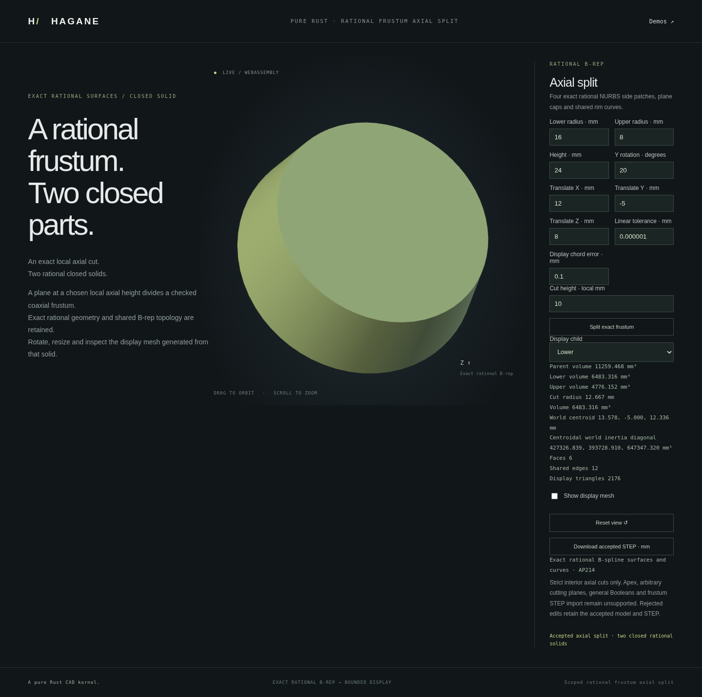

# Axial rational frustum partitions



`NurbsFrustumSolid::split_axial(cut_height, policy)` splits a validated rational
frustum by its source-local plane `Z = cut_height`. Both returned children are
closed 8-vertex, 12-edge, 6-face B-reps with rational ruled sides, rational rim
curves and planar caps. Their frame axes are retained; the upper origin moves
to the cut plane. The four `section` curves are the actual lower top-cap rims.
No mesh cut or fitted surface is used.

`split_axial_many(&[6., 12., 18.], policy)` partitions the same source into
four ordered closed parts. It accepts 1–16 finite, strictly increasing local
heights. Every interval, including the last, must exceed ten full-source
tolerance bands plus arithmetic reserve. Duplicate, unordered, endpoint and
unresolved cuts fail without modifying the source or returning partial parts.
Each resulting patch is certified against the original source, each adjoining
rim pair is checked, and total volume and first moments are checked again;
unchecked repeated-frame drift is not accumulated. `sections[i]` contains the
actual top rim curves of `parts[i]`, adjacent to `parts[i + 1]`.

Run `cargo run --example nurbs_frustum_partitions` for the four-part native
demo. Supply an existing output directory as its argument to save each part's
exact STEP. The API is shared Rust code compiled for native and WASM; the
single-cut page remains available; the separate [batch demo](nurbs-frustum-partitions.md)
provides the multiple-cut browser and numeric ABI.

```rust
use hagane::*;
# fn example() -> Result<()> {
let policy = GeometryTolerance::default();
let source = NurbsFrustumSolid::new(Frame3::IDENTITY, [16., 8.], 24., policy)?;
let parts = source.split_axial(10., policy)?;
let lower_step = parts.lower.export_step_mm(policy)?;
let upper_step = parts.upper.export_step_mm(policy)?;
# Ok(()) }
```

```sh
cargo run --example nurbs_frustum_split
./scripts/build-web.sh
python3 -m http.server 8000 --directory web
# Open /nurbs-frustum-split.html.
```

The native/WASM numeric payload is `[lower_radius, upper_radius, height,
Y_rotation_radians, translate_x, translate_y, translate_z, linear_tolerance,
display_chord_error, local_cut_height]`, in mm for physical lengths.

The default cut at local height 10 mm has radius 12.666666666666666 mm.
The lower and upper volumes are 6483.316394741602 and 4776.151675724216 mm³,
whose sum agrees with the source 11259.468070465819 mm³.

## Actual geometry and conditioning

The complete original B-rep is validated before splitting, and both actual child
bodies undergo their complete typed validation. Each child side has the same
positive rational basis as the source restricted in its linear V direction.
Equal V-row weights make the restriction an affine control-row interpolation;
the largest physical control discrepancy bounds the entire patch. This checks
retained geometry continuously rather than accepting a few matching samples.

The two section rims retain matching knots, weights and whole-curve controls
within the reserved absolute physical precision budget. Cut caps have opposed
normals. Binary64 arithmetic does not promise identical bits for independently
evaluated world frames. Every child is individually closed, and its display mesh
uses the existing exact-coordinate shared-edge cache.

The cut must leave two heights exceeding ten effective **source-body** geometric
tolerances plus arithmetic reserve. Children also pass their own dimension/frame
checks; unresolved curve/surface restriction or seam precision is refused.
Representable volume and centroid are required for conservation admission:
metric errors propagate, while normalized local moments avoid large-world and
intermediate-product overflow. Inputs producing unrepresentable metrics are
explicitly outside this split's supported domain.

## Browser, tests and limits

The browser selects either actual child and downloads that child's exact AP214
STEP. Changing selection rebuilds only the display from the accepted report;
rejected cuts, dimensions or display budgets preserve the accepted report,
camera and STEP. Native/WASM serialization uses the returned B-reps rather than
reconstructing bodies from their report parameters.

Independent tests compare dense original-to-child same-parameter geometry,
section circles, opposed cap normals, analytic volume and world first/second
moments including parallel-axis inertia recomposition. They also check closed
mesh incidence, chord bounds, actual STEP spline records, repeated child splits,
cylinder/swapped radii, poses/scales and invalid/source-relative thin cuts.

This API supports strictly interior axial cuts of the declared positive-radius
coaxial family. It does not recognize arbitrary NURBS bodies, preserve original
entity IDs, split by oblique/world-coordinate planes, admit cap contacts, perform
general Booleans. The separate [STEP reader](nurbs-frustum-step-import.md)
accepts strict unplaced canonical mm bodies; placed children remain unsupported
imports. The original generic solid and analytic
split domains remain unchanged. Sources and original MIT OR Apache-2.0 code are
recorded in [references](references.md); no new dependency was added.
