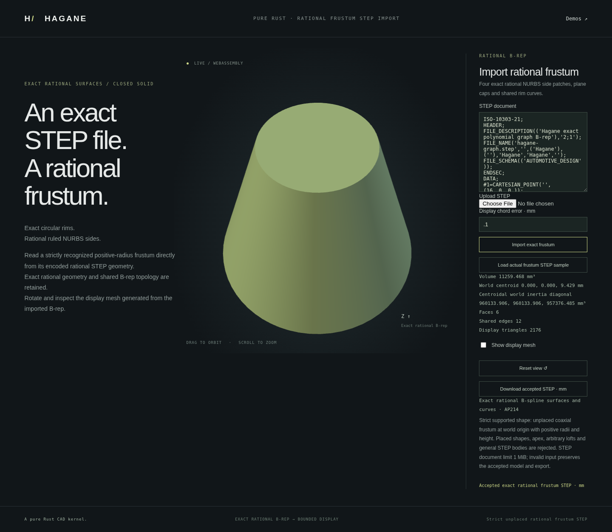

# Strict rational frustum STEP import



The dedicated importer reads one unplaced, full-domain positive-radius rational
frustum from supported AP214 STEP in mm. It preserves the actual spline control
points, knots, weights, shared B-rep topology and rational UV boundaries.
It accepts the checked canonical family, rather than fitting an arbitrary shell
or substituting a body built from guessed dimensions.

```rust
use hagane::*;
# fn example(text: &str) -> Result<()> {
let policy = GeometryTolerance::default();
let body = import_step_nurbs_frustum_mm(text, policy)?;
let volume = body.volume(policy)?;
let mesh = body.tessellate(0.1, policy)?;
let step = body.export_step_mm(policy)?;
# Ok(()) }
```

```sh
cargo run --example nurbs_frustum_step_import
cargo run --example nurbs_frustum_step_import -- part.step 0.1
./scripts/build-web.sh
python3 -m http.server 8000 --directory web
# Open /nurbs-frustum-step-import.html.
```

The browser starts by exporting an actual unplaced Rust/WASM frustum and passing
that STEP text through the importer. Uploaded or edited STEP text uses the same
path. Display meshes, mass properties and re-export come from the checked
imported B-rep. Invalid files or display requests preserve the last accepted
model, camera and exact STEP export.
The byte transport and CLI cap input at 2 MiB; the shared bounded STEP parser
limits documents to 1 MiB and imposes separate entity/list budgets.

## Supported representation

The initial domain has identity frame axes and origin `(0, 0, 0)`, two positive
radii, positive height and the complete 8-vertex, 12-edge, 6-face topology. Four
rational quarter rims per cap bound four rational degree `[2, 1]` ruled side
patches and two planar caps. Entity ordering is not a modeling parameter.

STEP `LINE` and affine UV directions are serialized as a unit direction and
magnitude. Their in-memory canonical representatives are restored only after
an exact serialized-preimage certificate for origin, direction and magnitude;
endpoint proximity alone is not accepted. Every parsed rational control net,
curve basis and UV spline remains unchanged. Complete typed validation checks
the retained geometry and shared oriented topology before returning a body.
There is no tolerance-based fitting, weight normalization or shape repair.
Re-export writes the active kernel policy's linear tolerance into STEP
uncertainty metadata. If that policy differs from the source export policy,
the uncertainty value changes while the retained geometry remains the same.
The demo uses `GeometryTolerance::default()`; the Rust import/export API accepts
an explicit policy.

Other unit systems, placements, apex bodies, arbitrary rational shells, general
STEP products/assemblies and differently parameterized representations remain
unsupported. The generic analytic and graph STEP importer domains remain
unchanged. Unresolved arithmetic and invalid geometry return explicit errors.
Original MIT OR Apache-2.0 code and mathematical references are recorded in
[references](references.md); no new dependency or OCCT source is used.

## Verification

Independent native tests check actual rational coefficients, dimensions, mass
and exact re-export across tapered/cylindrical models, scales and unplaced lower
children. Record order and ID changes are accepted; one-ULP control/weight/vector
changes, orientation corruption, extra geometry, placements and other units are
rejected. Demo tests compare retained B-rep, display, STEP and point queries.
WASM tests compare actual native reports and exercise byte/UTF8/size latch
recovery. The browser regression covers file/text import, rejected-input camera
and export retention, closed meshes, rational pcurves, chord bounds and mobile
layout. Run `node scripts/test-frustum-step-import-browser.mjs` after building
WASM and installing locked Playwright/Chromium; CI includes this regression.
