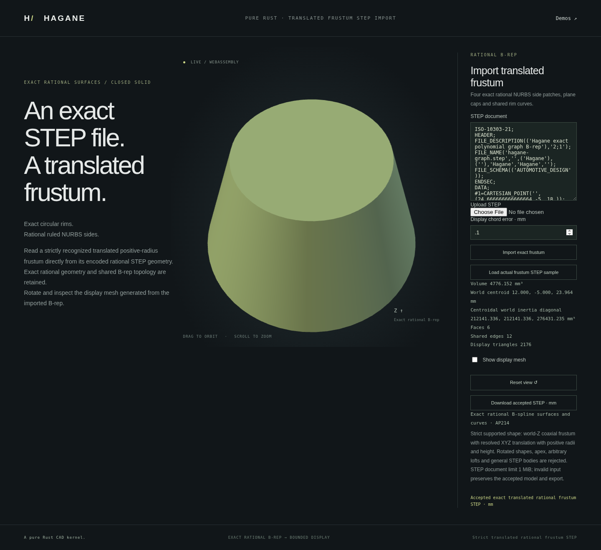

# Translated rational frustum STEP import



`import_step_nurbs_frustum_translated_mm` extends the checked canonical frustum
family to identity axes with a finite translation. It can read translated
source bodies and upper children exported by axial partitions. The existing
`import_step_nurbs_frustum_mm` API and browser demo retain their origin-zero
restriction.

```rust
use hagane::*;
# fn example(text: &str) -> Result<()> {
let policy = GeometryTolerance::default();
let body = import_step_nurbs_frustum_translated_mm(text, policy)?;
let mesh = body.tessellate(0.1, policy)?;
let step = body.export_step_mm(policy)?;
# Ok(()) }
```

Run `cargo run --example nurbs_frustum_translated_step_import` to export a
translated frustum, split it, and import the actual upper child's STEP. Pass a
file path to inspect another supported representation.

```sh
cargo run --example nurbs_frustum_translated_step_import_demo
cargo run --example nurbs_frustum_translated_step_import_demo -- part.step 0.1
./scripts/build-web.sh
python3 -m http.server 8000 --directory web
# Open /nurbs-frustum-translated-step-import.html.
```

The separate browser workflow generates an actual translated frustum, splits
it, exports the upper child's STEP and imports that text through the new API.
Uploaded or edited supported STEP files use the same path. Mass properties,
display meshes and downloads come from the retained imported B-rep. Rejected
files and display requests preserve the accepted model, camera and STEP export.

The bottom cap supplies the translation; height is the represented separation
of the cap planes. Radii come from the actual local rational UV curves, avoiding
loss of radius information when subtracting translated world coordinates.
The original construction height's floating-point bits are not guaranteed to
be recoverable from translated coordinates. Admission requires the inferred
frame and dimensions to reproduce every actual rational coefficient exactly,
plus the existing serialized LINE and affine UV certificates. All parsed
rational geometry and oriented shared topology are retained.

The same full 8-vertex, 12-edge, 6-face positive-radius canonical family and mm
units are required. Rotations, other unit systems, assemblies, arbitrary
parameterizations and general NURBS shells remain unsupported. Unresolved
precision returns an error. Parser budgets and uncertainty metadata behavior
are documented in the [original importer](nurbs-frustum-step-import.md).
Native and WASM use the same importer and report serializer. The byte ABI limits
transport to 2 MiB; the demo CLI and shared parser limit documents to 1 MiB.

## Verification

The default example reads the actual upper child at `(12, -5, 18)` with height
14 mm, radii `[12.666666666666666, 8]` mm and volume
`4776.151675724216` mm³. Independent tests exercise tapered and cylindrical
bodies, decimal radii, translated upper and batch children, retained control
nets and exact STEP re-export. A representable-height fixture also compares
actual meshes, mass and inertia. Height cancellation, one-ULP changes to control
points, weights and raw vectors, rotations and insufficient precision are
checked explicitly; the original origin-zero importer retains its restrictions.
WASM checks compare complete native reports and STEP, and exercise malformed
bytes, overflow, invalid display requests and reset recovery. The focused
browser regression checks actual geometry, chord bounds, closed mesh topology,
native parity, accepted-state retention, downloads, orbit and mobile layout.
Run `node scripts/test-frustum-translated-step-import-browser.mjs` after the
WASM build; CI also runs this regression.
