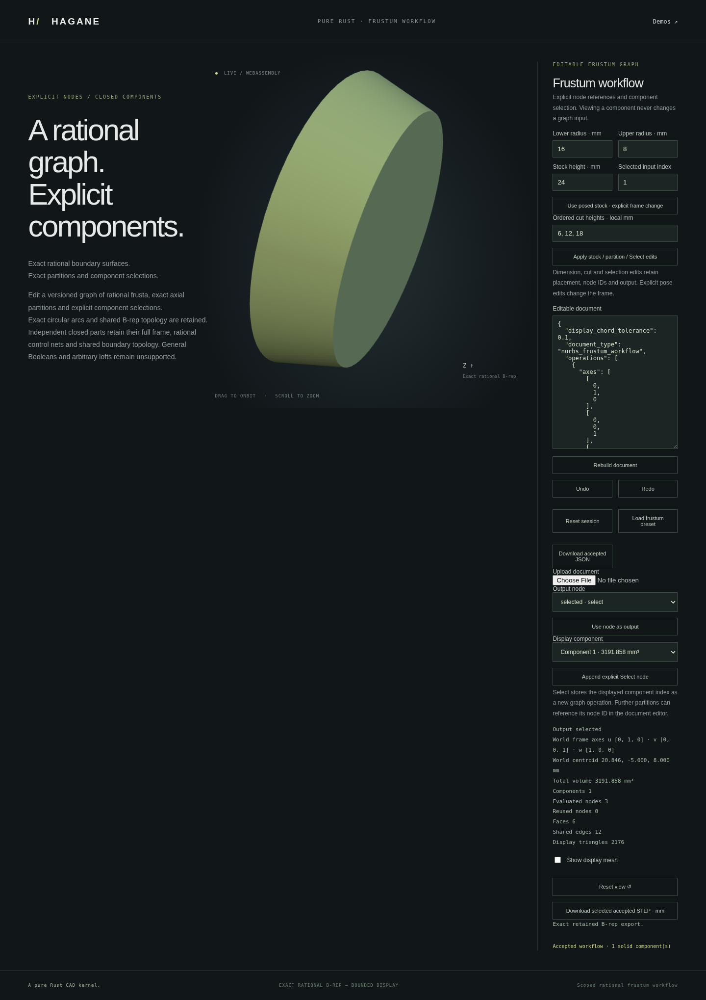
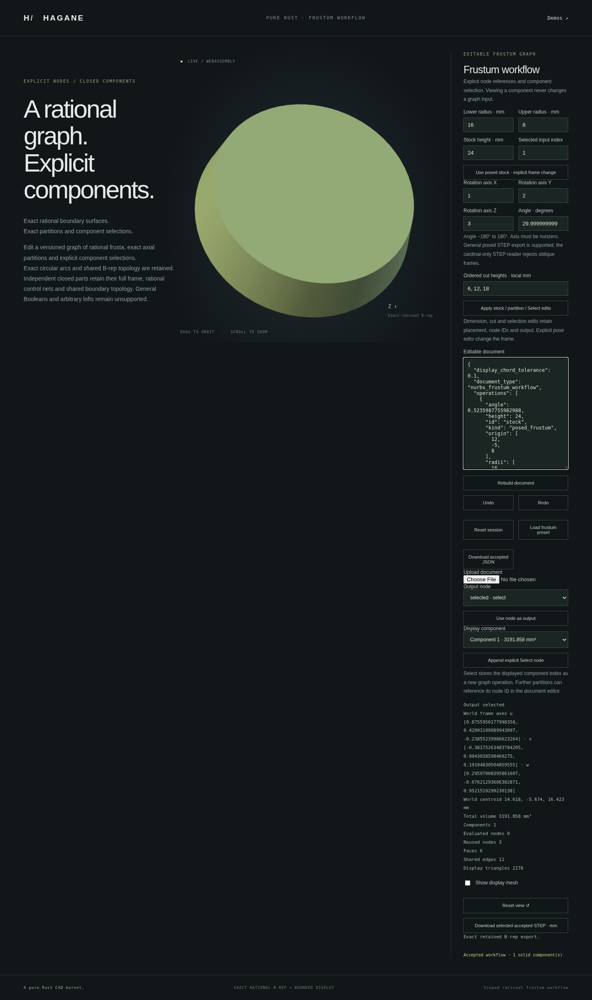

# Editable rational frustum workflow

The versioned Rust workflow connects exact cardinal-frame frustum construction,
axis-angle poses, actual STEP input, axial partitions and explicit component selection. A session
retains unchanged B-rep prefixes, reports real node evaluation counts and
supports bounded Undo/Redo. It is a scoped modeling graph, not a general CAD
history or Boolean engine.

```rust
use hagane::*;
# fn example() -> Result<()> {
let document = nurbs_frustum_workflow_example_document()?;
let mut session = NurbsFrustumWorkflowSession::new();
let command = serde_json::json!({"command":"rebuild","document":document});
let report = nurbs_frustum_workflow_session_command_json(
    &mut session, &command.to_string(),
)?;
# Ok(()) }
```

Run `cargo run --example nurbs_frustum_workflow` for the actual default report.
The [example document](nurbs-frustum-workflow-example.json) is the actual default graph.
The example also accepts one JSON command or a JSON array of commands; the
array shares one session and can demonstrate incremental edits and Undo/Redo.

## Document and operations

Schema 1 uses `document_type: "nurbs_frustum_workflow"`, mm units, explicit
linear/angular/relative tolerances, a display chord tolerance, an output node ID
and an ordered list of operations. Unknown fields, duplicate IDs, unavailable
outputs and forward references are rejected.

| Kind | Result and restrictions |
| --- | --- |
| `frustum` | One exact positive-radius frustum from radii, height, origin and three axes. Axes must be one of the 24 exact right-handed signed coordinate bases. |
| `posed_frustum` | One actual frustum from positive radii/height, origin, a nonzero finite `rotation_axis` and `angle` in [-π, π] radians. Uses checked rigid rotation; no scale, shear or reflection. |
| `step_stock` | One actual body from the checked [cardinal STEP importer](nurbs-frustum-cardinal-step-import.md), retaining rational geometry and UV boundaries. |
| `partition` | All actual closed parts from 1–16 ordered source-local physical cut heights. Input must contain exactly one component. |
| `select` | The explicitly indexed component of an earlier node, shared as the actual typed body. |

The default graph constructs an X-oriented 16-to-8 mm frustum of height 24 mm,
cuts at local heights 6, 12 and 18 mm and selects component 1. Setting the output
to the partition node returns all four parts, each with its own display report
and exact STEP. Further partitioning a multi-part output requires an explicit
`select` node; no largest-component heuristic is used.

## Transactions and bounds

The command protocol supports `rebuild { document }`, `undo`, `redo` and
`reset`. Successful reports contain the accepted document, all output
components, individual STEP strings, output status, cache counters and history
availability. Domain failures return `ok: false` with an operation diagnostic
and the last accepted document. Malformed transport returns an explicit error.

Geometry, display and report validation finish before the accepted document,
cache or history changes. Output-only and display-only edits reuse geometric
prefixes; tolerance changes invalidate the cache. Rejected edits and failed
Undo/Redo callbacks retain the accepted state. Undo/Redo retain at most 32
document states in each direction; accepting a new edit clears Redo.

There are at most 16 operations and 17 components per partition. Default session
acceptance and the shared demo enforce 131,072 display triangles across the
complete output; custom `rebuild_with` callbacks control output validation. STEP sources are individually bounded to
1 MiB, with a combined 2 MiB source budget. JSON/byte commands are bounded to
2 MiB. The WASM byte input rejects invalid bytes, malformed UTF-8 and overflow;
begin/finish resets the transport latch without silently resetting the session.

The native and WASM command paths share the kernel, actual-body serializer and
transaction rules. Arbitrary-angle STEP import, apex shapes, general lofts,
oblique partitions and frustum Booleans are unsupported.

## Browser editing

Run `./scripts/build-web.sh`, then `python3 -m http.server 8000 --directory web`
and open `/nurbs-frustum-workflow.html`. The dedicated page edits the same
versioned document and supports Undo/Redo, JSON upload/download and exact STEP
export for each accepted output component.

The default three-node graph has radius, height, cut-height and component-index
controls. These preserve node IDs and the exact stock frame. Other histories,
including STEP stocks and additional nodes, use the JSON editor; simplified
controls are disabled. Choosing a displayed component does not change the graph.
The explicit Select button appends a real operation. Setting another output
node reuses the accepted geometric prefixes.

A rejected edit leaves the accepted report, rendering, camera, export and kernel
history intact; the JSON editor retains the attempted document. Reset clears
the session, display and exports. A downloaded JSON document can be reloaded
and rebuilt in a new session; Undo/Redo history is session-local.



## Verification and provenance

Tests compare fresh and incremental actual B-reps, rational control nets, STEP
input and re-export, analytic volume/first-moment conservation and opposed
partition seams. They check real `Arc` reuse, explicit selection, invalid graph
and tolerance failures, callback rollback, output/display cache reuse, history
bounds and Redo invalidation. Demo checks compare complete actual component
reports and reject display work beyond the aggregate budget before committing.
The workflow reuses this repository's original kernel and transaction design;
no dependencies or OCCT source were added. Code is MIT OR Apache-2.0.

## Axis-angle stock placement

Run `cargo run --example nurbs_frustum_workflow_pose` for the actual posed
workflow report. Its [document](nurbs-frustum-workflow-pose-example.json) uses
axis `[1, 2, 3]`, angle `0.37` radians and world origin `[12, -5, 8]` mm.
The axis direction is normalized with overflow-safe vector normalization. The
frame is a checked right-handed orthonormal basis; reports retain its actual
three axes rather than a guessed Euler angle. Local points map to `R*p + origin`:
the origin is placed after rotation and remains the supplied world point.

In the browser, **Use posed stock** explicitly replaces the cardinal stock axes
with the new axis-angle recipe and preserves dimensions, origin and node IDs.
The pose controls display degrees; the document stores radians. Dimension and
cut edits preserve an unchanged accepted angle without a unit-conversion
round trip. Advanced histories still use the JSON editor.

Partitions use physical source-local axial distances in this frame. Their
closed children retain actual posed rational curves, ruled surfaces and pcurves.
Native/WASM tests independently check Rodrigues rotation, world centroids and
full matrix inertia; rejected pose edits preserve the accepted graph/history.

This new node preserves the old `frustum` node's 24 exact signed coordinate bases.
STEP export remains actual B-rep; the cardinal STEP importer still rejects
general oblique frames. A posed document can be saved and rebuilt without
claiming general rotated STEP import.


